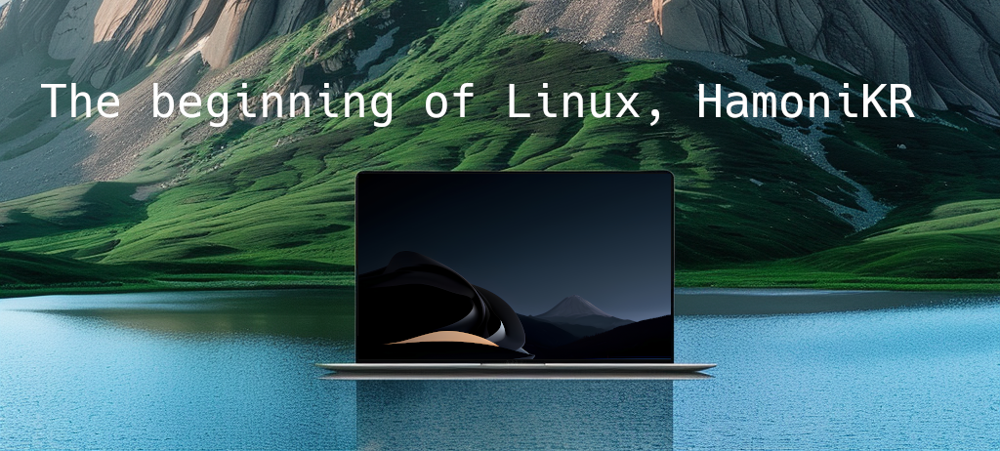
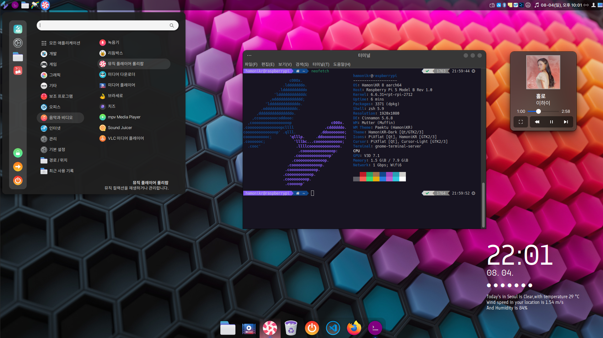
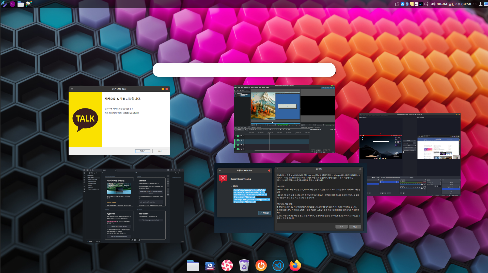

# 하모니카 사용자 가이드

### **하모니카 프로젝트** 

하모니카 프로젝트는 2014년 시작된 개방형 OS 데스크톱 환경을 제공하는 오픈소스 프로젝트입니다.&#x20;

MS Windows 이외의 선택권이 없는 사용자들에게 소프트웨어 라이선스에 대한 걱정이 없는 개방형 OS를 쉽게 경험할 수 있도록 기업이나 개인 누구에게나 오픈소스로 배포하고 있습니다. &#x20;

이 프로젝트는 커뮤니티 참여자들을 중심으로 데스크톱 에 필요한 100여개의 프로젝트(하모니카 OS, 다국어 입력기, 화상회의, 원문검색엔진 등)가 깃허브에서 활발하게 되고 있으며, 참여하는 많은 기업 및 재단(오픈소스 소프트웨어 재단, 한국 공개소프트웨어 협회)과 함께 다양한 활동을 통해 국내 오픈소스 생태계의 활성화를 위해 노력하고 있습니다.

**하모니카 프로젝트 참여 방법**

1. **깃허브**: 프로젝트의 코드와 문서는 [깃허브](https://github.com/hamonikr)에서 확인하고 참여할 수 있습니다.
2. **하모니카 커뮤니티**: [하모니카 공식 웹사이트](https://hamonikr.org/)에서 다양한 정보와 토론을 찾을 수 있습니다.

**하모니카 프로젝트 관련 자료**

* **유튜브 채널**: [하모니카 유튜브 채널](https://www.youtube.com/hamonikros)에서는 사용법과 팁을 제공합니다.
* **온라인 매뉴얼**: [하모니카 온라인 매뉴얼](https://docs.hamonikr.org/hamonikr-6.0)을 통해 어려움을 쉽게 해결할 수 있습니다.

<figure><figcaption></figcaption></figure>

하모니카 OS는 데스크톱 사용자에게 최적화된 다양한 편의성을 제공하는 개방형OS로, 소프트웨어 품질에 대한 많은 테스트를 통해 GS인증, SW품질대상 등을 받은 안정적인 제품으로, 현재까지 일반 사용자에게 22만건 이상 배포되었으며 국내 33개 공공 및 민간부문에서 40만명 이상이 사용하고 있습니다.

### 하모니카 8 Paektu

이번에 출시한 하모니카 8 은 [Ubuntu 24.04 LTS (Noble Numbat)](https://releases.ubuntu.com/noble/) 를 기반으로 다양한 최신 하드웨어를 지원하고, 2034년 5월까지 기능 및 보안 업데이트를 제공하는 [LTS 버전(커널 6.8)](https://ubuntu.com/about/release-cycle#ubuntu-kernel-release-cycle)로 제공됩니다.

<figure><figcaption></figcaption></figure>

#### **최소 사양** 

* CPU: 2GHz 이상의 INTEL 또는 AMD 듀얼 코어  (2 core) 이상
* 메모리: DDR3 4GB 이상
* 메인보드: 기본적인 INTEL 또는 AMD 메인보드
* 하드디스크: 25GB 이상
* 해상도: 1024x768 이상

#### **권장 사양** 

* CPU: 2GHz 이상의 INTEL 또는 AMD 4 core 이상
* 메모리: DDR4 8GB 이상, 동작클럭 2,400MHz 이상
* 메인보드: H310 (INTEL) 이상 또는 A320 (AMD) 이상
* 하드디스크: 50GB 이상의 SSD 또는 HDD
* 해상도: 1920x1080 이상

### 다운로드

* [https://hamonikr.org/download\_paektu](https://hamonikr.org/download\_paektu)

<figure><figcaption></figcaption></figure>

### 하모니카 8 주요 기능 

새로 출시한 하모니카는 시스템 전체 인터페이스가 기본으로 다크 테마를 사용하고 있으며, 특히 인공지능이 잘 활용될 수 있도록 **AskGPT** 기능이 추가되었습니다..

최근 인기있는 옵시디언 메모 프로그램, 클라우드 저장소 메가 드라이브, 그리고 다운로드 관리자 Motrix 를 기본으로 제공하고 있으며, AppImage 파일을 클릭하면 자동으로 프로그램 메뉴에 추가되는 기능도 추가되었습니다.&#x20;

#### 편리한 시스템 관리와 문제 해결

* **AskGPT 기능**: 시스템 문제를 쉽고 빠르게 해결할 수 있는 ChatGPT 기반의 AskGPT 기능을 제공합니다. (Ctrl + Alt + A)  - [자세히 보기](recommendation/askgpt.md)
* **향상된 시스템 관리 도구**: 시스템 성능을 쉽게 모니터링하고 관리할 수 있습니다. - [자세히 보기](recommendation/stacer.md)

#### 다양한 사용자 경험과 편리한 기능

* **데스크톱 퀵 런처**: Ctrl + Space를 눌러 빠르게 원하는 애플리케이션을 실행할 수 있습니다. [자세히 보기](recommendation/albert.md)&#x20;
* **데스크톱 스타일 전환 기능**: 사용자가 원하는 대로 데스크톱 환경을 쉽게 변경할 수 있습니다. [자세히 보기](key-features/hamonikr-welcome/)
* **멋진 사용자 로그인 화면** ([https://github.com/hamonikr/ukui-greeter](https://github.com/hamonikr/ukui-greeter))

#### 한국 사용자 맞춤형 기능

* **한글 문서 호환성**: 한글 HWP 파일과 MS 오피스 문서 형식을 편집할 수 있도록 지원합니다.&#x20;
* **국내 오픈소스 기여자의 프로젝트 활성화**를 응원합니다.: @kuroehanako, @orioncactus, @begin-theadventure, @ebandal 등 국내 개발자들이 기여한 아이콘, 글꼴, 한글 지원 기능이 포함되어 있습니다.
  * 국내 오픈소스 개발자 @kuroehanako 님의 아이콘 최신버전 적용 ([https://github.com/kuroehanako/Stylish-icon-theme](https://github.com/kuroehanako/Stylish-icon-theme))
  * 국내 오픈소스 개발자 @orioncactus 님의 글꼴 최신버전 적용 ([https://github.com/orioncactus/pretendard](https://github.com/orioncactus/pretendard))
  * 국내 오픈소스 개발자 @begin-theadventure 님의 온보드 레이아웃 추가 ([https://github.com/hamonikr/hamonikr-onboard-layout-ko/pull/5](https://github.com/hamonikr/hamonikr-onboard-layout-ko/pull/5))
  * 국내 오픈소스 개발자 @ebandal 님의 리브레오피스로 아래한글 문서 편집 기능 ([https://github.com/hamonikr/libreoffice-hwp2odt](https://github.com/hamonikr/libreoffice-hwp2odt))
  * 국내 기업 @(주)한메소프트 의 한메타자 프로그램 기본 제공 ([https://github.com/hamonikr/hanme-taja](https://github.com/hamonikr/hanme-taja))
  * 국내 기업 @(주)카테노이드의 인터넷 강의 지원 Kollus Player Agent 기본 제공 ([https://hamonikr.org/hamoni\_notice/131522](https://hamonikr.org/hamoni\_notice/131522))

#### 멀티미디어와 비대면 업무 지원

* **한글 가사 지원 뮤직 플레이어**: Lollypop으로 음악을 즐기면서 한글 가사를 함께 볼 수 있습니다. [자세히 보기 ](tips/lollypop-1.md)
* **비대면 업무 환경 지원**: 카카오톡, 슬랙, 줌 등의 비대면 업무 툴이 원활하게 작동합니다.

#### 소프트웨어 호환성과 설치 지원

* **다양한 소프트웨어 제공**: 소프트웨어 매니저를 통해 6만여 개의 애플리케이션을 쉽게 설치하고 관리할 수 있습니다.&#x20;
* **윈도우 전용 프로그램 지원**: 카카오톡, 배틀넷, 리그 오브 레전드 등 윈도우 전용 프로그램도 문제없이 설치하고 사용할 수 있습니다. [자세히 보기](key-features/hamonikr-welcome/kakaotalk.md)
* **스마트한 메모 프로그램**: 옵시디언으로 제텔카스텐(Zettelkasten)을 적용 해보세요.  [자세히 보기](recommendation/obsidian.md)

#### 데이터 관리 및 백업

* **파티션 백업 및 복구 프로그램**: 데이터를 안전하게 백업하고 필요 시 복구할 수 있는 기능을 제공합니다. [자세히 보기](key-features/undefined-1/qt-fsarchive.md)
* **라이브 이미지 제작**: 사용 중인 PC 환경을 그대로 저장하고 배포할 수 있습니다. [자세히 보기](recommendation/systemback.md)

#### 효율적인 작업 도구

* **자유로운 창 타일링**: 창을 쉽게 배열하고 정리할 수 있는 gTile 기능을 지원합니다. (SUPER+G)&#x20;
* **스크린샷 및 동영상 녹화**: 패널에서 간단히 스크린샷을 찍거나 동영상을 녹화할 수 있습니다.
* **빠른 화면 녹화**: 단축키 Ctal+Shift+Alt+R 을 누르면 녹화가 시작되고 한번 더 누르면 종료됩니다. 저장된 녹화영상은 사용자 홈 > 비디오 폴더에 저장됩니다.
* 기본 터미널 ZSH + powerlini10k 적용 (CTRL+ALT+T)  [자세히 보기](key-features/hamonikr-tui/hamonikr-zsh.md)
* 명령어를 몰라도 파일 탐색기에서 git 명령어를 GUI로 실행할 수 있는 기능. [자세히 보기](recommendation/git-./rabbitvcs-git-git.md)
* 이미지를 PDF로 변환, 이미지 크기조정, 폰트 설치, 움직이는 GIF 만들기 등 상황에 맞는 다양한 명령을 파일 탐색기에서 제공

### 하모니카 8.0 릴리즈 노트 

* Cinnamon 6.0 성능 및 응답성 향상. 향상된 창 관리 및 타일링 기능. 다중 모니터 지원 개선.
* 소프트웨어 관리자 개선된 검색 기능.
* 시스템 종료 시간 10초로 단축.
* Pipewire 사운드 서버로 전환.
* 터치패드 드라이버 기본 드라이버는 "libinput", "synaptics"로 전환 가능.
* NTFS 마운트 문제 수정
* 서드파티 패키지 추가 - ahnlab-v3lite, alzip, dropbox, evernote-client, megasync, microsoft-edge-dev, slack-desktop, telegram, zoom
* barrier - 키보드 마우스 공유 프로그램 ([https://github.com/hamonikr/barrier](https://github.com/hamonikr/barrier) )
* media-downloader - 유튜브 동영상을 다운로드 받는 프로그램 (yt-dlp, youtube-dl, aria2c, wget 등의 GUI) ([https://github.com/hamonikr/media-downloader](https://github.com/hamonikr/media-downloader))
* 하드웨어 정보보기 최신 업스트림 적용([https://github.com/hamonikr/hardinfo](https://github.com/hamonikr/hardinfo))
* 하모니카 APT 미러서버 추가 ([https://mirror.hamonikr.org](https://mirror.hamonikr.org/))
* hamonikr-nemo-rabbitvcs - svn, hg hide as default ([https://github.com/hamonikr/hamonikr-nemo-rabbitvcs](https://github.com/hamonikr/hamonikr-nemo-rabbitvcs))
* hamonikr-welcome - update program list, kakaotalk install process ([https://github.com/hamonikr/hamonikr-welcome](https://github.com/hamonikr/hamonikr-welcome))
* hamonikr-backgrounds - create with AI(midjourney, SDXL) ([https://github.com/hamonikr/hamonikr-backgrounds](https://github.com/hamonikr/hamonikr-backgrounds))
* hamonikr-albert - update with latest upstream, add new theme ([https://github.com/hamonikr/hamonikr-albert](https://github.com/hamonikr/hamonikr-albert))
* 메인 시스템 예외 핸들링 및 로깅 추가 ([https://github.com/hamonikr/hamonikr-system/](https://github.com/hamonikr/hamonikr-system/))
* 슬라이드 쇼 업데이트 ([https://github.com/hamonikr/ubiquity-slideshow-mint](https://github.com/hamonikr/ubiquity-slideshow-mint))

