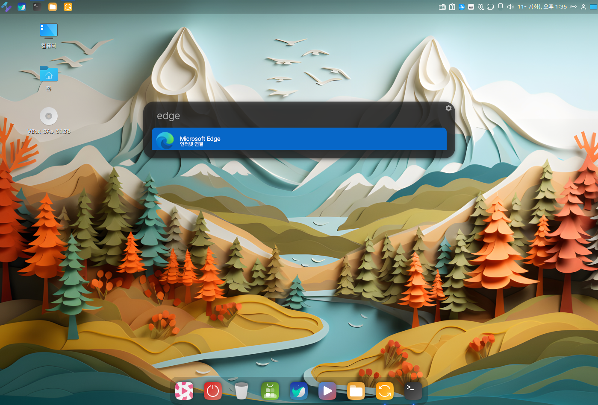
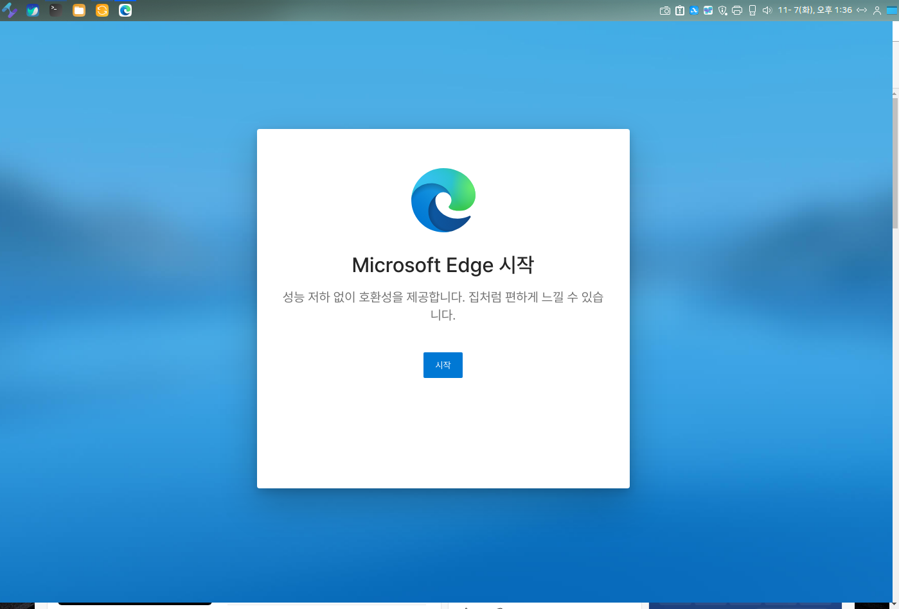
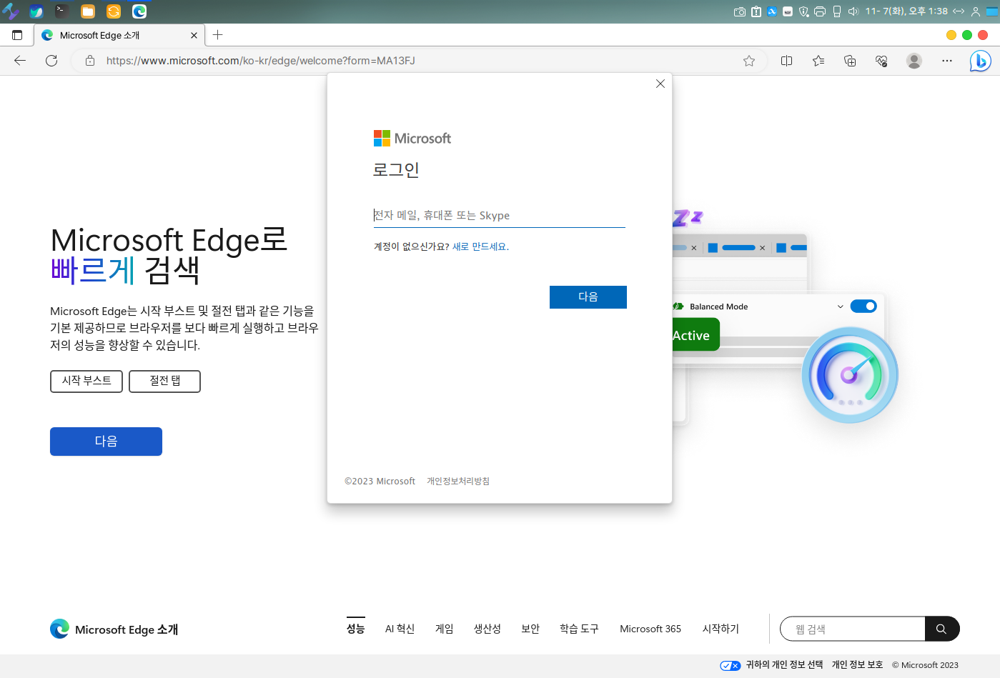
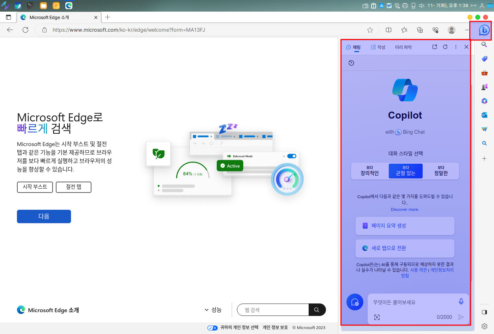
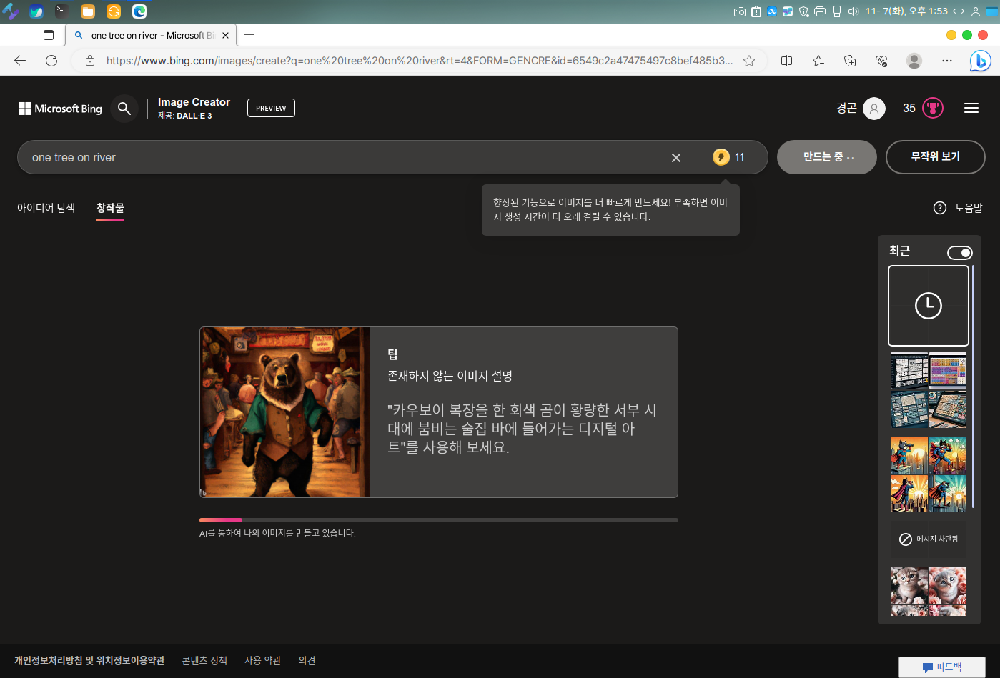

# Microsoft Edge & Bing AI

MS Edge를 사용해서 Bing AI를 사용하시는 많은 분들이 많으실거 같아 하모니카 팀에서는 이번 버전에 MS Edge 브라우저 설치를 지원해 드립니다.&#x20;


MS Edge 설치방법

```
# Ms Edge 설치하기

$ sudo apt-get update 또는 apu ( zsh alias )
$ sudo apt-get install -y microsoft-edge-stable 또는 api microsoft-edge-stable
```


Microsoft Edge Bing Ai Chatbot .

Alert (alt + Space) 또는 프로그램 메뉴에서 "Microsoft Edge"를 실행합니다.&#x20;

<figure><figcaption></figcaption></figure>

<figure><figcaption></figcaption></figure>


Edge 브라우저 로그인을 합니다.

<figure><figcaption></figcaption></figure>


로그인을 하신 후 우측 상단에 있는 "bing" 아이콘을 클릭하면 아래 화면과 같은 패널이 열리고,

채팅, 작성, 미리파악 메뉴을 선택해 Bing AI와 채팅으로 사용하실 수 있습니다.&#x20;

<figure><figcaption></figcaption></figure>


### Bing AI로 이미지 생성하기&#x20;

Bing AI을 이용한 이미지를 생성을 위해 "https://www.bing.com/create" 접속합니다.&#x20;

원하시는 이미지를 텍스트로 입력을 하시고 "만들기" 버튼을 클릭합니다.&#x20;

<figure><figcaption></figcaption></figure>

Bing AI를  이용한 이미지가 만들어 집니다.\~\~

<figure><figcaption></figcaption></figure>

<figure><figcaption></figcaption></figure>


