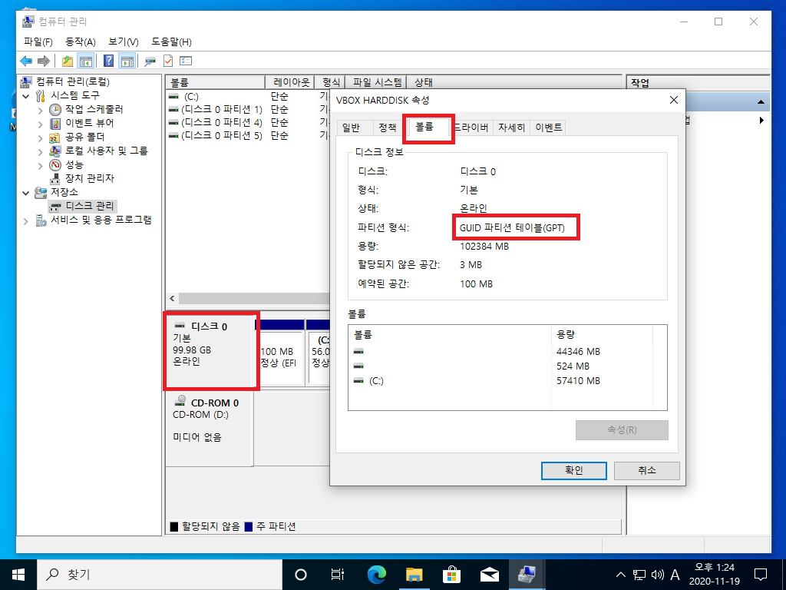
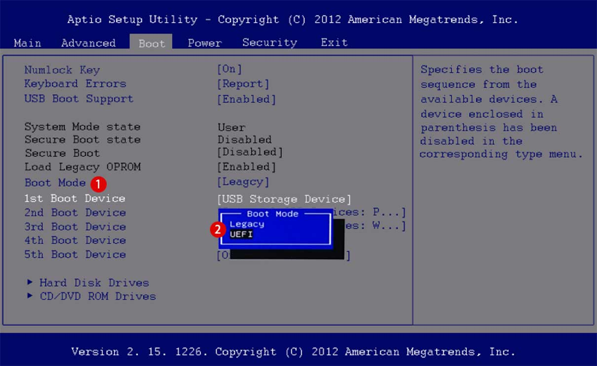

# 기타 설치 관련 정보

## MBR, GPT 파티션 방식 알기

부팅 USB가 동작을 하지 않거나 설치가 되지 않는 원인은 부팅 USB를 만들 때 설정했던 **파티션 방식 문제**입니다.

윈도우에서 부팅 USB를 만드는 가이드 내용에서 ❸을 보면 파티션 방식이 적혀있습니다.

MBR(Master Boot Record)과 GPT(GUID Partition Table) 방식이 존재합니다.

MBR은 1983년에 처음 도입되었던 형식으로 많은 시스템과 호환성 때문에 사용되는 방식입니다.

하지만 여러가지 단점이 존재합니다. &#x20;

1. 파티션을 **최대 4개**까지 밖에 인식을 하지 못한다. (윈도우는 MBR설치시 3개의 파티션을 이미 사용)
2. MBR은 **32비트**를 사용하기 때문에 최대 **2TB**의 용량 밖에 인식하지 못한다.

이 문제를 해결하기 위해 나온 방식이 GPT 방식입니다.

GPT 방식은 일반 사용자는 다 사용할 수 없을 정도로 파티션을 나눌 수 있고 용량도 크게 사용할 수 있습니다.

설치될 때 100M의 EFI 파티션이 생성되며 부트 영역을 담당합니다.

<figure><figcaption></figcaption></figure>

다음 표와 같이 멀티부팅이 정상적으로 설치가 되려면 4가지 설치 방식 중에 2가지만 가능합니다.

| ​        | MBR 방식 설치                                                              | GPT 방식 설치                 | ​                                                                                 | ​        |
| -------- | ---------------------------------------------------------------------- | ------------------------- | --------------------------------------------------------------------------------- | -------- |
| 윈도우      | 윈도우 MBR                                                                | 윈도우 GPT                   | ​                                                                                 | ​        |
| 하모니카     | 하모니카 MBR                                                               | 하모니카 GPT                  | 하모니카 MBR                                                                          | 하모니카 GPT |
| 설치 가능 여부 | 가능                                                                     | 불가능                       | 가능(바이오스 계속변경)                                                                     | 가능       |
| 추가 설명    | <ul><li>정상적으로 설치</li><li>4개의 제한된 파티션</li><li>파티션 초과시 설치가 불가능</li></ul> | <ul><li>설치가 불가능</li></ul> | <ul><li>정상적으로 설치가 안됨</li><li>바이오스 설정 필요</li><li>레거시와 UEFI를 선택해서 각각 부팅가능</li></ul> |          |

## 윈도우에서 자신의 파티션 방식 확인하기

**시작 메뉴 우클릭 > 디스크 관리 > 윈도우가 설치된 디스크 우클릭 > 속성 > 볼륨 > 파티션 형식** 에 적혀있습니다.

※ EFI 파티션이 존재한다면 GPT 방식입니다.

<figure><figcaption></figcaption></figure>

## BIOS : Legacy, UEFI 방식 확인

부팅시 F2 또는 DEL 키를 연타하면 진입하는 화면입니다.

컴퓨터의 방식에 따라 F10, F11 등 다른 키를 눌러야 할 수 있습니다.

BIOS화면은 사용되고 있는 메인보드에 따라서 다르게 표시됩니다.

보통 Legacy, Legacy\&UEFI, UEFI 3가지 방식이 적혀있습니다.

부팅 USB를 꽂아도 바로 윈도우로 넘어간다면

1. 부팅순서 확인 (위의 이미지에서는 1st Boot Device에 USB로 설정이 되어 있어야함)
2. Boot Mode (Legacy는 MBR, UEFI는 GPT로 부팅 USB를 만들었을 때 인식합니다.)

<figure><figcaption></figcaption></figure>
