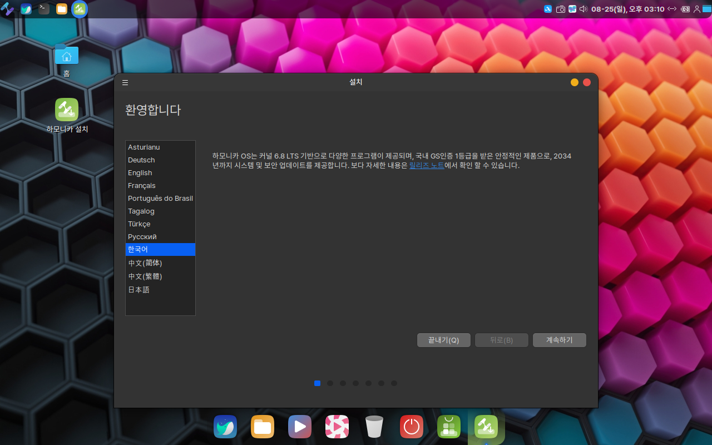
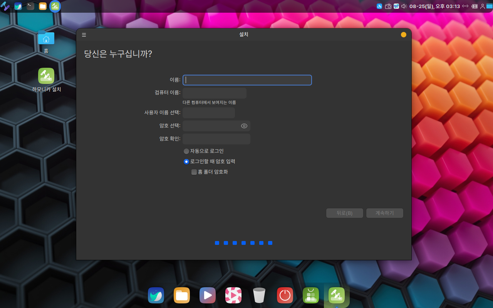

# 하모니카 설치

## **라이브 USB 부팅** 

제작한 부팅 USB를 컴퓨터에 연결 후 재부팅 합니다.

정상적으로 설정되어 있다면 아래 이미지와 같은 화면으로 넘어가게 됩니다.

만약 아래와 같은 화면이 나오지 않고 이미 설치되어 있던 OS 화면이나 기타 다른 화면이 나온다면 다시 재부팅을 해준 후 F2 또는 DEL키를 눌러 BIOS창으로 진입해 줍니다.

부팅 순서의 첫번째를 연결한 USB로 변경합니다. (BIOS창은 메인보드의 종류에 따라 화면이 다르게 나옵니다.)

F10을 눌러 저장하고 종료합니다.

## 하모니카 설치 

### 부팅메뉴 선택

처음 부팅을 하면 다음과 같은 선택화면이 나옵니다.

**" Start HamoniKR and Install" 또는 "Start HamoniKR and Install (safe grapics)" 모드를 선태해 주세요.**&#x20;

일부 그래픽 카드나 드라이버는 기본 설치 프로그램과 호환되지 않을 수 있습니다. 이러한 경우, 사용자는 "Safe Graphics" 모드를 사용하여 이러한 문제를 우회하고 시스템을 정상적으로 부팅하거나 설치할 수 있습니다.

<figure><figcaption></figcaption></figure>

라이브 부팅이 완료되면 아래 그림과 같이 체험모드로 하모니카의 다양한 기능들을 미리 사용해볼 수 있습니다.&#x20;

### 설치 시작

바탕화면에 "하모니카 설치"  아이콘을 더블클릭합니다.

<figure><figcaption></figcaption></figure>

### 언어 선택

사용할 언어를 선택하고 **계속하기**를 눌러주세요. 기본값으로 '한국어'가 선택되어 있습니다.

<figure><figcaption></figcaption></figure>

### 키보드 형식 선택

사용할 키보드의 형식을 선택하는 부분입니다. 기본값으로 한국어 101/104키 호환이 선택되어 있습니다.

**계속하기**를 눌러주세요

<figure><figcaption></figcaption></figure>

### 설치 유형 선택

하모니카 설치 시 **일반 설치**와 **최소 설치**를 선택하실 수 있으니, 원하시는 유형을 선택해 주세요.

**기타 설정**은 멀티미디어 코덱, 슬랙, 텔레그램, 줌, 알집 등 유용한 소프트웨어를 OS를 설치하면서 동시에 추가 설치를 하실 수 있습니다.&#x20;

원하는 옵션을 선택한 후 **계속하기**를 눌러주세요. &#x20;

<figure><figcaption></figcaption></figure>

### 파티션 설정

※ OS를 설치할 때 가장 중요한 부분입니다. 가이드 문서를 읽고 진행해 주세요.

**디스크를 지우고 HamoniKR 8.0 설치**는 사용하시는 하드디스크 전체를 지우고 설치하는 방식입니다.

**지금 설치**를 누릅니다.

만약 윈도우 또는 다른 OS가 하나 이상 설치되어 있고 추가적으로 OS를 설치해야 한다면 다음 가이드 문서를 이용해주세요.

[윈도우 하모니카 멀티부팅 설치](installmultiboot.md)

디스크를 지우고 환경에 맞게 파티션을 분리하는 작업입니다.&#x20;

옵션을 선택한 후 **계속하기**를 눌러주세요

<figure><figcaption></figcaption></figure>

 

<figure><figcaption></figcaption></figure>

### 위치 설정

거주하고 있는 국가의 시간을 설정하는 부분입니다. 기본값으로 Seoul로 선택되어 있습니다.

**계속하기**를 눌러주세요

<figure><figcaption></figcaption></figure>

### 계정 설정

사용자 이름과 비밀번호를 선택하는 부분입니다.

이름과 비밀번호를 설정하고 **계속하기**를 눌러주세요.

<figure><figcaption></figcaption></figure>

설치하고 있는 화면입니다. 잠시만 기다려주세요.

<figure><figcaption></figcaption></figure>

### 설치 완료

설치 진행이 끝나면완료 메세지가 나오고  "지금 다시 시작" 버튼을 클릭하시면 재부팅됩니다.

시스템 재 시작 후 설치시 입력하셨던 계정의 비밀번호를 입력하고 로그인하세요.

<figure><figcaption></figcaption></figure>

이제부터 새 버전의 하모니카에서 다양한 경험을 해보세요.

## <mark style="color:orange;">무인 설치 모드</mark>

이 모드는 컴퓨터 제조사 또는 클라우드 가상머신 등의 환경에서 설치가 필요한 사용자를 위한 모드 입니다.&#x20;

만약 클라우드 환경 또는 가상 머신에 모든 과정을 자동으로 설치하고 싶은 경우에는 **"Show more options"** 메뉴를 선택해서 다음과 같은 **"Automatic Install"** 메뉴로 부팅할 수 있습니다. 이경우 hamonikr 계정과 비밀번호 hamonikr 로 계정이 자동 생성됩니다.

<mark style="color:red;">**(주의) 이 메뉴는 자동으로 설치되면서 하드 디스크의 모든 데이터가 삭제되기 때문에, 디스크에 데이터를 보존해야 하는 경우는 사용하면 안됩니다.**</mark>

<figure><figcaption></figcaption></figure>

