# 윈도우와 하모니카 멀티부팅 설치

윈도우가 설치되어 있는 상태에서 추가적으로 하모니카 OS를 설치하는 방법입니다.

윈도우에서 듀얼부팅을 하기 위해서는 다음과 같은 확인 과정을 거쳐야 합니다.

1. 설치해야 하는 하드디스크(SSD)의 위치 확인
   * 윈도우가 설치되어 있는 하드디스크(SSD)에서 설치
   * 새로운 하드디스크(SSD)에서 설치
2. 윈도우의 설치가 Legacy(CSM) 방식인지 UEFI 방식인지 확인
   * 확인하는 방법은 매뉴얼 진행과정에 있습니다.
   * 이 방식에 따라 만들어야 하는 부팅 USB가 다릅니다.
3. 하드디스크(SSD)의 용량은 충분한지 확인
   * lite 버전은 15GB, 기본 버전은 25GB의 용량이 필요합니다.

## 윈도우 파티션 나누기

윈도우 11 기준 파티션을 나누는 방법입니다.

윈도우 10에서도 진행 방식은 동일합니다.

시작메뉴를 우클릭하여 나오는 메뉴에서 디스크 관리를 클릭합니다.

<figure>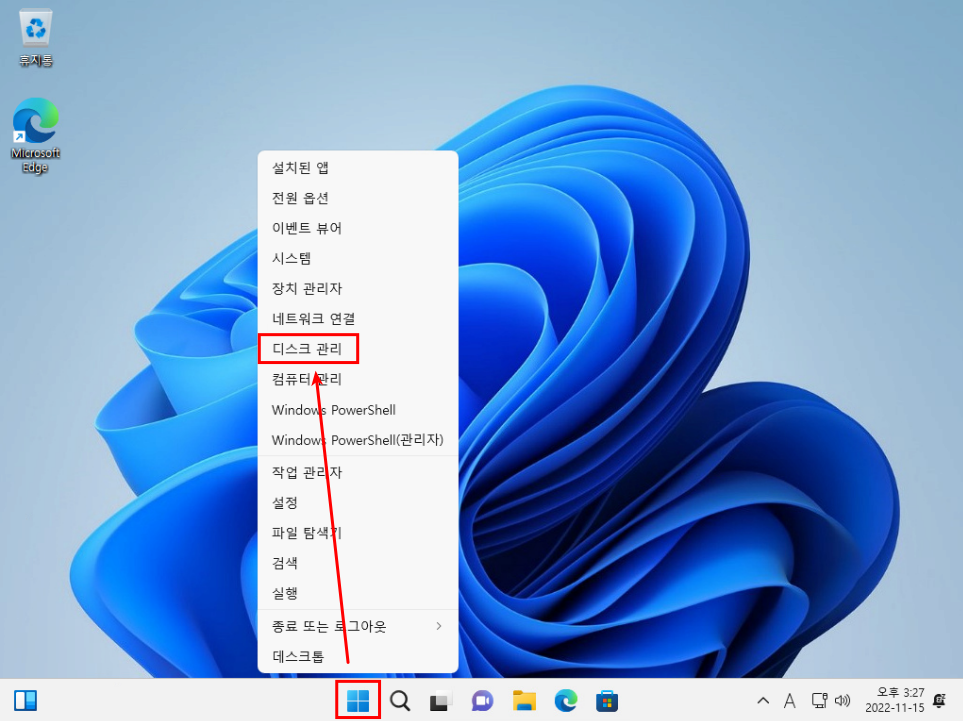<figcaption></figcaption></figure>

디스크 관리 창이 나오면 다음과 같은 창이 나오게 됩니다.

<mark style="color:red;">**① 의 파티션이 있다면 UEFI 방식으로 윈도우가 설치**</mark>된 것입니다.

이에 따라 <mark style="color:red;">**부팅 USB도 GPT 방식으로 만듭니다.**</mark>

① 의 항목이 없다면 Legacy 방식으로 설치된 것이기 때문에 부팅 USB는 MBR 방식으로 만들어야합니다.

듀얼부팅을 하기 위해 파티션을 나누어야 합니다.

② 에서 마우스를 우클릭합니다.

<figure>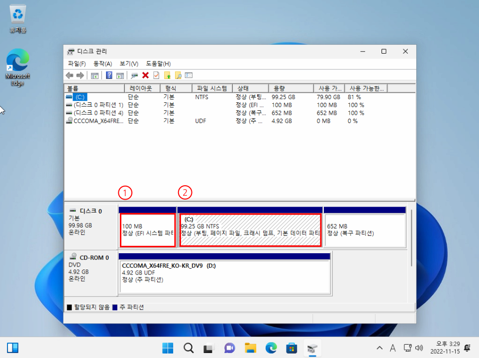<figcaption></figcaption></figure>

불륨 축소를 클릭합니다.

<figure>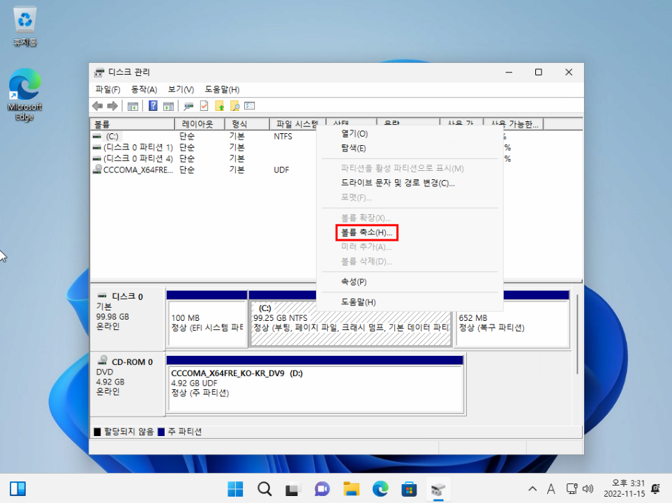<figcaption></figcaption></figure>

축소할 공간을 입력하고 축소 버튼을 누릅니다.

나중에 하모니카 OS를 설치할 공간이 됩니다.

해당 이미지에서는 20000을 입력하였는데 20GB의 공간을 축소하였습니다.

<figure>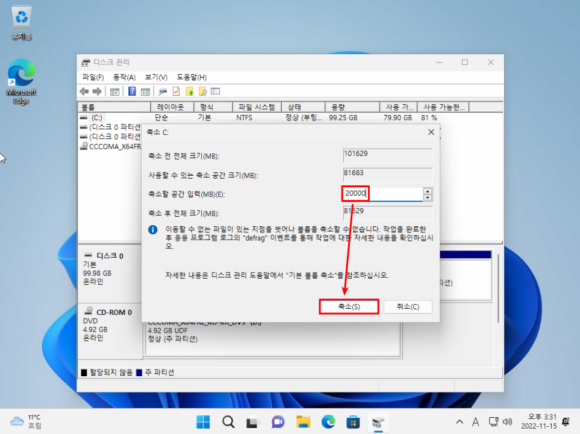<figcaption></figcaption></figure>

할당되지 않은 공간이 생기게 되면 윈도우에서의 파티션 분할 작업이 끝났습니다.

윈도우를 종료하고 만들어 놨던 하모니카 부팅 USB를 꽂고 하모니카로 live 부팅을 진행합니다.

<figure>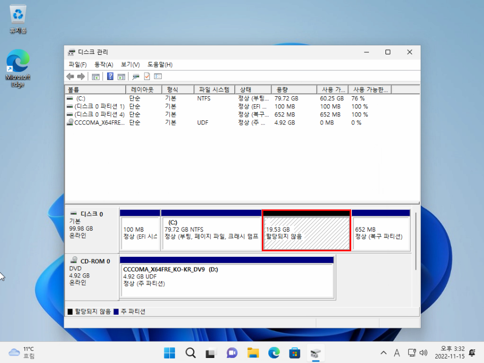<figcaption></figcaption></figure>

## 하모니카 멀티 부팅 설치하기

바탕화면에 있는 하모니카 설치 아이콘을 실행합니다.

<figure><figcaption></figcaption></figure>

원하는 언어를 선택하고 계속하기 버튼을 누릅니다.

기본 환경은 한국어입니다.

<figure><figcaption></figcaption></figure>

원하는 키보드 입력기를 선택하고 계속하기를 누릅니다.

기본 환경은 한국어 입력기 입니다.

<figure><figcaption></figcaption></figure>

어떤 방식으로 하모니카를 설치할 것인지 설치할 때 서드 파티 소프트웨어를 설치할 것인지 체크를 합니다.

아래 이미지에서 빨간색 네모박스로 되어 있는 부분은 <mark style="color:red;">**bios에서 시큐어부트가 설정되어 있을 경우 보이게 됩니다.**</mark>

사용하지 않을 경우에는 체크를 하지 않고 진행하시면 됩니다.

<figure>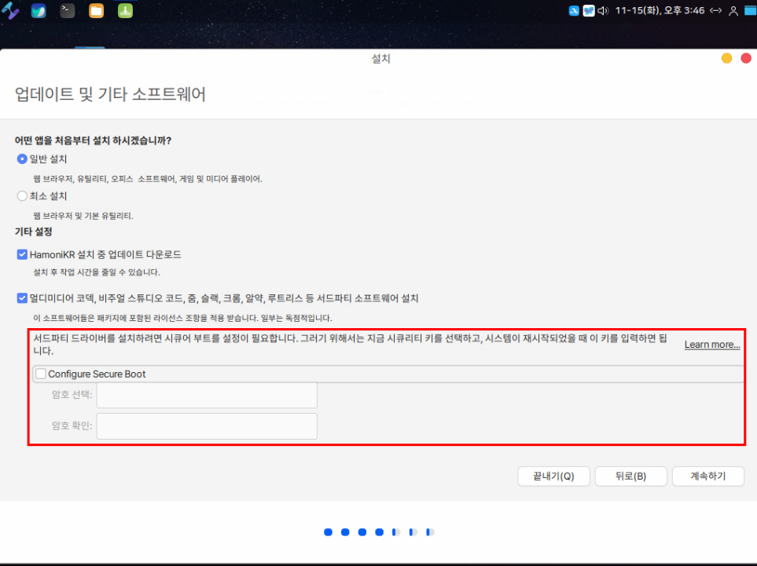<figcaption></figcaption></figure>

체크하였다면 비밀번호 8자리를 입력하고 계속하기 버튼을 눌러줍니다.

<figure>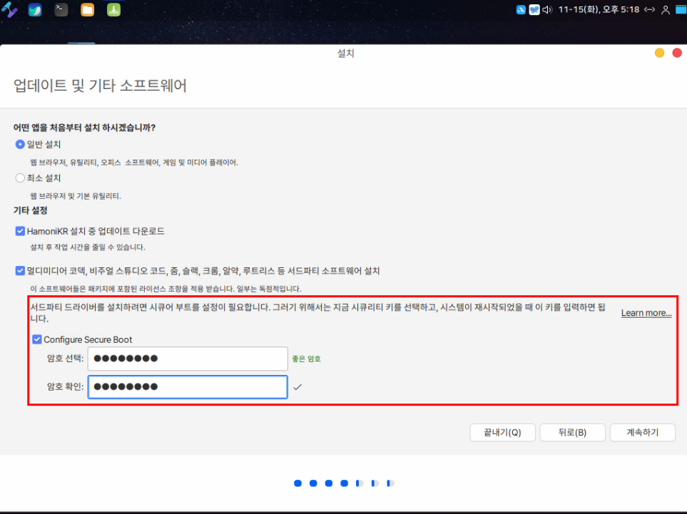<figcaption></figcaption></figure>

기타를 체크하고 계속하기 버튼을 눌러줍니다.

<figure>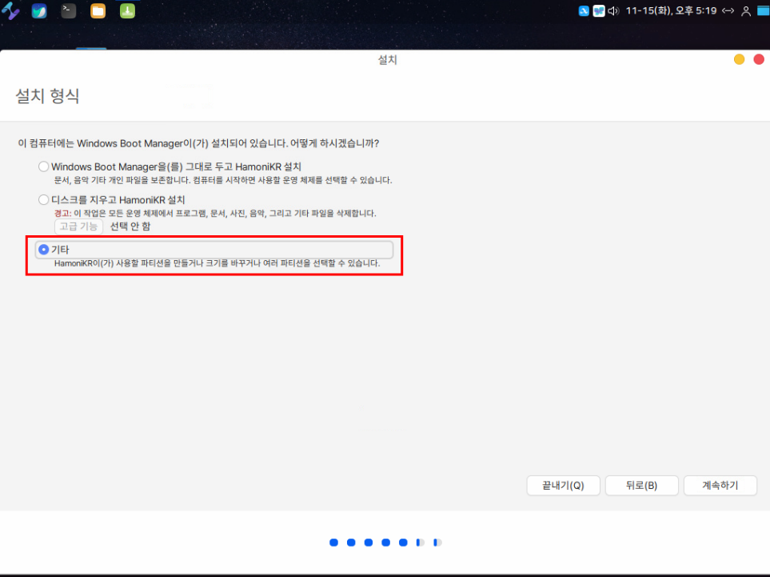<figcaption></figcaption></figure>

윈도우에서 20GB를 축소했던 빈 공간이 남은 공간으로 표시가 됩니다.

\+ 버튼을 눌러줍니다.

<figure>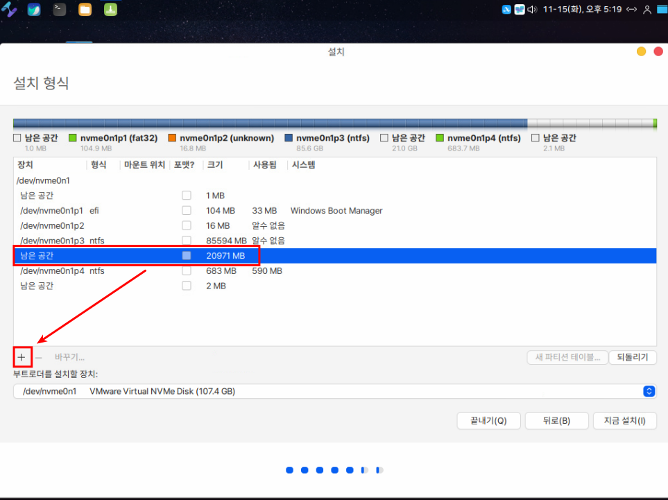<figcaption></figcaption></figure>

20GB 공간에 설치할 것이므로 마운트 위치에 루트( / )를 입력해주고 OK 버튼을 누릅니다.

<figure>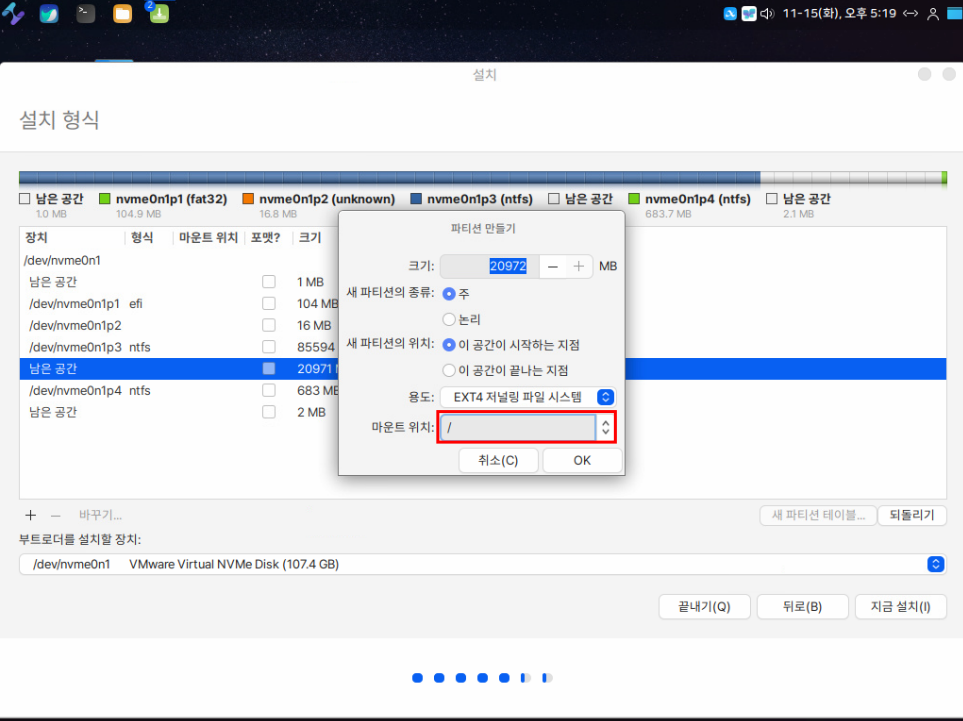<figcaption></figcaption></figure>

윈도우에서 확인하였던 EFI 파티션이 있는 디스크 위치에 하모니카 OS를 부팅할 부트로더를 설치해야 합니다.

아래 이미지처럼 먼저 efi 라고 입력되어 있는 항목의 위치를 확인하고 해당하는 최상단의 장치명을 찾아서 선택해주면됩니다.

선택을 완료했으면 계속하기를 눌러줍니다.

<figure>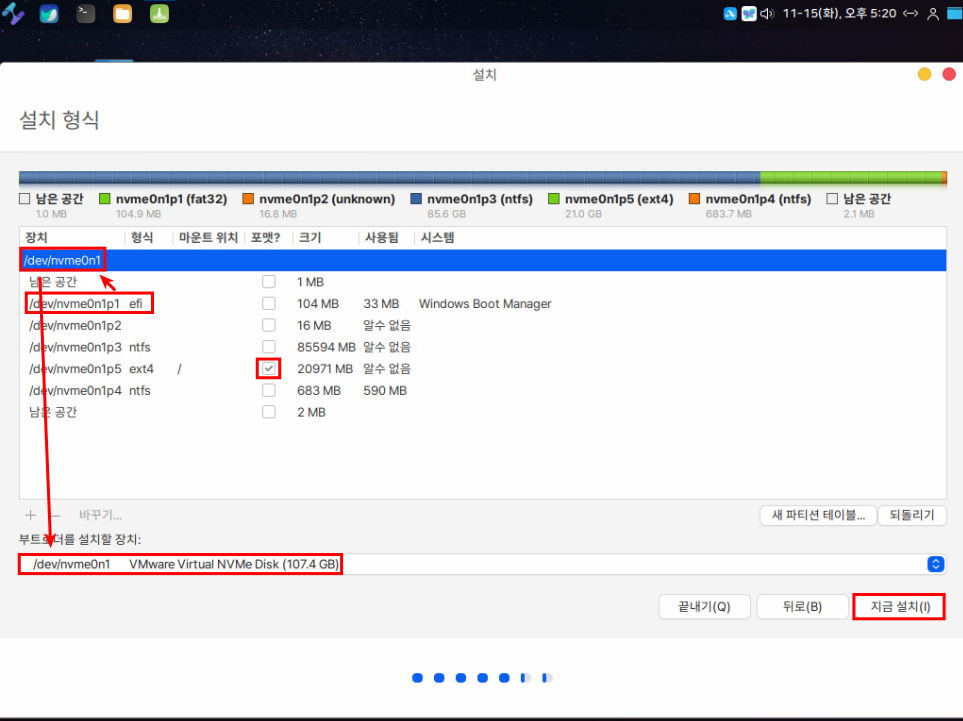<figcaption></figcaption></figure>

위에서 설정했던 변경 내용을 디스크에 쓸지 다시 한번 물어보는 내용입니다.

계속하기를 눌러줍니다.

<figure>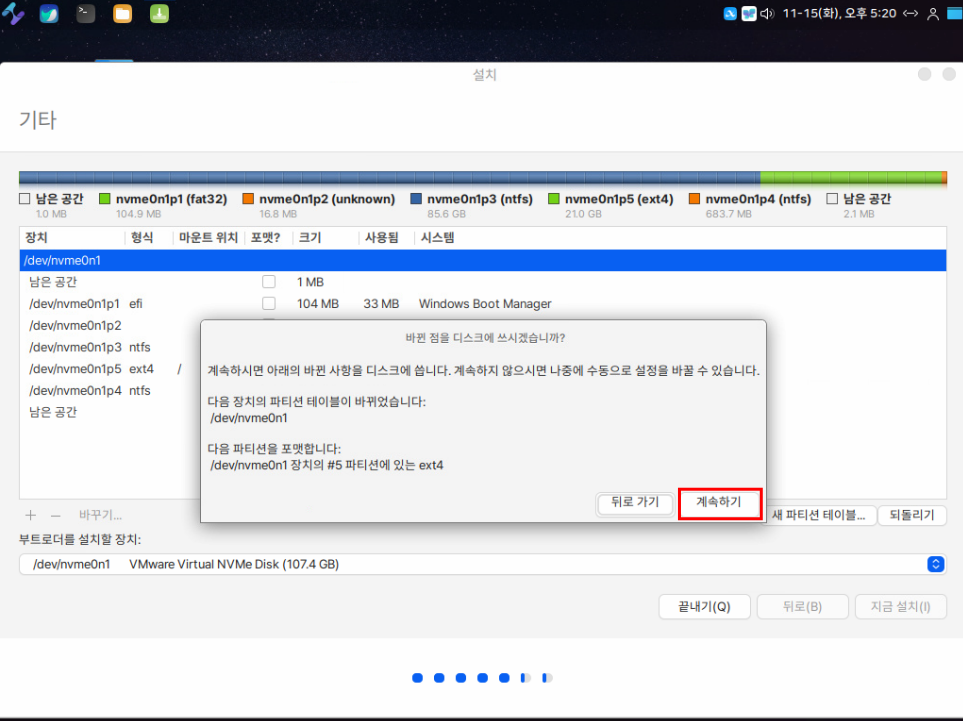<figcaption></figcaption></figure>

살고있는 지역을 선택하여 현재 시간을 설정하는 부분입니다.

계속하기를 눌러줍니다.

<figure>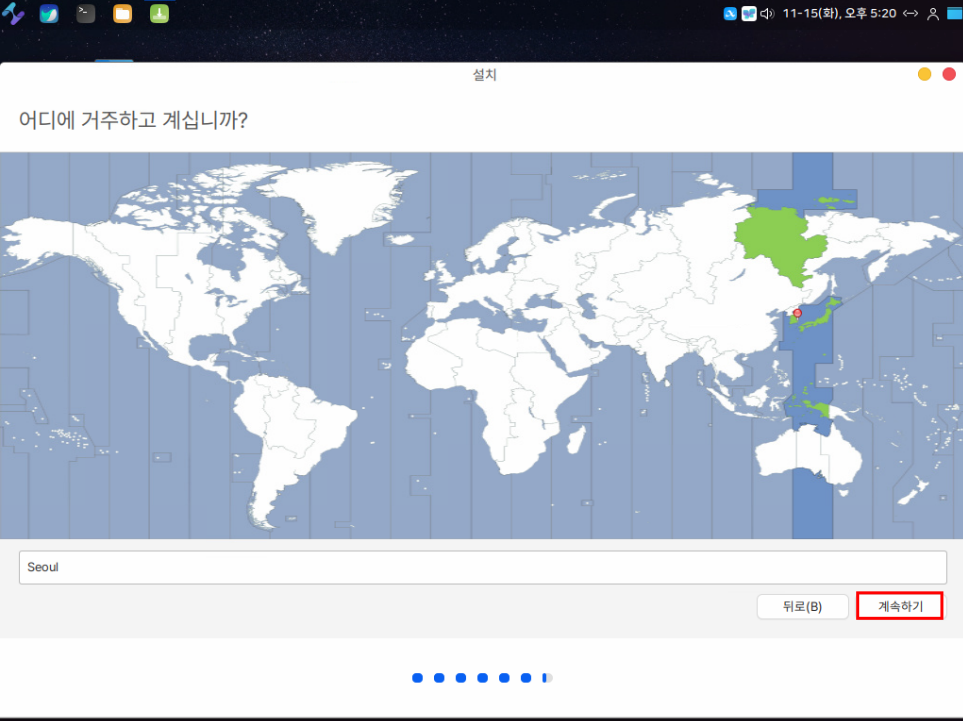<figcaption></figcaption></figure>

사용자 계정 정보를 입력해주는 부분입니다.

계속하기를 눌러줍니다.

<figure>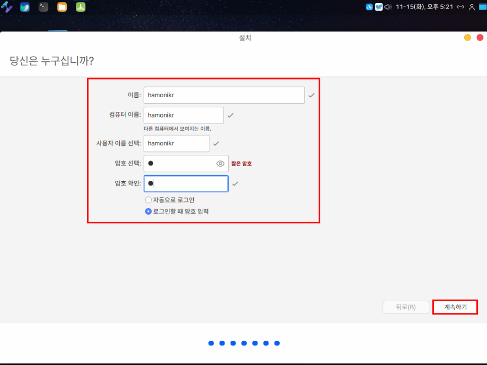<figcaption></figcaption></figure>

설치를 진행합니다.

<figure><figcaption></figcaption></figure>

설치가 완료되면 live부팅을 유지할지 다시 시작할지에 대한 창이 나옵니다.

지금 다시 시작을 눌러줍니다.

<figure><figcaption></figcaption></figure>

다음 화면은 위에서 시큐어 부팅 설정에 체크를하고 비밀번호를 입력한 경우에 보여지는 창입니다.

Continue boot를 선택하면 해당 화면이 스킵이 되며 다시 나오지 않습니다.

Enroll MOK를 선택하면 입력했던 비밀번호를 입력합니다.

<figure>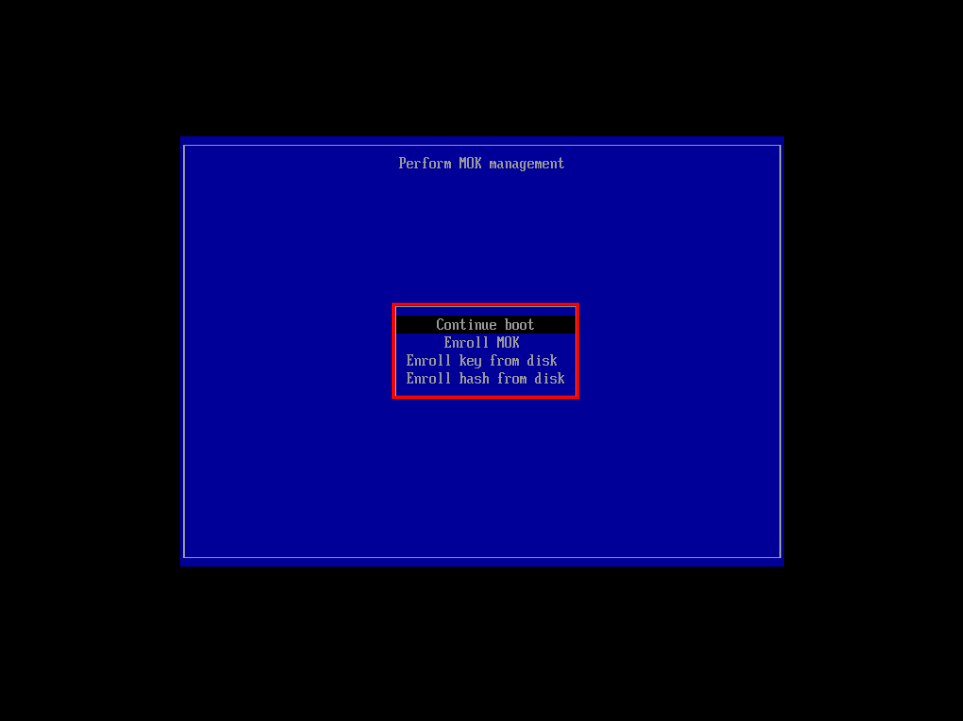<figcaption></figcaption></figure>

듀얼 부팅 설치가 정상적으로 완료되었다면 다음과 같이 듀얼부팅 선택 창이 나오게 됩니다.

하모니카와 윈도우를 자유롭게 선택하여 부팅할 수 있습니다.

하모니카 로그인 화면입니다.

<figure><figcaption></figcaption></figure>

로그인 후 바탕화면입니다.

<figure><figcaption></figcaption></figure>
