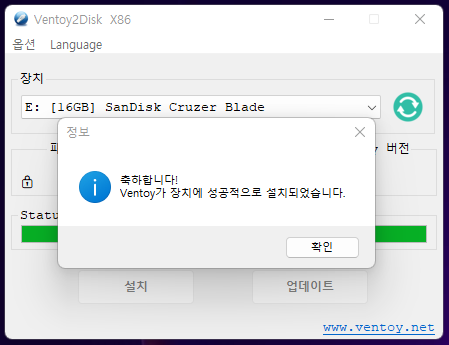

# 하모니카에서 부팅 USB 제작

## **설치 사양** 

| 구분       | 최소사양                                                                                    | 권장사양        |
| -------- | --------------------------------------------------------------------------------------- | ----------- |
| CPU(x64) | 
하모니카는 모든 최신 컴퓨터에 권장됩니다.

(2007 년 이후 판매 된 거의 모든 컴퓨터에는 64bit 프로세서가 장착되어 있습니다)
 |             |
| 메모리      | 1GB 이상                                                                                  | 최적 4GB 이상   |
| 하드디스크    | 10GB 이상(Lite) /20GB 이상                                                                  | 20GB 이상     |
| 해상도      | 800x600                                                                                 | 1024x768 이상 |

## **설치 전 준비사항** 

하모니카를 설치하기 위해서는 하모니카 ISO 파일과 4GB 이상의 USB 메모리가 필요합니다.

### **ISO 다운로드** 

하모니카 ISO 다운로드 주소 입니다.

[\[하모니카 ISO 다운로드 바로가기\]](https://hamonikr.org/download\_KUMKANG)

### **부팅 USB 제작 프로그램** 

윈도우에서 부팅 USB를 만들기 위한 프로그램 입니다.

다양한 종류의 부팅 USB 제작 프로그램이 있습니다.

현재는 가장 간단한 방법으로 만들 수 있는 Ventoy 프로그램을 추천합니다.

[\[Ventoy 부팅 USB 제작 프로그램 다운로드 바로가기\]](https://www.ventoy.net/en/download.html)

&#x20;OS 종류에 맞게 다운로드 할 수 있습니다.

<figure><figcaption></figcaption></figure>

[\[Rufus 부팅 USB 제작 프로그램 다운로드 바로가기\]](https://rufus.ie/)

* 사용하시는 OS에 맞게 다운로드 후 설치하세요

<figure><figcaption></figcaption></figure>

설치하지 않고 간편하게 사용하실 수 있는 포터블 버전을 권장합니다.

## &#x20;

## **부팅 USB 제작** 

### 윈도우에서 부팅 USB 만들기 

#### Ventoy 에서 부팅 USB 만들기

Ventoy를 다운로드 받고 압축을 풀고 Ventoy2Disk.exe를 실행하면 다음과 같은 창이 나옵니다.

<figure><figcaption></figcaption></figure>

상단의 Language를 통해 언어를 변경할 수 있습니다.

<figure><figcaption></figcaption></figure>

옵션에서 파티션 유형을 GPT로 선택합니다.

설치한 윈도우에 따라 파티션을 MBR로 선택해야 할 수 있습니다.

<figure><figcaption></figcaption></figure>

USB를 꽂으면 장치에 해당 USB가 선택된 것이 보입니다.

보이지 않는다면 우측의 새로고침 버튼을 누릅니다.

다양한 USB장치가 꽂혀있다면 직접 선택할 수 있습니다.

부팅 USB를 만들 USB를 선택하였다면 설치버튼을 누릅니다.

포맷 한다는 내용이 나오면 '예' 를 눌러줍니다.

<figure><figcaption></figcaption></figure>

포맷하면 USB안의 내용이 전부 없어지기 때문에 다시한번 확인하는 절차입니다.

'예' 를 눌러줍니다.

<figure><figcaption></figcaption></figure>

포맷이 진행되면서 부팅 USB를 만들고 있습니다.

<figure><figcaption></figcaption></figure>

완료가 되면 확인을 눌러줍니다.

<figure><figcaption></figcaption></figure>

아래 이미지의 우측에 장치 내부의 Ventoy 버전 항목이 표시된다면 정상적으로 설치된 것입니다.

해당 프로그램을 종료하고 USB를 뺏다가 다시 꽂아줍니다.

<figure><figcaption></figcaption></figure>

내 PC 항목에 Ventoy라는 저장 장치 드라이버가 새로 잡힙니다.

<figure><figcaption></figcaption></figure>

해당 위치에 iso 파일을 통째로 넣어주시면 부팅 USB 제작이 완료되었습니다.

iso 파일이 대용량이기 때문에 USB를 바로 뽑으면 문제가 생길 수 있습니다.

**반드시 USB를 안전하게 제거해주세요**

<figure><figcaption></figcaption></figure>

#### Rufus 에서 부팅 USB 만들기

윈도우에서 부팅 USB를 만드는 방법입니다.

다운받은 부팅 USB 제작 프로그램을 실행하면 다음과 같은 창이 나옵니다.

❶ 준비했던 USB를 컴퓨터에 연결 후 장치를 선택해 줍니다.

❷ 선택 부분을 클릭하여 다운받은 하모니카 ISO 이미지를 선택해줍니다.

❸ 파티션 방식을 선택해줍니다. (※ MBR과 GPT 방식 두가지가 있습니다. 최근 사용되고 있는 방식은 GPT 방식입니다. 듀얼 설치시 먼저 설치된 OS의 설치 방식에 따라 맞춰주시면 됩니다.)

❹ 시작을 눌러줍니다.

다음과 같이 추가 작업이 진행된다는 내용이 나올 수 있습니다.

OK를 눌러줍니다.

부팅 USB를 만들기 전에 USB안에 있는 데이터가 삭제된다는 경고 메세지 입니다.

미리 백업을 하지 않으셨다면 취소를 누른 후 데이터를 백업해주세요.

확인을 눌러줍니다.

작업이 끝나면 이미지 하단의 상태 부분의 막대가 초록색으로 되고 시작과 닫기 버튼이 활성화 됩니다.

부팅 USB를 빼시면 됩니다.

### &#x20;
