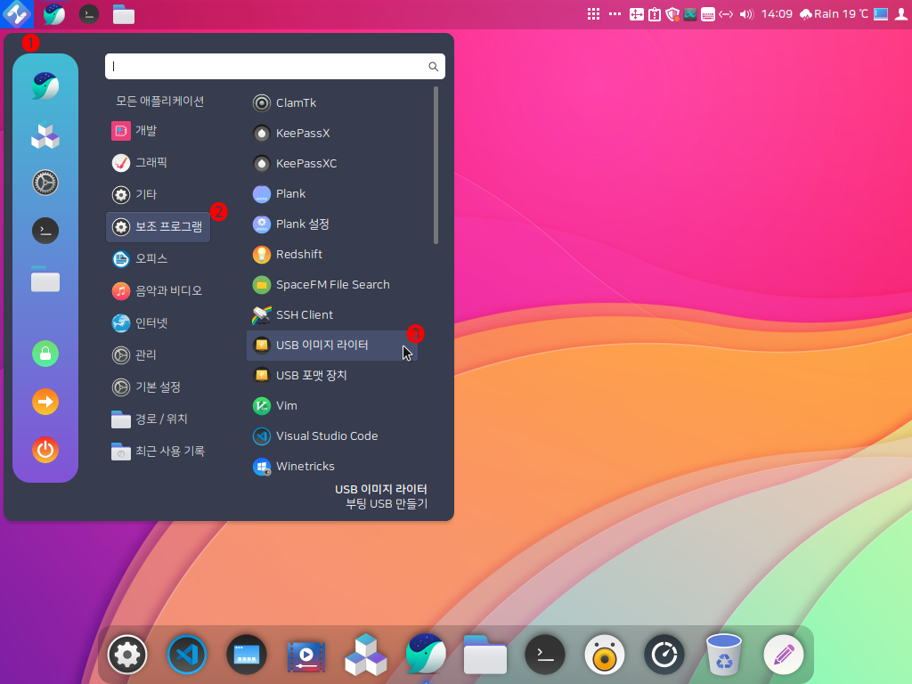
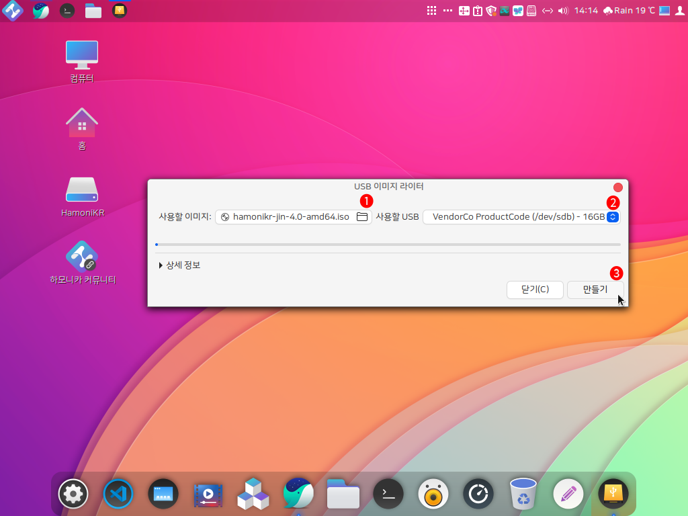
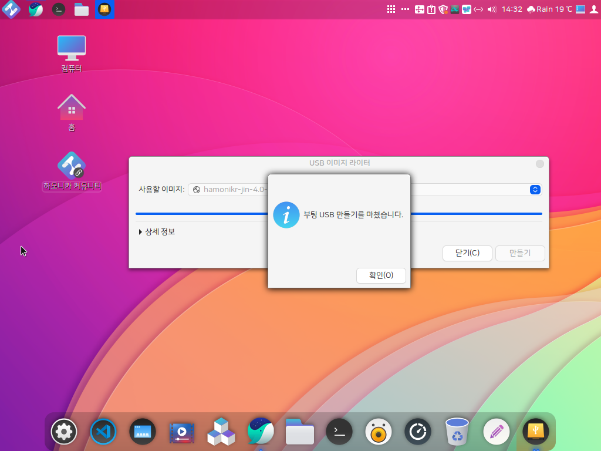

# USB 이미지 라이터로 부팅 USB 만들기

### **USB 이미지 라이터로 부팅 USB 만들기** 

하모니카 OS에서 부팅 USB를 만드는 방법입니다.

하모니카 OS에서는 별 다른 프로그램 없이 부팅 USB를 만들 수 있습니다.

❶ 시작메뉴를 누릅니다.

❷ 보조 프로그램을 누릅니다.

❸ USB 이미지 라이터를 클릭하여 실행합니다.

❶ 다운받은 하모니카 ISO 이미지를 선택합니다.

❷ 준비했던 USB를 컴퓨터에 연결하면 연결한 USB를 선택할 수 있게 목록이 나오게 됩니다. (※ 부팅 USB 제작시 기존 USB에 있던 내용이 지워집니다. 백업 필수!)

❸ 만들기를 누르면 부팅 USB를 만들기 위한 작업이 시작됩니다.

부팅 USB작업이 시작되면 100%가 될 때까지 기다립니다.

부팅 USB를 제작할 때 다른 작업을 하면 정상적으로 만들어지지 않을 수 있습니다.

부팅 USB 제작이 완료되면 다음과 같은 창이 나오게 됩니다. '확인' 버튼을 눌러 완료하고 USB를 빼시면 됩니다.
