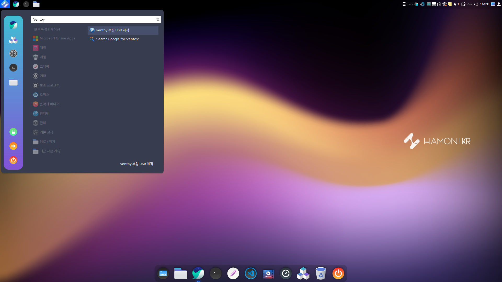
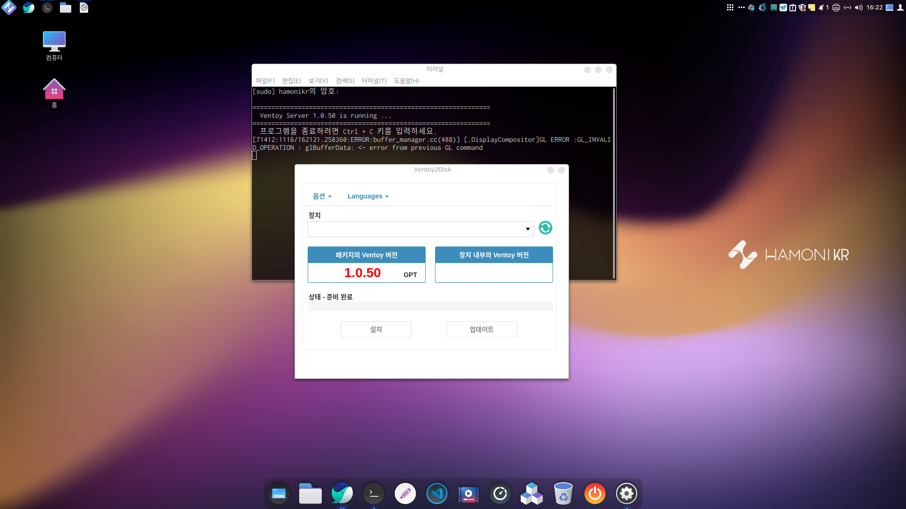
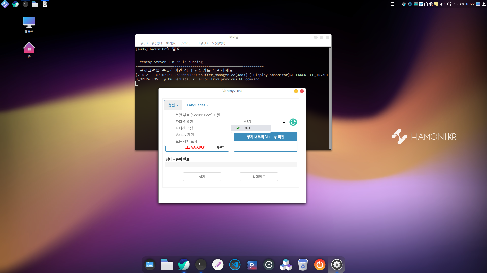
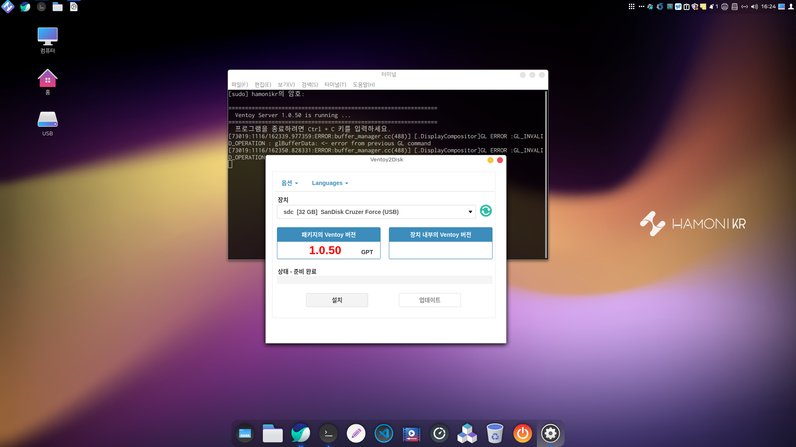
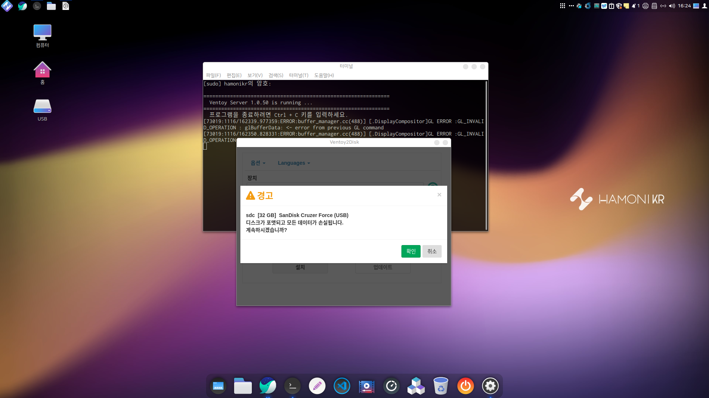
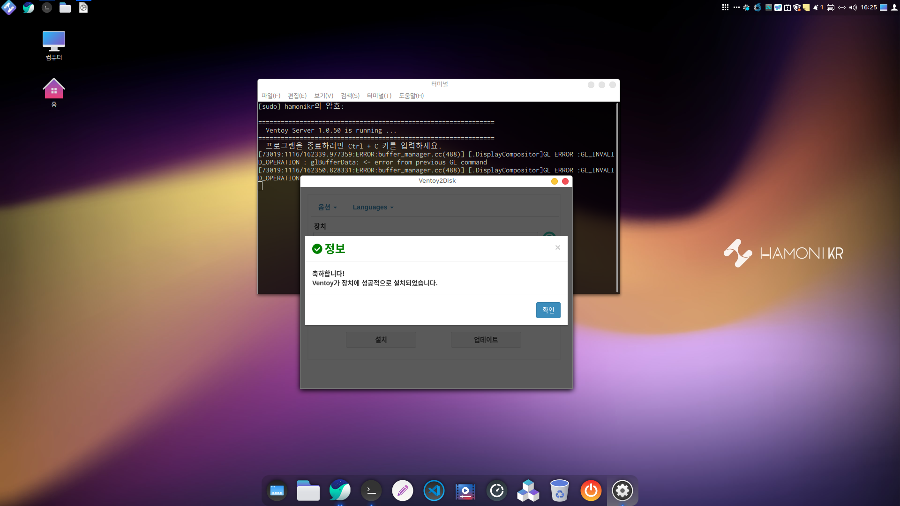
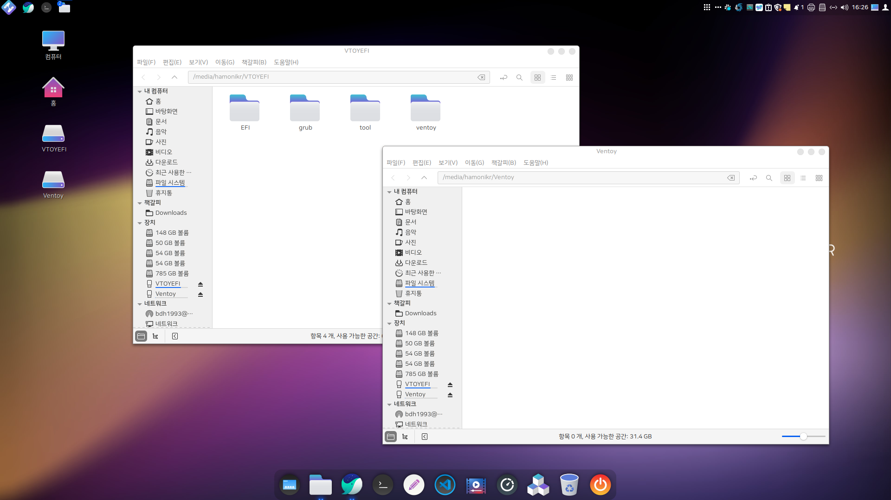
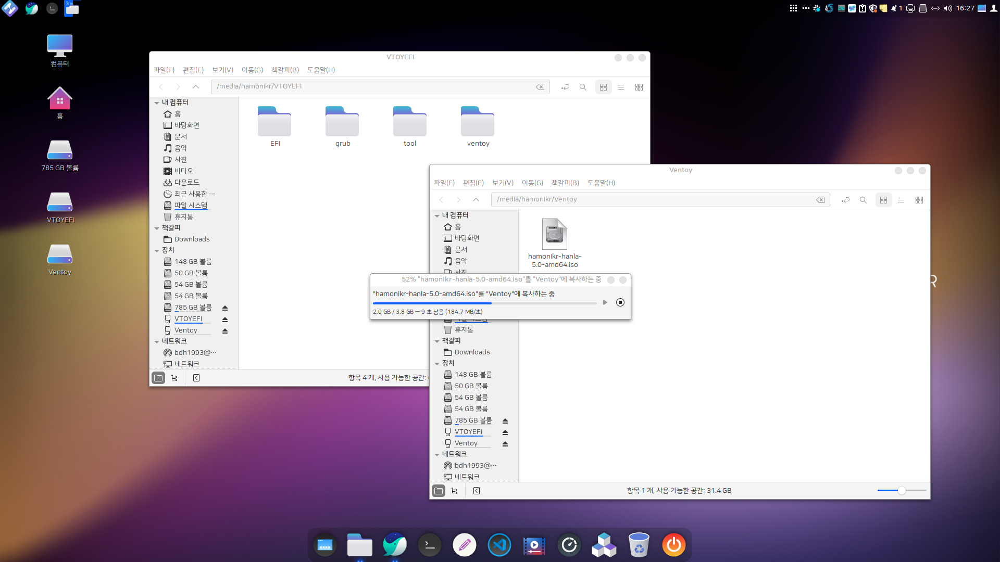
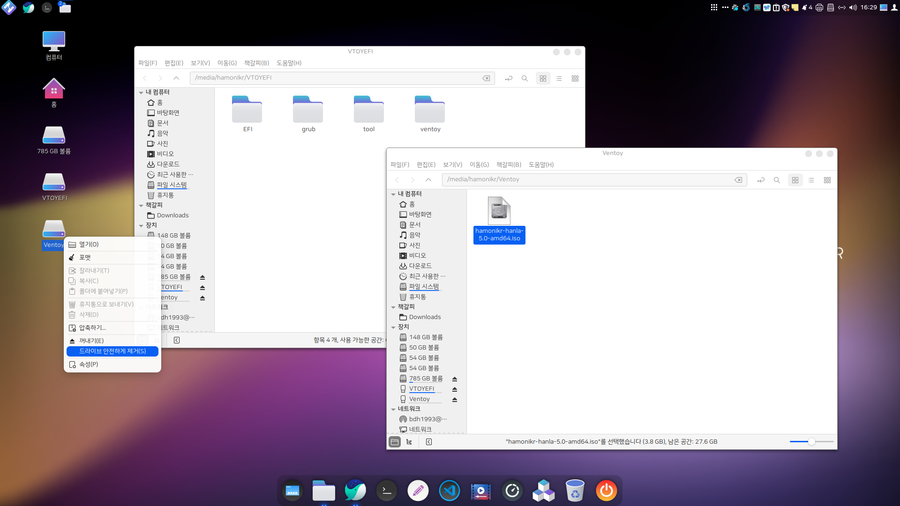
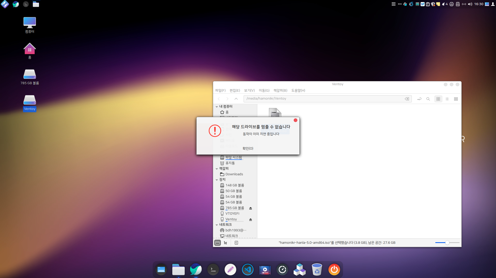

# Ventoy 부팅 USB만들기

### Ventoy 부팅 USB 만들기

기본 설치되어 있는 Ventoy를 이용하여 쉽게 부팅 USB를 만들고 간편하게 설치하실 수 있습니다.

시작 메뉴에서 ventoy를 검색하여 실행합니다.

터미널 창이 하나 열려 비밀번호를 입력하면 GUI 화면이 나옵니다.

파티션 유형을 MBR로 할지 GPT(기본설정)로 할지 선택해줍니다.

부팅 USB를 만들 USB를 컴퓨터에 연결하고 새로고침 버튼을 눌러 해당 USB가 목록에 나오는지 확인합니다.

설치 버튼을 누르면 다음과 같이 USB가 초기화 된다는 경고 메세지가 나오게 되는데 확인을 눌러 주시면 됩니다.

설치가 완료되면 다음과 같이 완료 메세지가 나오고 확인을 누른 후 Ventoy 프로그램을 종료 합니다.

USB를 연결해제 했다가 다시 연결하면 다음과 같이 바탕화면에 VTOYEFI, Ventoy 이름의 아이콘 2개가 생기면서 창이 2개 뜹니다.

VTOYEFI는 부팅 USB역할을 할 수 있게 도와주는 파일이 설치되어 있는 공간이고 Ventoy는 부팅할 ISO파일을 넣는 공간입니다.

부팅 USB를 만들 ISO 파일을 통째로 복사하여 붙여넣습니다.

복사가 완료되면 반드시 USB를 바로 뽑지 마시고 우클릭을 하여 USB를 안전하게 제거해야 합니다.

VTOYEFI, Ventoy 둘다 안전하게 제거해주시면 됩니다.

<mark style="color:red;">**USB를 안전하게 제거해야 되는 이유입니다.**</mark>

작은 파일은 바로 복사가 되지만 큰 파일의 경우는 다음과 같이 파일은 복사되었다고 나오지만 실제로 데이터가 옮겨지는데 시간이 걸리게 됩니다.

다운받을 때에도 마찬가지로 대용량 파일을 다운받고 나서 100퍼센트가 되었는데 완료가 안되고 조금 기다려야 하는 것과 같은 상황입니다.

Ventoy가 안전하게 제거되면 다른 부팅 USB와 마찬가지로 재부팅하여 정상적으로 부팅이 되는지 확인하시면 됩니다.
