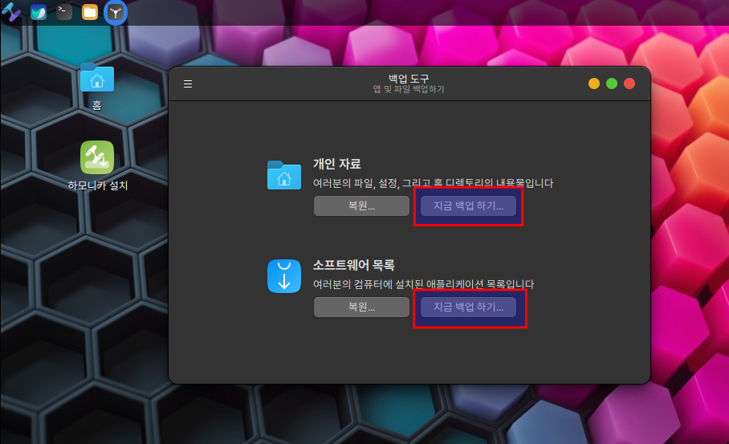
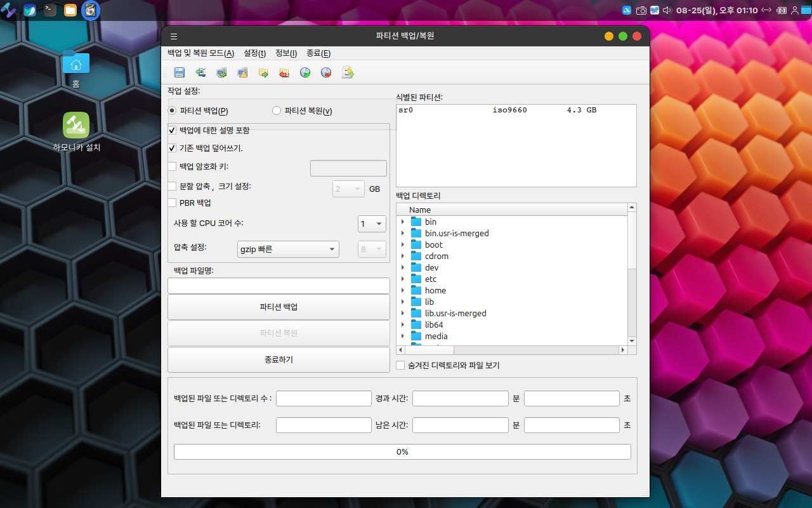

# 하모니카 7.0에서 8.0으로 업그레이드

## <mark style="color:blue;">업그레이드 주의 사항</mark>

<mark style="color:red;">**반드시 백업하세요.**</mark>

업그레이드할 때 가장 중요한 것은 개인 데이터입니다. 어떤 일이 생겨 운영 체제가 잘못되어도 다시 설치할 수 있습니다.  하지만 데이터를 잃어버리면 복구할 방법이 없으니 **꼭, 외부 장치(USB 또는 외장 하드 디스크)에서 개인 데이터를 백업 하세요**

<mark style="color:red;">**하드웨어 호환성을 확인하세요**</mark>

새로운 커널이 사용되기 때문에 하드웨어가 정상 동작하지 않을 수 있습니다.

예를 들어, 현재 정상적으로 작동하는 그래픽 카드 또는 무선 어댑터가 업그레이드하려는 최신 버전의 하모니카OS 에서 동작하지 않을 수도 있습니다.

업그레이드를 진행하기 전에, 먼저 ISO 이미지를 USB에 제작한 후, **라이브 부팅 환경으로 하드웨어가 인식되는지 확인**하세요.


## <mark style="color:blue;">업그레이드 방법의 차이점</mark>

### ISO 업그레이드

새 버전의 ISO 이미지를 사용하여 새 설치를 수행하고 기존 파티션을 덮어쓰는 방식입니다.

* ISO 다운로드 바로가기 : [https://hamonikr.org/download\_paektu](https://hamonikr.org/download\_paektu)

<mark style="color:red;">**이 방법은 하모니카를 업그레이드하는 데 권장되는 방법**</mark>이며 다음과 같은 이점을 제공합니다.

1. **시간 절약**: 하모니카 OS 설치는 일반적으로 15분 정도 소요됩니다. 새 버전의 ISO 이미지에는 압축 데이터가 포함되어 있습니다. ISO 이미지를 다운로드해서 업그레이드하는 것이 저장소에서 시스템을 업그레이드하는 것보다 훨씬 빠릅니다.
2. **신뢰성**: 먼저 라이브 부팅을 사용하여 새 버전에서 하드웨어를 테스트할 수 있습니다. 잘못 동작하는 것이 있으면 미리 문제를 확인할 수 있습니다.&#x20;
3. **품질 보증**: 새 버전의 하모니카 OS를 새로 설치하게 됩니다. 즉, 개발 팀에서 완전히 테스트한 시스템입니다.

### **Rolling 업그레이드**

이 방법은 현재 사용하고 계시는 하모니카 7.0에서 하모니카 8.0으로 쉽게 업그레이드가 가능합니다.&#x20;

<mark style="color:red;">**주의. 하모니카 7.0 이 아닌 다른 버전은 지원되지 않습니다.**</mark>

"패키지" 업그레이드는 다음 단계로 구성됩니다.

1. 패키지 저장소를 최신 버전의 주소로 변경
2. 전체 업그레이드 수행

이러한 방식으로 시스템을 업그레이드하는 것에 대한 장단점은 다음과 같습니다.

**단점**:

* **오랜 시간 소요**: 시스템에 설치된 모든 패키지의 새 버전을 저장소에서 다운로드 하기 때문에 시간이 많이 소요됩니다. (인터넷 속도와 시스템 사양에 따라 다르지만, **일반적으로 1시간 정도** 걸립니다.)
* **문제 발생의 가능성**: 사용자 수정 사항, 소스, 추가된 소프트웨어 및 구성, 시스템의 네트워크 안정성 등 다양한 요인으로 인해, 업그레이드 중간에 실패하거나, 새로운 버전과는 다르게 느린 성능으로 동작할 수 있습니다.&#x20;
* **데이터 손실 위험**: 패키지로 업그레이드할 때 백업을 수행하지 않는 경우가 많습니다. 반드시 중요한 데이터를 백업하세요.
* **복잡함**: 일반적으로 마이너 업그레이드의 경우(7.0 -> 7.1)는 보통 별다른 문제가 없지만, 메이저 업그레이드의 경우(7.0 -> 8.0)에는 커널이 크게 달라지고 여러 패키지가 서로 충돌하고 복잡한 종속성이 있어서 해결하기 어려운 상황에 놓일 수 있습니다.

**장점**:

* **자동화**: 문제가 발생하지 않는다면, 모든 것을 자동으로 해줍니다.

## <mark style="color:blue;">ISO 업그레이드 하기</mark>

업그레이드 시간도 적게 소요되며, 배포하는 ISO 이지미는 완전히 하모니카 개발팀에서 테스트 한 상태이기 때문에, 특별한 이유가 없는 한 이 방식을 사용해서 업그레이드 하는것이 권장됩니다.

다음의 과정으로 새 하모니카를 사용할 수 있습니다.

* ISO 이미지로 부팅 USB 준비
* 현재 사용중인 시스템의 중요 데이터 백업
* ISO 이미지로 하모니카 설치
* 백업한 데이터 복원하기

### 1. ISO 이미지로 부팅 USB 준비

* ISO 이미지 다운로드 : [https://hamonikr.org/download\_paektu](https://hamonikr.org/download\_paektu)

먼저 다운로드 받은 새 버전의 하모니카 ISO 이미지를 부팅이 가능한 USB로 제작합니다. 부팅 USB 제작 방법은 아래 문서를 참고하세요.

* [https://docs.hamonikr.org/hamonikr-8.0/install/makebootusb/usb-usb](makebootusb/usb-usb.md)
* [https://docs.hamonikr.org/hamonikr-8.0/install/makebootusb/ventoy-usb](makebootusb/ventoy-usb.md)

### 2. 현재 사용중인 시스템의 중요 데이터 백업

ISO 이미지로 부팅하면 라이브 시스템 메뉴에 2가지 백업 도구가 있습니다.

**메뉴 > 관리 > 백업 도구**

이 프로그램은 중요한 데이터를 외장 하드 디스크 또는 USB에 백업하고, 추후에 복원할 수 있습니다.

<figure><figcaption></figcaption></figure>

**메뉴 > 관리 > 파티션 백업 복구**

이 프로그램은 파티션 단위로 데이터를 백업하고 복구할 수 있습니다.

실행하면 비밀번호를 묻는 창이 나옵니다. 비밀번호는 **hamonikr** 를 입력하세요.

<figure><figcaption></figcaption></figure>

자세한 사용법은 [qt-fsarchive 문서](../key-features/undefined-1/qt-fsarchive.md)를 참고하세요.

### 3. ISO 이미지로 하모니카 설치

설치 과정은 [하모니카 설치하기 문서](installhamonikr.md)를 참고하세요.

### 4. 백업한 데이터 복원하기

백업에 사용한 프로그램을 사용해서, 백업한 데이터를 복원하고 새 하모니카를 사용합니다.


## <mark style="color:blue;">**Rolling**</mark> <mark style="color:blue;"></mark><mark style="color:blue;">업그레이드 하기</mark>

업그레이드 하는 순서는 다음과 같습니다.

1. 사용중인 하모니카 7.0에서 패키지를 최신 상태로 만든다.
2. 하모니카 8.0으로 업그레이드 시작한다.&#x20;
3. 재부팅&#x20;
4. 끝.

### 1. 패키지 업데이트

하모니카 8.0으로 업그레이드 하기 위해서는 사용 중인 하모니카 7.0의 패키지를 최신 상태로 모두 업그레이드 해야합니다.

먼저 저장소 리스트를 최신화 합니다.

**방법1. 터미널에서 패키지 업그레이드.**

```bash
$ sudo apt update
$ sudo apt -y upgrade
```

**방법2. "업데이트 매니저" 애플리케이션에서 패키지 업그레이드.**

최신 상태로 패키지 업그레이드 완료가 되면, 새 하모니카 8.0으로 업그레이드 준비가 완료된것을 의미하며, 실행하신 터미널 또는 업데이트 메니저를 종료해주세요.

참고로 하모니카 8.0으로 업그레이드를 위한 패키지는 "hamonikr-upgrade-info"입니다.&#x20;

다음과 같이 버전을 확인해서 <mark style="color:red;">**3.5.0 이상의 hamonikr-upgrade-info 패키지가 설치되었는지 확인**</mark>하시고, 만일 3.5.0 보다 더 하위의 버전인 경우 hamonikr-upgrade-info 패키지를 먼저 업데이트 하신 후 업그레이드를 진행해야 합니다.

```
$ dpkg -l hamonikr-upgrade-info 
```

만약 설치된 패키지가 3.5.0 보다 하위의 버전이면, hamonikr-upgrade-info 를 최신 버전으로 업데이트 후, 업그레이드를 시도해야 합니다.

```
희망상태=알수없음(U)/설치(I)/지우기(R)/깨끗이(P)/고정(H)
| 상태=아님(N)/설치(I)/설정(C)/풀림(U)/절반설정(F)/일부설치(H)/트리거대기(W)/
| /    트리거밀림(T)
|/ 오류?=(없음)/다시설치필요(R) (상태, 오류가 대문자=불량)
||/ 이름                  버전         Architecture 설명
+++-=====================-============-============-=================================
ii  hamonikr-upgrade-info 3.5.0        all          Information about upgrade paths
```

### 2. 업그레이드 시작

먼저 터미널을 실행합니다. 단축키 Ctrl+Alt+T 로 실행 하거나, 프로그램 메뉴에서 터미널을 실행합니다.


우선, 사용자를 root 로 전환합니다.&#x20;

```
sudo -s
```

아래와 같이 비밀번호를 묻는 화면에서 시스템 root 의 비밀번호를 입력하세요.

<figure><figcaption></figcaption></figure>

터미널창에서 "do-upgrade"을 입력 후 엔터키를 눌러주세요.&#x20;

```
do-upgrade
```

다음과 같은 설치 진행을 위한 안내 메시지가 나오면 "Y" 또는 "y"를 누르시면 업그레이드가 시작됩니다.&#x20;

<figure><figcaption></figcaption></figure>

패키지 삭제, 새 저장소 추가, 시스템 메이저 업그레이드, 새 패키지 업데이트 등 많은 작업을 수행하기 때문에 업그레이드를 진행하는데 시간이 오래 소요됩니다.&#x20;

인터넷 속도와 시스템 성능에 따라 다르지만, 일반적으로 1시간 정도 소요됩니다.

.png>)이제 커피를 한잔 마시며 기다립니다...

정상적으로 업그레이드가 완료되면, 시스템 재시작을 확인하는 화면이 보입니다.

가볍게 엔터를 눌러주세요 이제 시스템을 재시작한 후 새 버전의 하모니카를 사용하시면 됩니다.&#x20;

<figure><figcaption></figcaption></figure>

