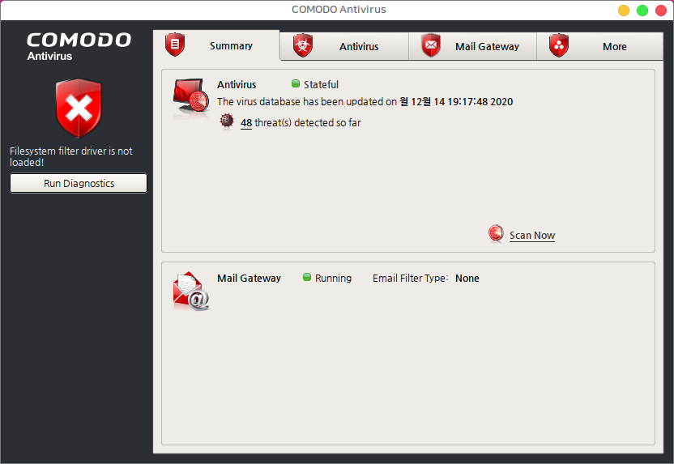
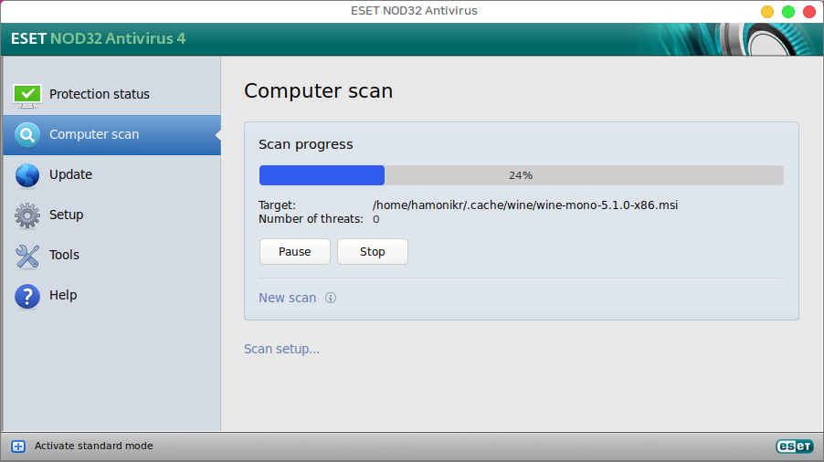

# 하모니카에서 바이러스 백신 사용하기

하모니카 4.0에 기본으로 제공하는 백신은 ClamAV 패키지와 ClamTK 패키지입니다.

백신 프로그램은 잘 동작하지만 하지만 ClamTK의 경우 UI가 간혹 멈추는 버그가 있습니다.

혹은  ClamAV 프론트엔드로 ClamAV-GUI([https://www.linux-apps.com/p/1127892/](https://www.linux-apps.com/p/1127892/)) 라는 다른 패키지를 설치해서 사용할 수 도 있습니다.

그외 국내에서 제공하는 백신 프로그램은 안랩의 V3와 이스트소프트의 알약이 있지만 개방형OS 버전은

사용자를 위한 프로그램 인터페이스가 웹 페이지 형식으로 제공되고 있어서 개선이 필요합니다.

## 추천 백신 프로그램 

해외의 바이러스 백신 프로그램 중 하모니카 4.0에서 사용할 수 있는 백신은 다음과 같습니다.

* COMODO Antivirus
* ESET NOD32 Antivirus 4 for Linux Desktop

## COMODO Antivirus 

COMODO 백신 다운로드

[https://www.how2shout.com/how-to/how-to-install-comodo-antivirus-for-linux-via-command-line-on-ubuntu.html](https://www.how2shout.com/how-to/how-to-install-comodo-antivirus-for-linux-via-command-line-on-ubuntu.html)

\
다운로드 받은 파일은 이전 버전의 패키지 의존성을 요구하고 있지만, 하모니카 4.0 에는 최신 버전의 libssl 패키지가 설치되어 있기 때문에\
아래와 같이 의존성 요구를 무시하고 설치할 수 있습니다.

1\) 패키지 설치\
sudo dpkg –ignore-depends=libssl0.9.8 -i cav-linux\_x64.deb

\
2\) 프로그램 초기 설정\
설치 후 아래와 같이 초기 설정을 위한 파일을 실행합니다.\
sudo /opt/COMODO/post\_setup.sh

실시간 파일 감시를 위한 커널 모듈을 설치하려고 하지만 하모니카 4.0에서 사용하는 최신커널에 적합한 모듈이 아니기 때문에 오류가 발생합니다.\
이 모듈은 소스코드가 없기 때문에 커널에 맞는 모듈을 설치할 수는 없는 상황이며, 백신의 기능 중 실시간 파일 감시 기능을 제외하고 사용할 수 있습니다.

3\) 서비스 구동파일 수정\
이후 서비스를 구동하는 부분에서 하모니카를 인식하지 못하기 때문에 서비스 구동파일을 수정해야 합니다.

/opt/COMODO/load\_cav.sh\
/opt/COMODO/load\_cmdagent.sh\
/opt/COMODO/load\_cmgdaemon.sh

이 3개의 파일에서 아래와 같은 부분을 수정해야 하모니카에서 정상적으로 서비스를 구동할 수 있습니다.

Debian|Ubuntu|Mint) -> Debian|Ubuntu|Mint|HamoniKR)

* 하모니카 4.0에서 설치할 수 있는 COMODO 백신 패키지 : [cav-linux\_hamonikr1.deb](https://app.gitbook.com/s/-MOdedbke\_kpJqE1CY2X/tips/A1/attachments/68420471/68420537.deb)

서비스를 구동하면 다음과 같은 화면이 나옵니다.

한글 지원은 되지 않으며, 실시간 파일 감시 기능을 제외한 다른 기능을 무료로 사용할 수 있습니다.

## ESET NOD32 

ESET NOD32 백신의 경우, 여기 링크([https://www.eset.com/int/home/antivirus-linux/download/](https://www.eset.com/int/home/antivirus-linux/download/))에서 설치파일을 다운로드 받은 후&#x20;

설치파일에 실행 권한을 주고 루트권한으로 설치파일을 실행하면 아무런 오류없이 설치가 완료됩니다.

이 백신은 무료가 아니라 유료 프로그램이며 설치가 완료되면 체험판으로 등록해서 30일간 사용할 수 있습니다.

* 프로그램 구매 : [https://shop.estc.co.kr/product\_list\_dx.php?category1=ESET\&category2=NOD32%20Antivirus](https://shop.estc.co.kr/product\_list\_dx.php?category1=ESET\&category2=NOD32%20Antivirus)

