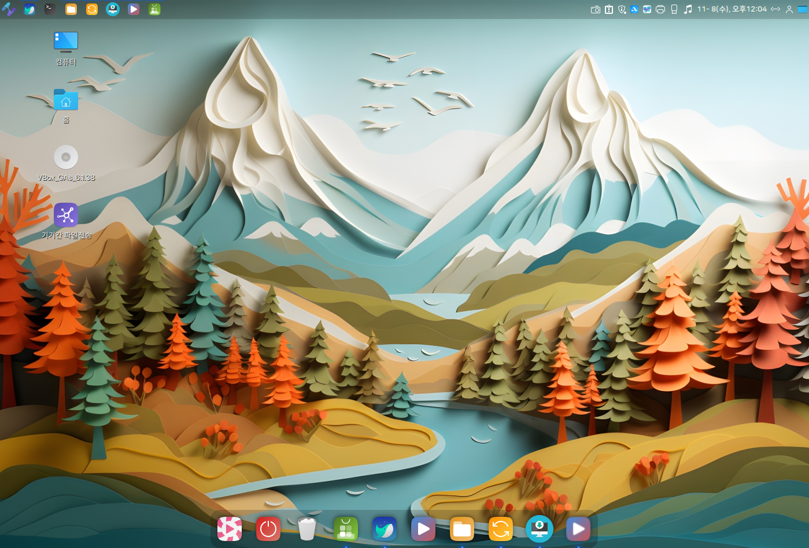

# 마우스 제스처를 지원하는 스마트 패널 기능

마우스 제스처와 키보드 단축키를 이용해서 스마트 패널 기능의 사용이 가능합니다.&#x20;

### 1. 모든 창 보기&#x20;

패널에 마우스 커서를 두고 클릭한채로 바탕화면쪽으로 드래그하거나  "Ctrl+Alt+아래방향키"를 누르면 열려있는 모든 창을 확인하고 원하는 창으로 이동할 수 있습니다.&#x20;

<figure><figcaption></figcaption></figure>

<figure><figcaption></figcaption></figure>

패널에 마우스 커서를 두고 휠 버튼을 누르면 열려있는 창 확인이 가능하고 스크롤을 내리면 원하는 창으로 이동이 가능합니다.&#x20;

<figure><figcaption></figcaption></figure>

### 2. 작업공간 이동

패널에 마우스 커서를 두고 스크롤을 내리거나, 커서를 두고 클릭한 채로 마우스를 좌우로 드래그하면 작업공간 이동이 가능합니다. "Ctrl+Alt+좌우방향키"를 통해서도 작업공간을 이동할 수 있습니다.  &#x20;

<figure><figcaption></figcaption></figure>

"Ctrl+Alt+위방향키"를 통해서는 모든 작업공을 확인할 수 있습니다.&#x20;

<figure><figcaption></figcaption></figure>

### 3. 바탕화면 보기&#x20;

패널을 더블클릭하면 바탕화면이 보여지고, 다시 한번 더블클릭하면 원래 열려있던 창들이 화면에 보여집니다.&#x20;

<figure><figcaption></figcaption></figure>

<figure><figcaption></figcaption></figure>

 

<figure><figcaption></figcaption></figure>

### 4. 스마트패널 설정&#x20;

시작메뉴의 확장 프로그램에서 스마트 패널 기능을 원하는대로 설정할 수 있습니다.

Albert (alt + space) 또는 프로그램 메뉴에서 "확장 프로그램" 을 실행합니다.&#x20;

<figure><figcaption></figcaption></figure>

스마트 패널 우측의 톱니바퀴 모양을 클릭하면 설정화면이 보여지고 옵션 변경이 가능합니다.&#x20;

<figure><figcaption></figcaption></figure>

<figure><figcaption></figcaption></figure>

&#x20;

