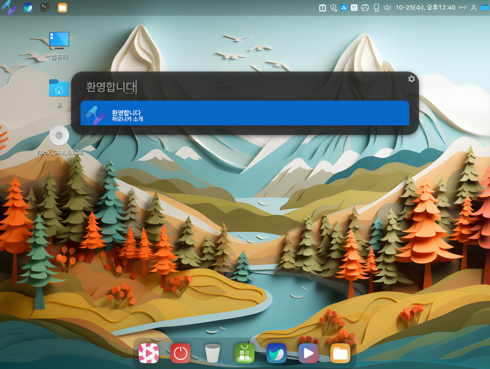
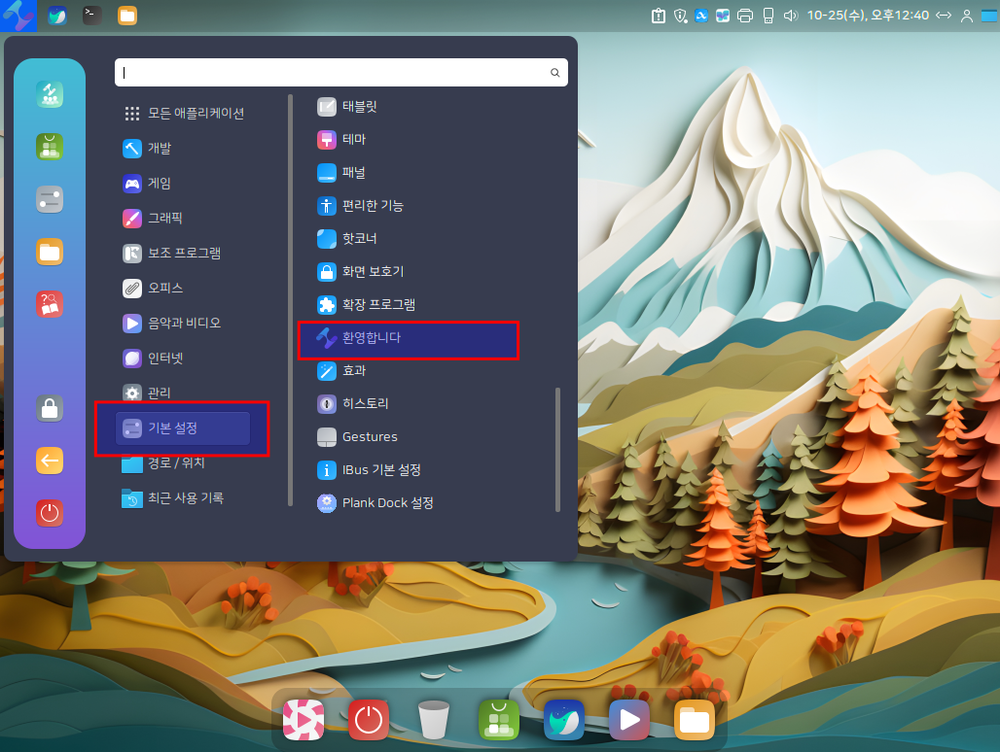
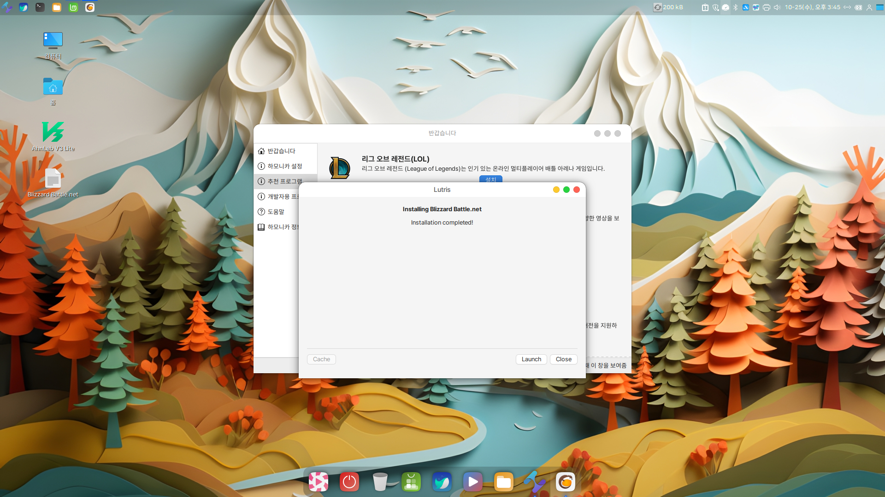
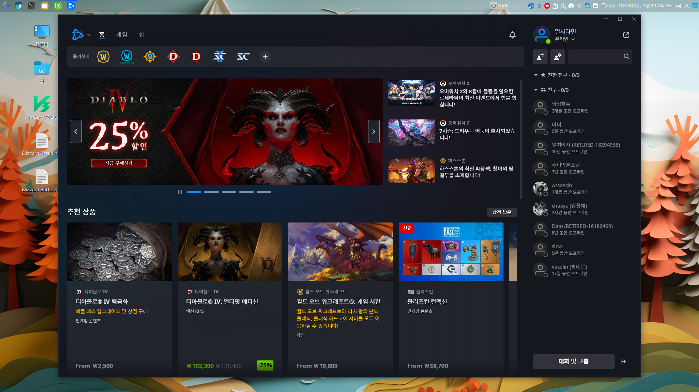
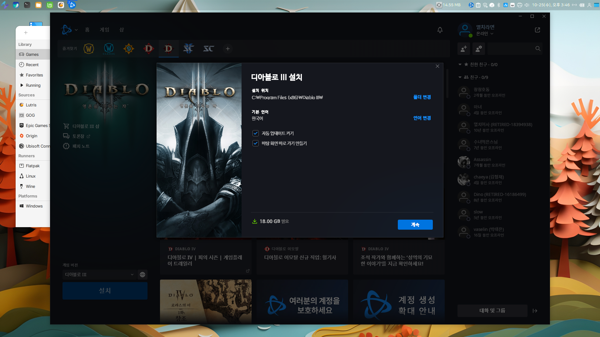
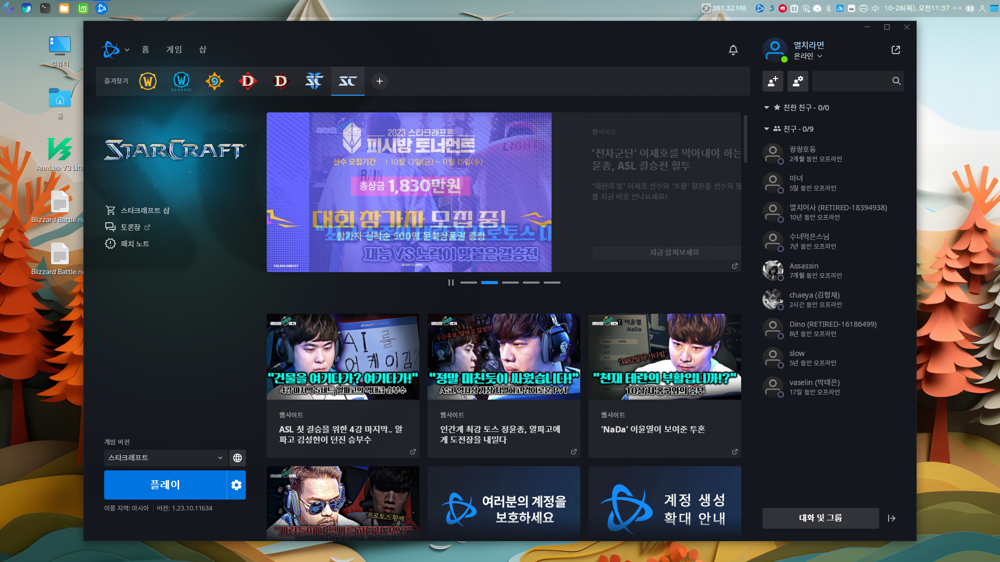
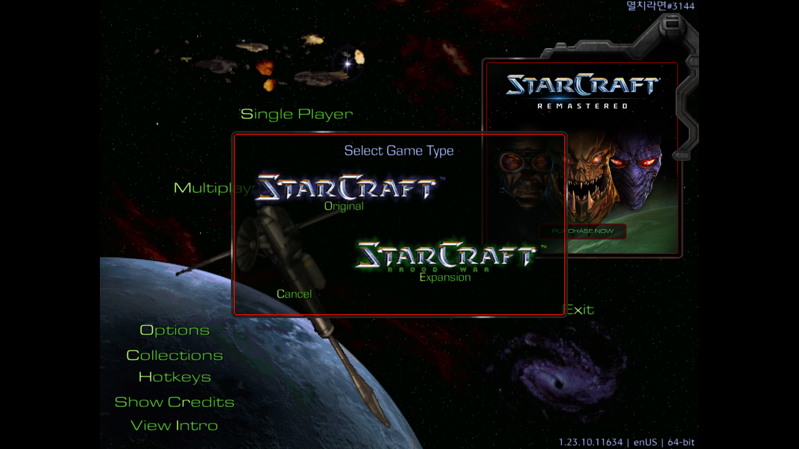

# 배틀넷(battleNet) 설치

HamoniKR OS에서 배틀넷 설치하여 스타크래프트, 디아블로등등 게임을 하실 수 있습니다.

### 블리자드 배틀넷 설치하기.

1. 프로그램 메뉴 또는 Albert(alt +space)를 이용해서 "환영합니다" 프로그램을 실행합니다.&#x20;

<figure><figcaption></figcaption></figure>

 

<figure><figcaption></figcaption></figure>

2. "환영합니다" 프로그램에서 "추천 프로그램 > 배틀넷"의 "설치" 버튼을 클릭합니다.&#x20;

<figure><figcaption></figcaption></figure>

3. Lutris 업데이트 확인이 진행된 후 블리자드 배틀넷 설치를 위한 Lutris 창이 활성화되며, "Install" 버튼을 클릭합니다.&#x20;

<figure><figcaption></figcaption></figure>

4. "Install" 버튼을 클릭합니다.

<figure><figcaption></figcaption></figure>

5. "Continue" 버튼을 클릭합니다.

<figure><figcaption></figcaption></figure>

6. Lutris에 블리자드 배틀넷 설치가 진행되며,&#x20;

<figure><figcaption></figcaption></figure>

 

<figure><figcaption></figcaption></figure>

7. 블리자드 배틀넷에 사용하실 언어를 선택 후 "계속" 버튼을 클릭합니다.

<figure><figcaption></figcaption></figure>

 

<figure><figcaption></figcaption></figure>

8. "컴퓨터 시작할 때 BATTLE.NET 실행 옵션을 선택하신 후 "계속" 버튼을 클릭합니다.

<figure><figcaption></figcaption></figure>

 

<figure><figcaption></figcaption></figure>

9. **중요! 배틀넷 로그인창이 실행되는데 로그인 하지 마시고 닫아주세요.. 아직 설치가 완료된것이 아닙니다.**

<figure><figcaption></figcaption></figure>

9. Lutris에 블리자드 배틀넷 설치가 완료되었으며, Lutirs 창을 닫습니다.&#x20;

<figure><figcaption></figcaption></figure>

### 블리자드 배틀넷 실행하기.

1. Albert(alt +space) Blizzard battle" 로 실행하시거나, 프로그램 메뉴에서 게임 > Blizzard Battlenet을 실행합니다.&#x20;

<figure><figcaption></figcaption></figure>

 

<figure><figcaption></figcaption></figure>

2. 블리자드 배틀넷 로그인을 하시고 원하시는 게임을 선택하여 다운로드 받으신 후 즐기세요\~\~

<figure><figcaption></figcaption></figure>

 

<figure><figcaption></figcaption></figure>

### 디아블로 게임 하기.

<figure><figcaption></figcaption></figure>

 

<figure><figcaption></figcaption></figure>

<figure><figcaption></figcaption></figure>

<figure><figcaption></figcaption></figure>

### 스트크레프트 게임 하기.

<figure><figcaption></figcaption></figure>

 

<figure><figcaption></figcaption></figure>

<figure><figcaption></figcaption></figure>

<figure><figcaption></figcaption></figure>

