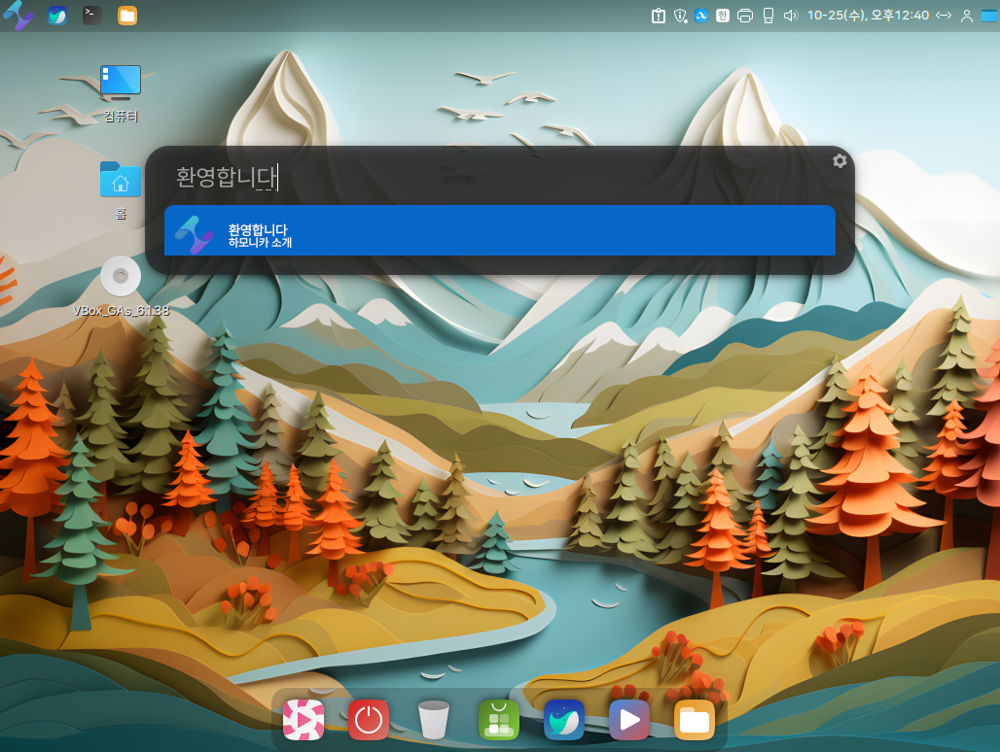
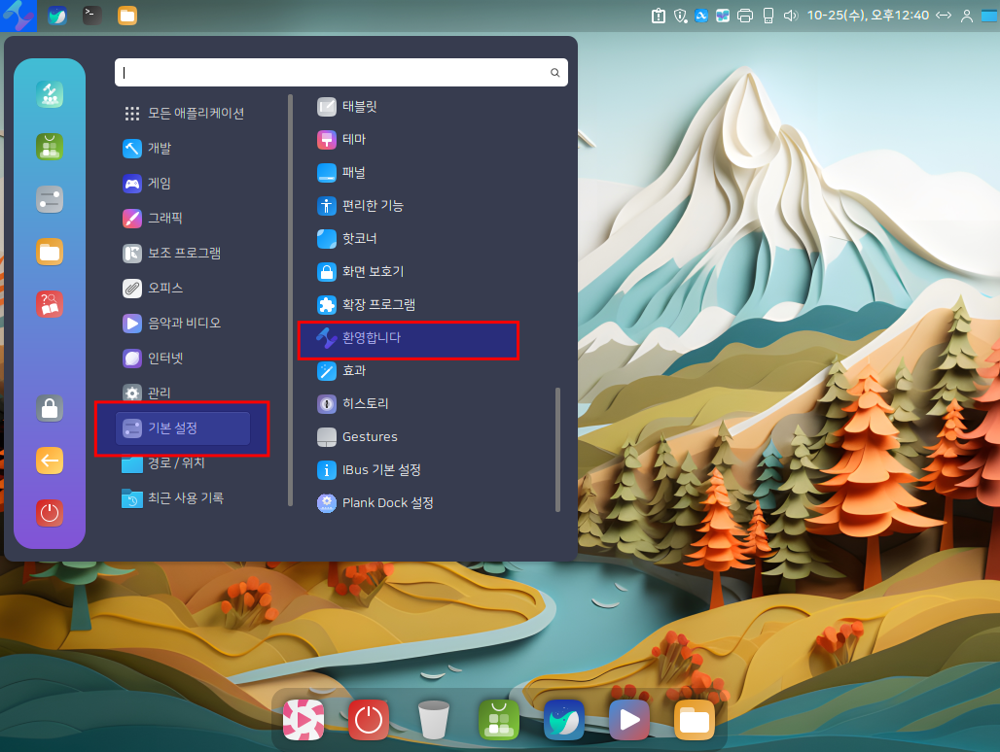

# 리그오브레전드(LOL) 설치

<figure><figcaption></figcaption></figure>

### 설치시 주의 사항.

리그오브레전드는 윈도우용 프로그램으로 리눅스 환경에서는 설치를 하기위해서는 **Lutris** 프로그램을 이용해야합니다.&#x20;

Lutris를 이용해서 리그오브레전드 게임을 설치 진행중 아래 그림과 같이 게임에 로그인하는 화면이 보여지는데&#x20;

**게임 접속(로그인)을  하지말고** 작업표시줄에 잇는 **트레이의 라이엇 클라이언트를 종료**해야만 게임 설치가 완료됩니다.&#x20;

<figure><figcaption></figcaption></figure>

### 리그오브레전드 설치하기.

1. 프로그램 메뉴 또는 Albert(alt +space)를 이용해서 "환영합니다" 프로그램을 실행합니다.&#x20;

<figure><figcaption></figcaption></figure>

 

<figure><figcaption></figcaption></figure>

2. "환영합니다" 프로그램에서 "추천 프로그램 > 리그오브레전드(LOL)에서"  설치 버튼을 클릭합니다.&#x20;

<figure><figcaption></figcaption></figure>

3. "설치" 버튼을 클릭하면 먼저 Lutris 업데이트를 진행합니다

<figure><figcaption></figcaption></figure>

4. Lutris 업데이트 진행이 완료가 되면, Lutris에 리그오브레전드(LOL) 설치를 진행하기위해 'Install" 버튼을 클릭합니다.&#x20;

<figure><figcaption></figcaption></figure>

5. "Install" 버튼을 클릭합니다.

<figure><figcaption></figcaption></figure>

 

<figure><figcaption></figcaption></figure>

6. "Continue" 버튼을 클릭합니다.

<figure><figcaption></figcaption></figure>

7. 사용하실 언어를 선택 후 "Continue" 버튼을 클릭합니다.

<figure><figcaption></figcaption></figure>

8. "설치" 버튼을 클릭합니다.

<figure><figcaption></figcaption></figure>

9. Lutris에서 리그오브레전드 설치를 위한 진행이되며, 설치 버튼을 클릭합니다.&#x20;

<figure><figcaption></figcaption></figure>

 

<figure><figcaption></figcaption></figure>

10. 컴퓨터에 리그오브레전드 라이엇 클라이언트가 실행이되며, 우측 하단에 리그오브레전드 게임을 즐기기위해 다운로드 및 설치가 진행되는것을 확인하실 수 있습니다.

<figure><figcaption></figcaption></figure>

11. 리그오브레전드 라이엇 클라이언트 업데이트가 완료되면, 라이엇 클라이언트 프로그램을 종료합니다.&#x20;

    \-작업표시줄에서 라이엇 클라이언트 아이콘에서 우측 버튼을 클릭하여 종료해야 설치가 완료됩니다.

    **-게임 접속(로그인)을  하지말고** 작업표시줄에 잇는 **트레이의 라이엇 클라이언트를 종료**해야만 게임 설치가 완료됩니다.&#x20;

<figure><figcaption></figcaption></figure>

12. 리그오브레전드 설치 완료.

<figure><figcaption></figcaption></figure>

13. 리그오브레전드 실행.

* Albert(alt + space) 실행하여 League of Legends 입력 후 리그오브레전드를 실행.

<figure><figcaption></figcaption></figure>

* 프로그램 메뉴에서 게임 > Lutirs 실행한 후  리드오브레전드 선택하여 실행.

<figure><figcaption></figcaption></figure>

 

<figure><figcaption></figcaption></figure>

<figure><figcaption></figcaption></figure>

<figure><figcaption></figcaption></figure>
