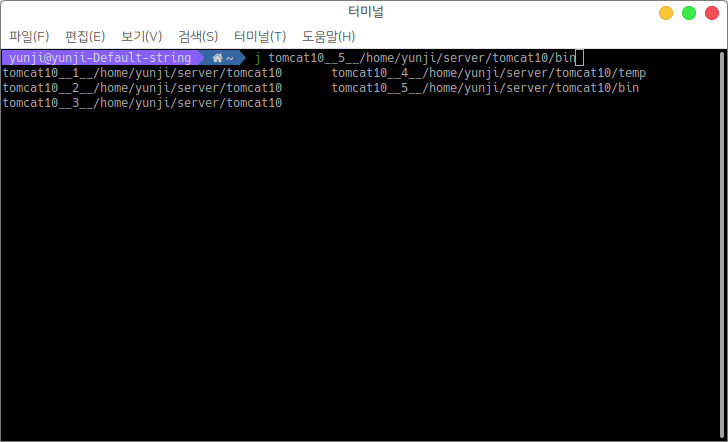
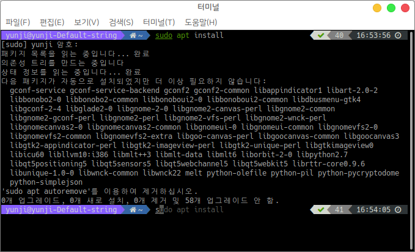
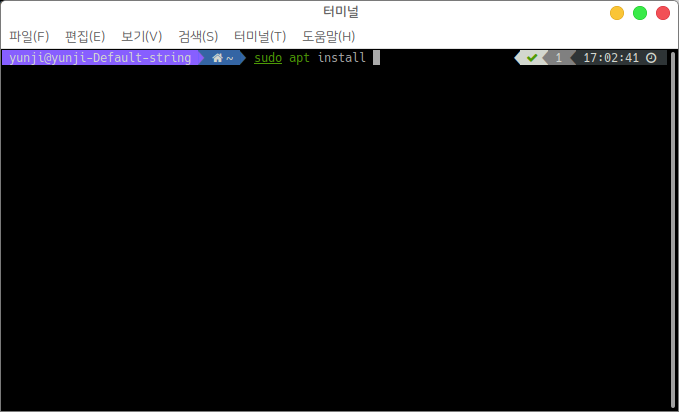
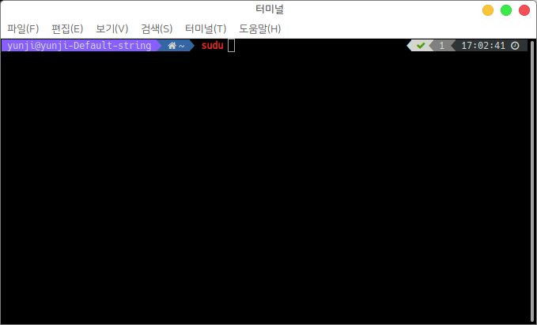
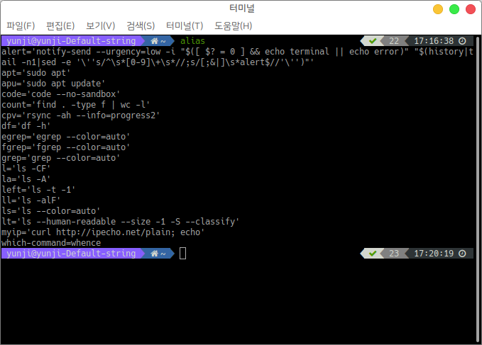
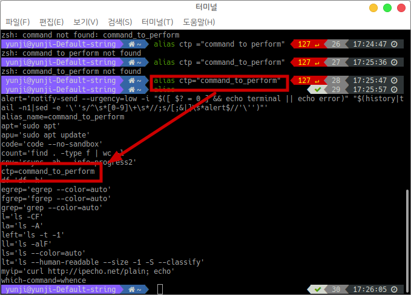
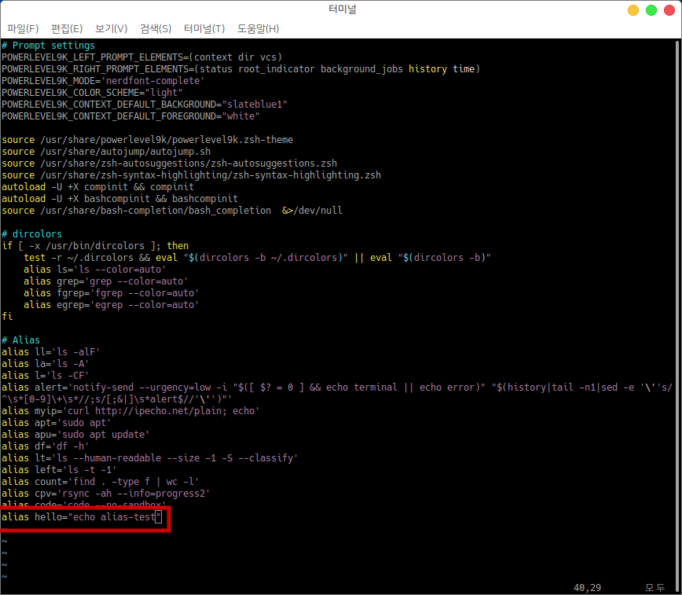
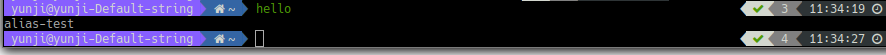
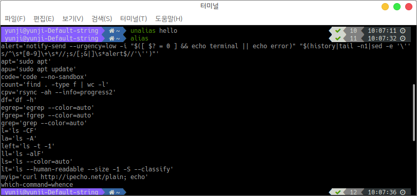

# 기본 터미널 Zsh 적용

## 1. zsh란?

zsh(z shell)는 하모니카 사용자에게 터미널 환경의 사용성을 개선해주는 쉘 스크립트 입니다.&#x20;

zsh의 더 자세한 설명은 [https://github.com/hamonikr/hamonikr-zsh](https://github.com/hamonikr/hamonikr-zsh) 에서 확인할 수 있습니다.&#x20;

1. zsh 설치
2. 폰트설정 변경
3. zsh의 기능 및 사용법

## 2. zsh 설치&#x20;

하모니카 운영체제는 기본적으로 hamonikr-zsh를 기본 쉘로 제공하고 있으며, POWERLEVEL9K 테마와 자주 사용하는 명령어를 Alias로 제공하고 있습니다.&#x20;

&#x20;\- $ cat  \~/.zshrc

<figure><figcaption></figcaption></figure>

zsh를 재설치 하시거나 데비안 계열에서 사용하실 경우 아래 깃허브 hamonikr-zsh 레포지토리로 이동을 하신수 최신 패키지를 다운받아 설치를 진행하시면 됩니다.&#x20;

### 2.1 최신 패키지 다운로드&#x20;

아래의 링크를 통해 최신 패키지를 다운로드.



### 2.2 zsh 패키지 설치

최신 패키지를 다운 받으신 폴더로 이동을 하신 후 설치를 진행합니다

<figure><figcaption></figcaption></figure>

정상적으로 설치가 완료되면 터미널을 열었을 때 아래와 같은 화면이 보여집니다.

<figure><figcaption></figcaption></figure>

## 3. 폰트설정 변경

&#x20;터미널을 열고 "편집" 메뉴에서  "기본 설정" 항목을 클릭하시면 "기본 설정" 창을 활성화됩니다.

<figure><figcaption></figcaption></figure>

활성화된 "기본 설정" 화면에서는 "hamonikr"이 기본 설정으로 지정되어 있으며, 프로파일을 추가하여 자신만의 스타일로 만들어 사용하실 수 있습니다.&#x20;

"기본 설정"  화면의 좌측 메뉴의  프로파일 -> "hamonikr" 프로파일을  클릭한 후 "사용자 지정 글꼴"을 클릭하면 터미널 글꼴 선택 화면이 보여지며, 원하시는 글꼴과 폰트 크기를 지정하여 설정을 완료히시면됩니다.&#x20;

<figure><figcaption></figcaption></figure>

## 4. zsh의 기능 및 사용법&#x20;

하모니카에 설치된 zsh의 주요기능들을 설명합니다.&#x20;

### 4.1 autojump

autojump는 여러번의 cd 명령을 통해서 디렉터리를 바꾸는 것을 간단히 j 명령을 통해서 한번에 이동 가능하게 하는 기능입니다.

autojump 옵션은 **autojump --help**에서 확인이 가능합니다.&#x20;

(※ j 명령어는 명령어를 사용하기 이전에 이동한적이 있었던 디렉토리에 한해서 사용 가능)&#x20;

**4.1.1  j 명령어**&#x20;

예를들어 'tomcat10' 을 포함하는 디렉토리로 이동하고 싶은 경우:  터미널에  **j tomcat10** 입력

이동 시에 파일명을 끝까지 입력하지 않아도(j to 혹은 j t) 겹치는 파일 이름이 존재하지 않으면 이동이 가능합니다.&#x20;

(파일이 겹칠시에는 우선순위가 높은 곳으로 이동 - 우선순위 설정 방법은 3.1.4에서 설명)&#x20;

<figure><figcaption></figcaption></figure>

j 명령어를 사용할 때 **이동할 디렉토리의 전체 경로를 보고 싶으면  j 파일명을(앞부분만 입력해도 확인 가능)  입력하고 tab 키를 두번 눌러줍니다.** &#x20;

j tomcat10을 입력 후 tab키를 누르면 아래와 같이 경로 목록이 나오고, 목록이 나온 후 tab 키를 더 누르면 아래의 경로들로 이동이 가능합니다. &#x20;

\<tab을 두 번 눌러서 경로가 나온 화면>&#x20;

<figure><figcaption></figcaption></figure>

\<tab을 더 누르면 아래의 경로들로 이동이 가능함>

<figure><figcaption></figcaption></figure>

**4.1.2  jc 명령어**

jc 명령어는 디렉토리 이동 기능은 j와 같으나 **tab키를 누르면 전체경로가 아닌 해당 디렉토리의 하위 디렉토리와 파일을 보여줍니다.**&#x20;

jc 명령어를 이용해 하위 디렉토리를 확인하려면 상위 디렉토리에서 명령어를 입력해야합니다.&#x20;

\<jc를 이용해 tomcat10의 하위 디렉토리와 파일 확인하는 화면>

<figure><figcaption></figcaption></figure>

\<jc를 이용해 확인한 하위 디렉토리 목록과 동일함>  &#x20;

<figure><figcaption>
 
</figcaption></figure>

**4.1.3  jo 명령어**

jo 명령어는 디렉토리로 이동하는 대신 파일 탐색기 창을 해당 디렉토리로 열 수 있습니다.

tomcat10디렉토리를 열기 위해 **jo tomcat10** 명령어 입력하면 파일탐색기가 보여집니다. &#x20;

\<jo를 사용해 tomcat10 디렉토리를 여는 과정>&#x20;

<figure><figcaption></figcaption></figure>

<figure><figcaption></figcaption></figure>

**4.1.4 파일명이 중복될 때 우선순위 설정**

j 명령어를 사용할 때 이름이 동일한 디렉토리나 파일이 있으면 우선순위가 높은 곳으로 이동합니다.&#x20;

**우선순위를 높이고 싶을 때는 해당 디렉토리로 이동해서 autojump --i 명령어를 입력하고, 낮추고 싶을 때는 autojump --d 명령어를 입력**합니다.&#x20;

명령어를 입력하면 변경된 우선순위가 보여집니다.&#x20;

\<tomcat10 디렉토리의 우선순위를 변경하는 화면>&#x20;

<figure><figcaption>
 
</figcaption></figure>

### 4.2 autosuggestion

이전에 입력한 적이 있는 명령어는 명령을 다 입력하기 전에 옅은 회색으로 완성된 내용이 표시됩니다.&#x20;

**옅은 회색으로 나온 명령어를 완성시키려면  키보드 방향키 "→"**를 눌러줍니다.&#x20;

<figure><figcaption></figcaption></figure>

### 4.3 syntax-highlighting

명령어 오류를 잡을 때 명령을 실행하기 전에 검토하는 데 도움이 되는 명령어 강조 표시 기능입니다.&#x20;

**맞는 명령어는 초록색으로 표시되고, 잘못된 명령어는 빨간색으로 표시**됩니다. &#x20;

<맞는 명령어>

<figure><figcaption></figcaption></figure>

<잘못된 명령어>&#x20;

<figure><figcaption>
 
</figcaption></figure>

### 4.4 Useful Alias

자주 사용하는 명령어에 단축어를 사용해서 시간과 노력을 절약할 수 있는 기능입니다.

단축어기능을 사용하면 사용자가 터미널 사용을 간단하게 개인화할 수 있습니다.&#x20;

**4.4.1 모든 단축어 표시**

터미널에 **alias** 를 입력하면 모든 단축어 확인이 가능합니다.&#x20;

<figure><figcaption>
 
</figcaption></figure>

**4.4.2 단축어 만들기**

**`alias 단축어="실행할 명령어"`**` ``형태로` 터미널에 입력하면 단축어 생성이 가능합니다. (단축어를 설정할 때 명령은 등호와 명령 사이에 공백 없이 따옴표료 묶어야 합니다. )

&#x20;단축어 생성 후 alias 명령어를 이용해 생성한 단축어를 확인할 수 있습니다.&#x20;

(※ 이러한 방법으로 생성한 단축어는 PC 재시작 시 사라집니다.)&#x20;

<단축어를 만들고 alias로 단축어 목록을 확인하면 생성된 단축어 확인 가능>&#x20;

<figure><figcaption>
 
</figcaption></figure>

**4.4.3 영구적인 단축어 만들기**

위의 방법으로 생성된 단축어는 PC를 재시작하면 사라지기 때문에 영구적인 단축어를 생성하려면 아래와 같은 방법을 사용해야 합니다.&#x20;

a. 터미널에 **ls -al** 명령어를 입력 후 디렉토리에 있는 내용 리스트 중 **.zshrc** 파일을 열어줍니다.  (.zshrc 파일을 여는 명령어 : **vi .zshrc )**

<figure><figcaption></figcaption></figure>

b. vi .zshrc를 터미널에 입력하면 아래와 같은 화면이 보여지고 단축어 생성이 가능합니다.&#x20;

`단축어 생성 방법 :`&#x20;

1. &#x20;`i, a, o 중 하나를 누르면 편집모드로 전환됩니다.`&#x20;
2. `편집모드로 전환되면 맨 아랫줄에 원하는 단축어를  alias 단축어="실행할 명령어" 형태로 작성합니다.`
3. `작성이 완료되면 esc 키를 누르고 :wq! 를 입력하고 엔터를 누르면 저장이 완료됩니다.`

<figure><figcaption></figcaption></figure>

생성한 단축어를 입력하면 정상적으로 단축어가 등록된 것을 확인할 수 있습니다.&#x20;

<figure><figcaption>
  
</figcaption></figure>

**4.4.4 단축어 삭제**&#x20;

생성한 단축어는 **unlias 삭제할 단축어** 의 형태로 터미널에 입력하면 삭제가 가능합니다.&#x20;

<figure><figcaption></figcaption></figure>

