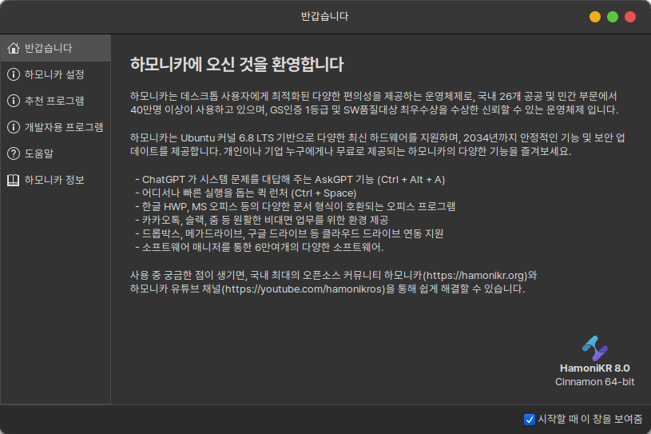

# "환영합니다" 애플리케이션

"환영합니다" 프로그램은 사용자들이 컴퓨터를 사용하는데 있어서 필요한 여러가지 기능들을 보다 쉽게 지원하기 위한 프로그램입니다.  이 프로그램을 통해 시스템 설정 및 추천 프로그램 설치, 관련 문서 확인 등의 기능들을 편리하게 실행할 수 있습니다.

"환영합니다" 프로그램은 다음과 같은 기능을 제공합니다.&#x20;

1. 하모니카 설정 -  시스템 전체 테마 설정, 시스템 인터페이스 스타일 변경, 컴퓨터 드라이버 설치 관리 등&#x20;
2. 추천 프로그램 - 배틀넷, 카카오톡, 한컴 오피스, V3 설치  지원 등
3. 개발자용 프로그램 - JDK, Python, WEB/WAS, IDE 도구
4. 도움말 - HamoniKR 사용 메뉴얼
5. 하모니카 정보

<figure><figcaption></figcaption></figure>

### "환영합니다" 프로그램 실행하기.

* 부팅시 바로 실행되는 프로그램이며, 우측 하단의 "시작할때 이창을 보여줌"의 체크를 해제 하시면 다음 부팅부터는 부팅시 바로 실행되지 않습니다.&#x20;
* Albert (Ctrl + Space)에서 "환영합니다" 또는 프로그램 메뉴에서 환영합니다/welcome을 입력하고 실행.

### 1. 하모니카 설정 메뉴에 대해서.

"하모니카 설정" 메뉴에서는 하모니카 운영체제를 사용하는데 있어서 필요한 기능들을 제공하고 있습니다.

<figure><figcaption></figcaption></figure>

* "**데스크톱 색상**"  :   테스크톱 전체에 사용할 색상을  "밝은 색상" 과  "어두운 색상" 으로 제공하고 있어 원하시는 색상으로 사용하실 수 있습니다.&#x20;
* "**테마 선택**"  :   테스크톱 인터페이스를 "전통적" 방식과 "현대적" 방식을 제공하고 있어 원하시는 테스크톱 인터페이스를 선택하실 수 있습니다.&#x20;
* "**시스템 스냅샷**" :  타임쉬프트를 이용한 운영체제의 백업 및 복구를 통해 데이터 손실 방지 및 시스템 오류 복구를 진행 하실 수 있습니다.&#x20;
* "**드라이버 관리자**"  : 하드웨어 구성 요소의 필요한 드라이버를 손쉽게 설치하실 수 있습니다.

### 2. 추천 프로그램에 대해서&#x20;

"추천 프로그램" 메뉴에서는 컴퓨터를 사용하시는데 도움이 될만한 프로그램들을 제공하여 "실행" 버튼을 통해 손쉽게 설치하고 사용하실 수 있습니다.&#x20;

*   추천 프로그램 목록

    1. 카카오톡 - [설치 및 사용법](https://docs.hamonikr.org/hamonikr-8.0/key-features/hamonikr-welcome/kakaotalk)
    2. 배틀넷 - [설치 및 사용법](../game/battlenet.md)
    3. 시스템 스냅샷 관리(SystemBack) - [설치 및 사용법](../../undefined-1/systemback.md)
    4. 라이브 USB 제작 도구 - [설치 및 사용법](../usb/usb-live-usb-creator.md)

<figure><figcaption></figcaption></figure>

### 3. 개발자용 프로그램&#x20;

"개발자용 프로그램" 메뉴에서는  개발환경에 필요한 "개발언어", "WEB/WAS", "Editor(IDE)", SSH Tool, Git등 의 프로그램들을 "실행" 버튼 클릭으로 설치하여 사용하실 수 있습니다.&#x20;

* 개발자용 프로그램 목록
  1. WEB/WAS  : Apache, Tomcat
  2. 개발도구 (IDE) : 비주얼 스튜디오 코드
  3. 데이터베이스 : MySQL, PostgreSQL
  4. 기타 :&#x20;
     * Asbru-cm(SSH Client)
     * Git
     * 파일탐색기 git 확장기능
     * Avahi Service

<figure><figcaption></figcaption></figure>

### 4. 도움말

하모니카 운영체제를 사용중 발생하는 다양한 문제의 해결 방법과 하모니카 운영체제를 잘 사용할 수 있는 단추키/사용법, 기민한 의사소통을 위한 슬랙 채널을 운영하고 있습니다.&#x20;

<figure><figcaption></figcaption></figure>

### 5. 하모니카 정보

하모니카 버전별로 출시되는 새로운 기능들과 릴리즈 정보, 패키지 라이선스 그리고 하모니카 운영체제에 애플리케이션 또는 번역, 폰트, 이미지등등 사용자분들의 재능을 기부 하실 수 있는 방법을 안내해 드리고 있습니다.&#x20;

<figure><figcaption></figcaption></figure>
