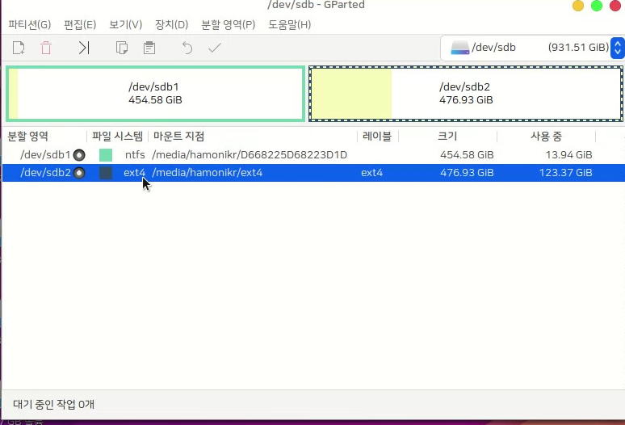

# 파티션 백업 복구 qt-fsarchive

이 프로그램은 원하는 파티션을 선택하고 백업하면 이미지로 저장되며 쉽게 복원하는 기능을 제공합니다.

이 프로그램을 사용하기 위해서는 마운트가 해제된 원본 디스크와 백업 이미지를 저장할 디스크가 필요합니다.

예를 들어 sda 디스크의 sda2  파티션을 백업하고 싶다면 sda의 마운트를 해제해야 하고, 백업한 이미지를 저장할 수 있는 다른 디스크를 마운트 해야하기 때문에 사용중인 디스크와 백업 데이터를 저장할 디스크가 있는 환경에서 사용할 수 있는 프로그램입니다.

외장하드에 시스템의 특정 파티션을 백업하는 경우라면 다음과 같이 사용할 수 있습니다.

### 준비물)

* 하모니카 ISO 이미지를 부팅 USB로 제작.
* 백업 데이터를 저장할 외장하드 또는 하드 디스크의 별도의 파티션

### 사용법

**먼저 하모니카 ISO 이미지를 라이브시디로 부팅 후 외장하드를 컴퓨터에 연결합니다.**

"프로그램 메뉴 > gparted" 프로그램을 실행해서 현재 부팅한 PC의 파티션 정보를 확인합니다.

PC의 환경마다 정보가 다를수 있기때문에 확인을 파티션 정보를 확인하셔야합니다.&#x20;

이 테스트용 PC의 경우 백업할 파티션이 /dev/nvme0n1 입니다.

이 경로는 제일 아래의 파티션 백업 복구 프로그램 이미지에서 1번 창에 선택될 경로입니다.

백업 데이터를 저장할 디스크는 다음과 같이 /dev/sdb 디스크이며

이 PC의 경우 /media/hamonikr/ext4 라는 경로에 마운트 되어 있는 것을 확인했습니다.

이 경로는 제일 아래의 파티션 백업 복구 프로그램 이미지에서 2번 창에 선택될 경로입니다.

"프로그램 메뉴 > 파티션 백업 복구" 를 선택하여 실행하면 다음과 같은 화면이 나옵니다.

외장하드를 PC에 장착하고 하모니카 부팅 USB를 PC에 꼽은 상태에서 BIOS 부팅 우선순위를 하모니카 ISO USB로 설정하고 부팅합니다.

이제 '프로그램 메뉴 > 파티션 백업 복구' 를 실행하면 다음과 같은 프로그램 화면이 보입니다.

이전 단계에서 확인한 정보를 1, 2 창에 선택하고 저장할 이미지 이름을 입력하고 '파티션 백업'버튼을 누르면 백업이 시작됩니다.

성공적으로 작업이 완료되면 해당 경로에 "저장할 이미지 이름.fsa" 이름으로 백업된 이미지가 생성됩니다.

