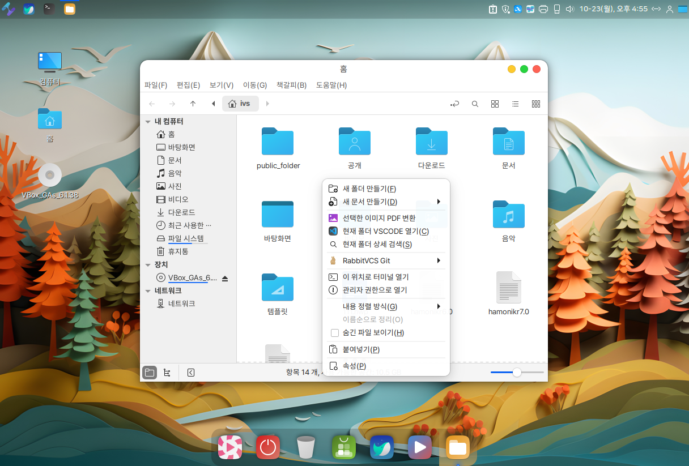
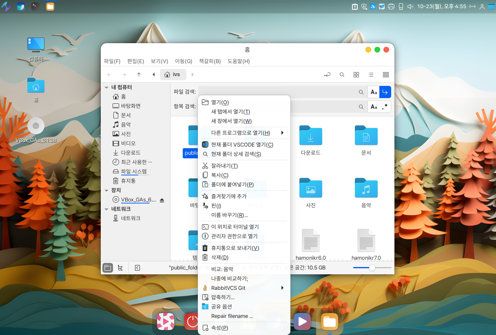

# 파일 및 폴더 관리

HamoniKR OS의 파일 탐색기는 유용한 기능을 가지고 있습니다.&#x20;

빈공간을 마우스 우측 버튼으로 클릭할때와  폴더나 파일 위에서 마우스 우측 버튼을 클릭할때, 다른 컨테츠 메뉴가 나타납니다.&#x20;

마우스 우측 버튼 클릭 시 주요 컨텐츠 메뉴.

1. 폴더 및 파일 비교.
2. RabbitVCS Git.
3. 선택한 이미지 PDF 변환
4. 폴더 공유.
5. 인코딩 깨진 파일명 복구
6. SVG 이미지 크기 변환(Convert-svg)
7. 파일 상세 검색.
8. 즐겨찾기, 책갈피, 핀
9. 서버에 연결하기, SMB/SFTP/FTP 연결하기&#x20;
10. **iso 파일에서 우측버튼 검증 , 파일체크썸, 부팅USB만들기, 보관함에 마운트하기.**

**"파일 탐색기" 단축키를 이용하시면 보다 수월하게 사용하실 수 있습니다.**&#x20;

<figure><figcaption></figcaption></figure>

### "파일 탐색기" 빈 공간에 마우스 우측 버튼을 클릭했을때

<figure><figcaption></figcaption></figure>

### "파일 탐색기" 폴더및 파일에서 마우스 우측 버튼을 클릭했을때

<figure><figcaption></figcaption></figure>

