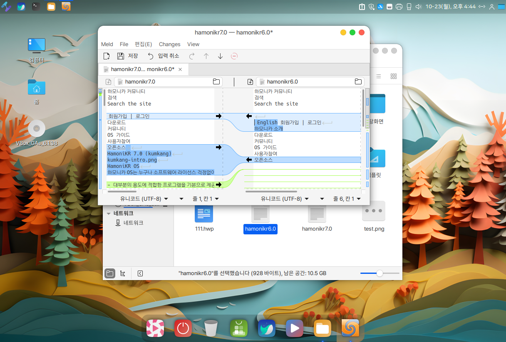

# 폴더 및 파일 비교

"파일 탐색기"에서 손쉽게 파일이나 폴더의 내용을 비교하여 변경된 사항을 확인하고 싶을때 사용하기위해서 "Nemo" 프로그램에 확장기능으로 "Meld" 프로그램을 적용하였습니다.&#x20;

"Meld" 프로그램은 "파일 탐색기"에서 폴더나 파일을 선택하신 후 마우스 우측 버튼으로 사용하시거나 프로그램 메뉴에서 "Meld" 프로그램이 실행되어 비교를 하실 수 있습니다.&#x20;

### "폴더 및 파일" 비교 (개별 선택하여 비교할때)

1. 비교하실 파일에서 마우스 우측 버튼을 클릭하고 "나중에 비교하기" 선택

<figure><figcaption></figcaption></figure>

2. 비교하실 두번째 파일에서 마우스 우측 버튼 클릭 후 "비교: \*\*\*\*" 선택

<figure><figcaption></figcaption></figure>

3. "Meld' 프로그램이 실행이되며, 선택하신 두개의 파일을 비교하실 수 있습니다.

<figure><figcaption></figcaption></figure>

### "폴더 및 파일" 비교 (동시 선택하여 비교할때)

<figure><figcaption></figcaption></figure>

비교하실 폴더나 파일을 Shift 키로 선택 또는 드래그해서 선택을 하신 후 마우스 우측 버튼을 클릭하여 "비교하기"메뉴을 선택하시면 "Meld"프로그램이 실행되어 폴더 또는 파일을 비교하실 수 있습니다.&#x20;
