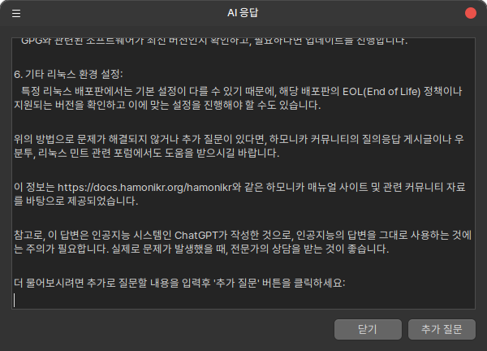

# AskGPT

시스템을 사용하다 보면 다양한 오류 메세지를 만나게 됩니다.

이 때 오류의 원인을 찾기 위해서 웹사이트를 검색해서 정보를 확인하거나, 커뮤니티를 방문해서 질문을 하고 답변을 기다리는 과정을 통해서 문제를 해결하는 것이 일반적입니다.

AskGPT는 HamoniKR OS 8 에 탑재된 강력한 시스템 문제 해결 도구로, 사용자가 겪는 다양한 문제를 ChatGPT를 통해 빠르고 효율적으로 해결할 수 있습니다. 이 기능은 시스템 내에서 발생하는 문제나 사용 방법에 대한 질문에 즉각적인 답변을 제공하여, 사용자 경험을 크게 향상시킵니다.

* **즉각적인 문제 해결**: 시스템 사용 중 발생하는 문제에 대해 빠른 답변을 제공합니다.
* **사용자 친화적인 인터페이스**: 직관적인 대화형 인터페이스를 통해 누구나 쉽게 사용할 수 있습니다.
* **다양한 질문 처리**: 시스템 오류, 소프트웨어 사용 방법, 설정 변경 방법 등 다양한 질문에 대한 답변을 제공합니다

### API 키 설정 하기

이 기능은 ChatGPT 호출에 비용이 들기 때문에, 자신의 OpenAI API 키를 이용하셔야 합니다.&#x20;

API 키를 생성하고 발급받는 방법은 이 문서의 마지막 섹션을 확인하세요.

이미 OpenAI 의 API 키가 있는 경우, 다음과 같이 <mark style="color:red;">**\~/ask\_openai.conf**</mark>  파일에 키를 저장해 주세요.

```
[openai]
api_key = 발급받은 API키
```

파일을 저장한 후 시스템을 재 시작하시면 이후 설정한 API 키를 이용하여 AskGPT 기능을 사용할 수 있습니다.

### 사용 방법

* **오류 메세지 복사**: `Ctrl + C`를 눌러 시스템의 오류 메세지를 클립보드로 복사합니다.
* **단축키 사용**: `Ctrl + Alt + A`를 눌러 AskGPT 기능을 활성화합니다.
* **답변 확인**: ChatGPT가 제공하는 해결 방법이나 정보를 화면에서 바로 확인합니다.
* **추가 질문**: 더 질문할 내용이 있는 경우 맨 아래쪽에 질문을 추가하고 '추가 질문' 버튼을 클릭합니다.

<figure><figcaption></figcaption></figure>

### OpenAI API 키 생성 및 가격 안내

AskGPT 기능을 사용하려면 OpenAI의 API 키가 필요합니다.&#x20;

아래는 OpenAI API 키 생성 방법과 가격에 대한 안내입니다.

**1. OpenAI API 키 생성 방법**

1. **OpenAI 웹사이트 방문**: [OpenAI 웹사이트](https://platform.openai.com/signup)로 이동하여 계정을 생성합니다. 이미 계정이 있다면 로그인합니다.
2. **API 키 생성**:
   * 로그인 후, 대시보드에서 "API Keys" 메뉴를 찾습니다.
   * "Create new secret key" 버튼을 클릭하여 새로운 API 키를 생성합니다.
   * 생성된 API 키를 안전한 곳에 저장합니다. 이 키는 시스템 설정에 입력하여 AskGPT 기능을 활성화하는 데 사용됩니다.
3. **API 키 적용**: HamoniKR OS의 설정 파일에 생성한 API 키를 입력하여 AskGPT 기능을 활성화합니다.

**2. OpenAI API 가격 안내**

OpenAI API 사용은 사용량에 따라 비용이 부과됩니다.&#x20;

GPT-4 모델을 기준으로 대략적인 비용은 다음과 같습니다:

* **GPT-4 모델 (8K context)**:
  * **Prompt Tokens**: $0.03 per 1,000 tokens
  * **Completion Tokens**: $0.06 per 1,000 tokens
* **GPT-4 모델 (32K context)**:
  * **Prompt Tokens**: $0.06 per 1,000 tokens
  * **Completion Tokens**: $0.12 per 1,000 tokens

**Tokens**는 API 호출 시 사용하는 텍스트의 단위로, 입력 및 출력 텍스트의 길이에 따라 비용이 산정됩니다. 1,000 tokens은 약 750단어에 해당합니다.

자세한 가격 정보는 OpenAI의 [가격 페이지](https://openai.com/pricing)에서 확인할 수 있습니다.


