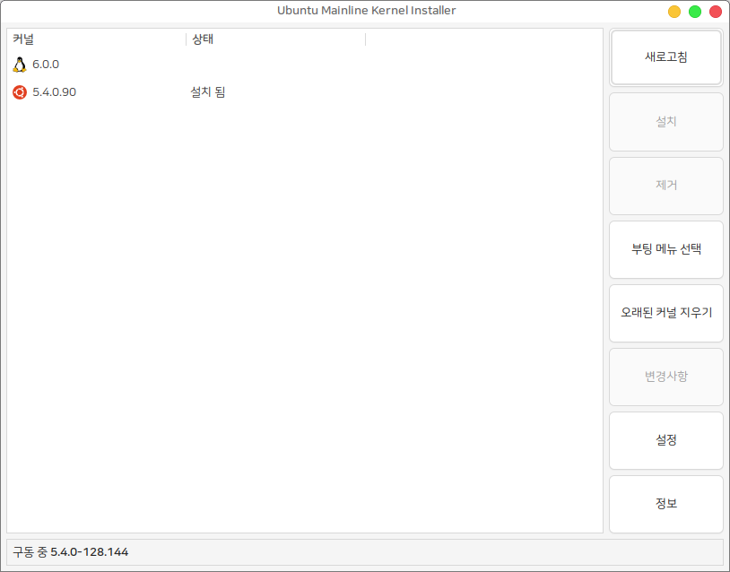

# 커널 업그레이드 도구 mainline

## 1. 커널 업그레이드 도구란?&#x20;

이 프로그램은 `sudo apt upgrade` 를 통해 제공되지 않는 특정 버전 또는 최신 버전의 우분투 커널을 사용하고 싶은 경우

터미널을 사용하지 않고 GUI 를 통한 손쉬운 커널 업그레이드를 제공하는 프로그램 입니다.

이 프로그램을 사용하면 누구나 쉽게 자신의 시스템 커널을 업그레이드 하거나 삭제할 수 있습니다.

(※ 커널을 업그레이드 하면 시스템의 하드웨어가 정상적으로 동작하지 않을 수 있습니다.)


## 2. 커널 업그레이드 도구 mainline 설치하기

&#x20;하모니카 사용자 (하모니카 3.0 이상)

```
sudo apt update
sudo apt install mainline
```

#### Ubuntu, LinuxMint 등 다른 배포판 사용자의 경우

터미널을 열고(Ctrl+Alt+T) 아래 명령어를 입력하세요.

```
# 하모니카 APT 저장소 추가 (우분투 22.04 이상)
wget -qO- https://repo.hamonikr.org/hamonikr-app.apt | sudo -E bash -

# 하모니카 APT 저장소 추가 (우분투 21.04 이하)
curl -sL https://pkg.hamonikr.org/add-hamonikr.apt | sudo -E bash -
```

```
# 프로그램 설치
sudo apt install mainline
```

###

## 3. 사용법

프로그램 설치가 완료되고 시작 프로그램에 mainline 또는 커널 업그레이드를 검색하면 프로그램을 실행할 수 있습니다.&#x20;

<figure><figcaption></figcaption></figure>

###

<figure><figcaption></figcaption></figure>

새로고침 : 좌측의 커널 목록이 새로고침 됩니다.

설치 : 커널 목록 중 설치되지 않은 커널을 선택 후 설치 버튼을 누르면 설치가 진행됩니다.&#x20;

제거 : 상태가 설치 됨 으로 표시된 커널을 선택 후 제거 버튼을 누르면 제거가 진행됩니다.

부팅 메뉴 선택 : 우선적으로 부팅 될 메뉴 선택이 가능합니다.&#x20;

오래된 커널 지우기 : 오래된 커널이 제거됩니다.

변경사항 : 변경사항을 확인하고 싶은 커널을 선택하고 버튼을 누르면 변경사항 확인이 가능합니다

설정 : 설정 화면이 보여집니다.

정보 : 프로그램의 상세 정보 확인이 가능합니다.&#x20;
