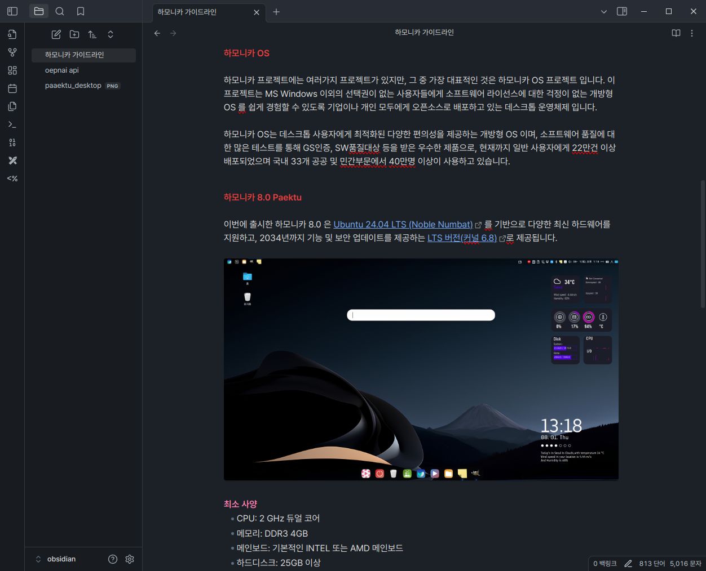
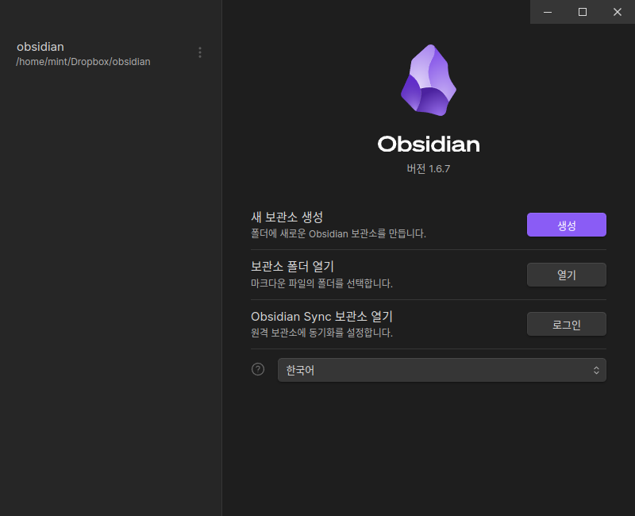

# 옵시디언 메모 앱

<figure><figcaption>
obsidian
</figcaption></figure>

옵시디언은 다양한 메모 앱이 있는 시장에서 많은 장점으로 빠르게 사용자들이 증가하고 있는 프로그램입니다.

* 모든 자료는 클라우드가 아닌 내 로컬 시스템에 저장되어 빠른 속도와 우수한 보안성
* 파일 이동만으로 동작하는 백업 및 복구 방법
* 우수한 검색 기능 : 노트의 제목(title), 본문 내용(content)뿐만 아니라 폴더 경로(path), 속성(properties), 태그(tag), 체크리스트(task), 소제목(section) 등으로 검색 가능.
* 다양한 커뮤니티 플러그인으로 다양한 확장 기능 제공
* 자유롭게 꾸밀 수 있는 테마 스토어 제공

#### 다양한 클라우드 서비스를 이용한 동기화 기능

별도의 동기화 서비스를 구독하지 않아도, 사용하고 있는 구글 드라이브나 드롭박스 같은 클라우드 서비스를 이용해서 메모 데이터는 동기화 할 수 있습니다.

<figure><figcaption>
vault
</figcaption></figure>

프로그램 왼쪽 하단의 Manage Vaults... 메뉴를 이용해서 새 보관소를 자신이 사용하는 클라우드 서비스의 저장 공간에 생성하고, 이 보관소를 기본으로 사용하면 모든 데이터가 동기화 됩니다.

