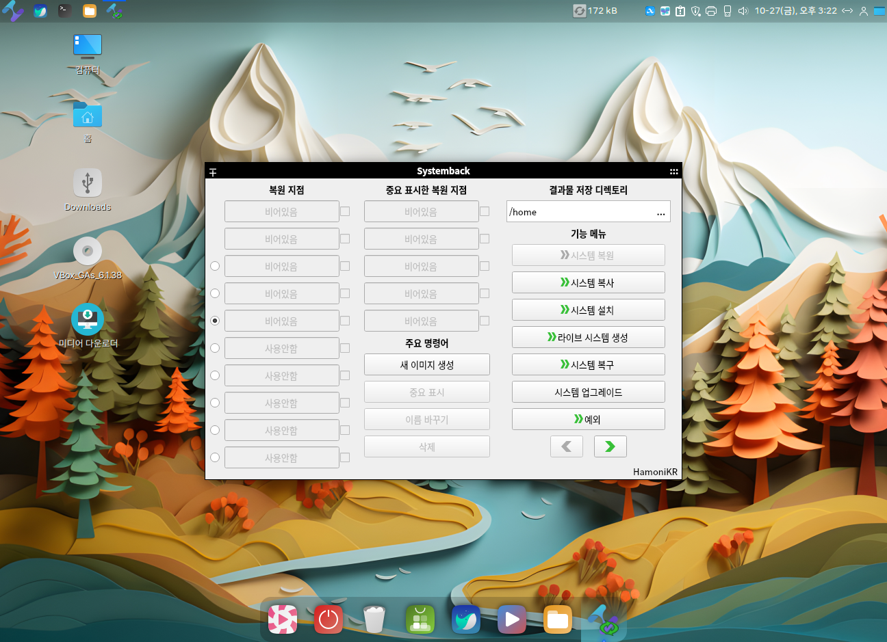
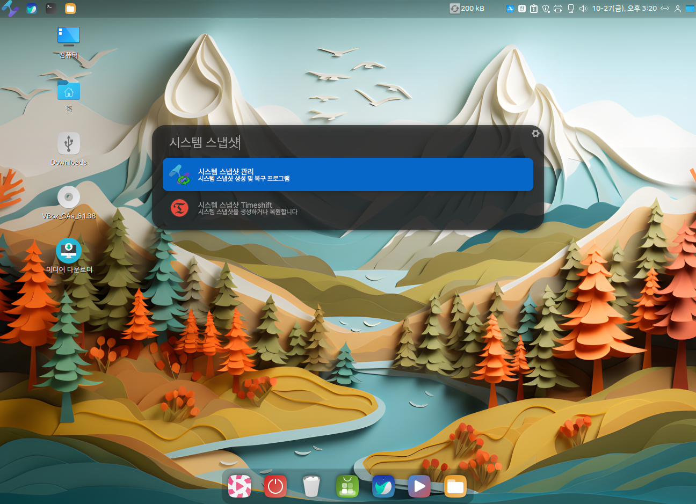

# 나만의 ISO 만들기(Systemback)

<figure><figcaption><p>시스템 스냅샷 관리 Systemback</p></figcaption></figure>


## 프로그램 설치하기

Systemback 프로그램은 초보자도 쉽게 자신만의 ISO 이미지를 만들어서 배포할 수 있는 프로그램으로 사용중인 자신의 PC 환경을 라이브 이미지로 제작할 수 있는 기능을 제공합니다.

자신이 추가한 프로그램을 포함해서 자신만의 환경으로 설정된 USB를 제작해서 어디서나 동일한 자신만의 PC 환경을 사용할 수 있으며 이 시스템을 다른 PC에 설치할수 있는 기능을 포함하고 있습니다.

[Github 레포지토리](https://github.com/hamonikr/systemback)에서 더 자세한 내용을 확인할 수 있습니다.

하모니카 OS 사용자의 경우 아래와 같은 방법으로 설치할 수 있습니다.

```
$ sudo apt update
$ sudo apt install systemback
```


&#x20; 하모니카OS 사용자가 아닌 경우, [Github 레포지토리](https://github.com/hamonikr/systemback)에서 설치 방법을 확인하세요.



프로그램 설치가 완료되면, 시작메뉴에 `시스템 스냅샷 관리` 가 추가된 것을 확인할 수 있습니다.

<figure><figcaption></figcaption></figure>

<figure><figcaption></figcaption></figure>

`시스템 스냅샷 관리` 를 클릭하면 아래와 같이 프로그램이 실행됩니다.

.png>)


## 시스템 스냅샷 백업하기

### 새 이미지 생성하기

`새 이미지 생성`을 클릭하면 현재 사용 중인 시스템 스냅샷 생성이 진행되고 , 완료되면 아래와 같이 복원 지점에 항목이 추가됩니다.


해당 복원 지점을 체크한 후, `중요 표시` 를 클릭하면 해당 항목이 `중요 표시한 복원 지점` 으로 이동됩니다.

중요 표시는 복원 지점의 자동 삭제를 방지하기 위해 사용됩니다.


###

### 예약 작업으로 백업 이미지 생성하기

`예약작업` 버튼을 통해 복원 포인트 생성을 예약하여 자동 실행되도록 설정할 수 있습니다.

.png>)

`선택하지 않음` 을 클릭해 예약 작업을 활성화 합니다.

.png>)

아래와 같이 설정하면 30분에 한 번씩 스냅샷 생성이 진행되며, 99초 동안 진행 시간이 보여집니다.

.png>)

예약 작업을 활성화 한 후, PC를 재부팅 해야 설정한 예약 작업이 수행됩니다.

아래 이미지와 같이 30분에 하나씩 이미지가 자동 생성된 것을 확인할 수 있습니다.

.png>)

###

### 시스템 업그레이드

`시스템 업그레이드` 버튼을 클릭하면 아래와 같이 업그레이드가 진행됩니다.

해당 기능을 통해 자동으로 시스템을 업그레이드 할 수 있습니다.

.png>)

## 시스템 스냅샷으로 복원하기

`복원하기` 버튼으로 생성한 이미지, 즉 스냅샷을 복원합니다.

이때, `예외` 버튼으로 복원 지점에서 숨김 파일과 디렉토리를 제외하여 복원하도록 설정할 수 있습니다.


`포함` 버튼으로 복원 지점에서 포함할 디렉토리를 지정할 수 있습니다.


`새 이미지 생성`으로 생성된 이미지 중 복원할 이미지를 체크한 후, `시스템 복원` 버튼으로 해당 이미지로 복원합니다.


## 라이브 시스템 백업 이미지 생성하기

### 예외 파일 또는 폴더 설정하기

홈 폴더에 이미지나, 동영상, 음악같은 용량이 큰 파일이 있는 경우 미리 예외목록 지정으로 라이브 이미지 용량을 조절합니다.

`예외` 버튼을 클릭, 다운로드 폴더를 항목에 추가하여 라이브 이미지 생성시 해당 폴더를 제외하겠습니다.


###

### 라이브 이미지 생성하기

예외 항목 지정 후, `라이브 시스템 생성` 버튼을 클릭합니다.

작업 디렉토리는 기본 설정을 유지하는 것을 권장합니다.

라이브 시스템 이름을 지정하고, 사용자 데이터 포함 여부를 선택 후, `새 이미지 생성` 을 클릭하여 이미지 생성을 진행합니다.


아래와 같이 이미지 생성이 진행됩니다.


이미지 생성이 완료되었습니다.


아래와 같이 이미지가 생성된 것을 확인합니다.


###

### 라이브 USB 제작하기

부팅 USB를 제작할 USB를 삽입하고 `저장 디렉토리` 오른쪽의 버튼을 클릭하면 조금 전 삽입한 USB 장치가 보입니다. 이 때 `저장 디렉토리` 창에서 USB를 선택하고, `선택한 장치에 쓰기` 버튼을를 클릭합니다.


시작 버튼을 클릭하면 부팅 USB 제작이 진행됩니다.


생성한 라이브 이미지를 이용하여 다음과 같이 이미지 쓰기가 진행됩니다.

시간이 다소 소요되기 때문에 기다려주세요.


완료되면 ok를 클릭하여 완료합니다.


###

### 라이브 USB의 쓰기 기능 사용하기

이미지가 생성된 USB를 백업을 진행할 PC에 삽입하고, BIOS 화면에 진입하여 해당 USB의 Partition1 으로 부팅되도록 설정 후 저장, 재부팅합니다.


아래 화면에서 `라이브 시스템 부팅`모드로 부팅합니다.



**시스템 설치프로그램 부팅** 은 시스템 설치 시작을 의미합니다. 새로운 유저를 추가하여 설치합니다.

**안전 그래픽 모드로 라이브 부팅** 은 라이브 시스템 시작시 그래픽 오류가 있을시 선택합니다.

**디버그 모드로 라이브 부팅** 은 debug 모드로 실행합니다.



생성한 이미지대로 정상 부팅되는 것을 확인할 수 있습니다.


바탕화면에 **SBLIVE** 라는 폴더가 생성되어 있습니다.&#x20;

이곳에 저장한 파일은 Live 모드 그대로 재부팅해도 유지됩니다.


아래와 같이 해당 폴더에 파일과 이미지를 저장하고 재부팅 하면 데이터가 유지됨을 확인할 수 있습니다.


###

### ISO 이미지 변환하기

아래 이미지와 같이 4GB 이하의 라이브 이미지가 존재할 때, 이것을 ISO 파일로 변환할 수 있습니다.


`ISO로 변환하기` 를 클릭하면, 아래와 같이 라이브 시스템 이미지 변환이 진행됩니다.


변환 작업이 완료되면, /home 디렉토리에 iso 파일이 생성된 것을 확인할 수 있습니다.


## 라이브 부팅 USB 사용하기

### 시스템 복사

`시스템 복사` 기능은 라이브 부팅 모드에 PC의 하드디스크에 파티션별로 시스템을 복사합니다.

라이브 USB로 라이브 부팅을 진행하고, Systemback을 실행한 후 `시스템 복사`를 클릭합니다.

&#x20;파티션을 선택하고 마운트 할 지점을 입력한 후 엔터 또는 화살표 버튼을 클릭하여 적용합니다.


###

### 시스템 설치

`시스템 설치` 기능은 새로운 유저를 등록하는 형태로 시스템을 설치합니다.

이는 `시스템 설치 프로그 부팅`모드로 부팅하는 것과 같은 기능입니다.


새로 등록할 유저 정보를 입력한 후, 다음을 클릭하여 파티션을 설정한 후 다음을 클릭하여 설치를 진행합니다.


###

### 시스템 복구

시스템 설치 후 사용 중, 시스템에 결함이 생겼을 경우 `시스템 복구` 기능을 통해 이를 복구할 수 있습니다.

라이브 USB 를 PC에 꽂은 후, `라이브 시스템을 부팅`을 선택하여 부팅합니다.

Systemback 프로그램을 실행하여 `시스템 복구` 를 클릭합니다.


원본 구조대로 /mnt 디렉토리에 파티션을 마운트 합니다.

(ex. 루트 디렉토리가 있는 sda2을 /mnt에 마운트, EFI 폴더가 있는 sda1을 /mnt/boot/efi에 마운트)

다음으로, 아래 이미지와 같이 복구 타입을 선택한 후 다음을 클릭하면 복구가 진행됩니다.


## 설정

설정 버튼을 통해 어플리케이션의 각종 설정을 관리합니다.

.png>)

아래와 같이 `라이브 ISO 이미지를 자동으로 생성` 항목을 체크해 두면 라이브 이미지 생성시 자동으로 ISO 파일로 변환합니다.

.png>)
