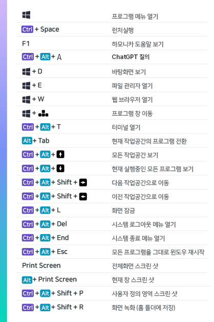

# 유용한 단축키

메뉴 > 환영합니다 프로그램을 실행하고 도움말 탭을 선책하시면 단축키를 확인할 수 있는 실행버튼이 있습니다.

<figure><figcaption></figcaption></figure>

실행 버튼을 누르면 바탕화면의 오른쪽에 아래와 같은 단축키 설명이 보입니다.

시스템의 여러가지 기능을 미리 단축키로 정의해 두고 있으니 유용한 기능들을 단축키로 활용해 보세요.

원하는 단축키로 변경하고 싶은 경우, 메뉴 > 키보드 프로그램의 단축키 탭 메뉴에서 설정할 수 있습니다.

<figure><figcaption></figcaption></figure>

