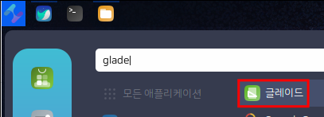
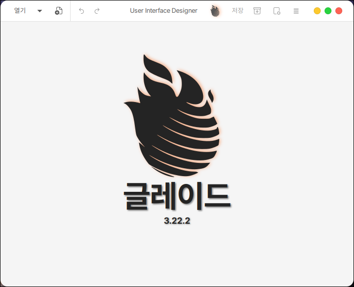
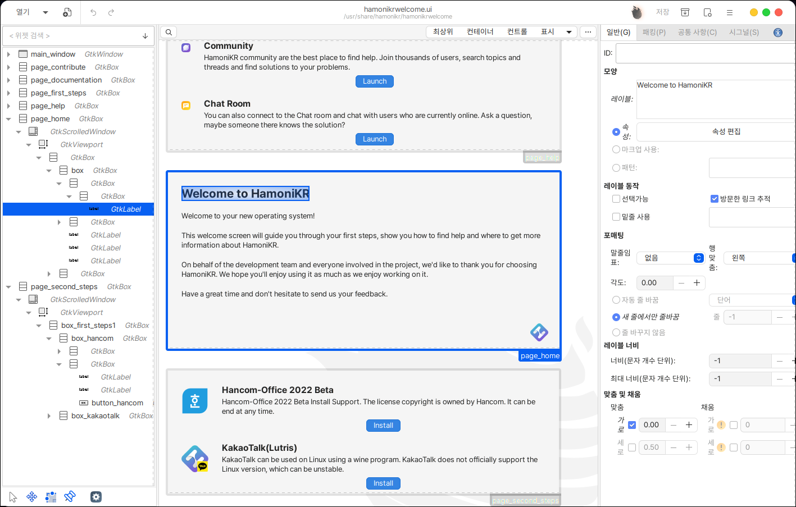

# 글레이드

&#x20;글레이드는 GTK 툴킷과 그놈 데스크톱 환경을 위한 프로그램의 UI 제작 도구입니다.

XML 형식으로 저장되며 C, C++, C#, 발라, 자바, 펄, 파이썬 등 많은 프로그래밍 언어에 붙여서 사용될 수 있습니다.

## 설치

터미널을 열어 다음과 같이 입력합니다.

```
sudo apt install glade
```

## 실행

시작 메뉴에서 확인하실 수 있습니다.

<figure><figcaption></figcaption></figure>

실행하면 다음과 같이 glade 기본 화면이 표시됩니다.

<figure><figcaption></figcaption></figure>

기존에 있던 ui(xml) 파일을 열어보면 다음과 같이 UI가 그려져 있는 모습을 볼 수 있습니다.

다음 화면은 hamonikrwelcome의 UI가 glade를 이용하여 만들어 져있는 것을 확인하실 수 있습니다.

좌측은 UI그리기를 위한 박스 등을 추가하는 곳이고 우측은 이름, 크기 등을 설정하는 곳입니다.

<figure><figcaption></figcaption></figure>
