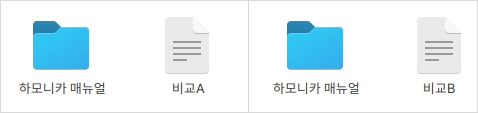
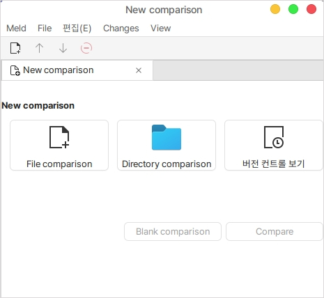
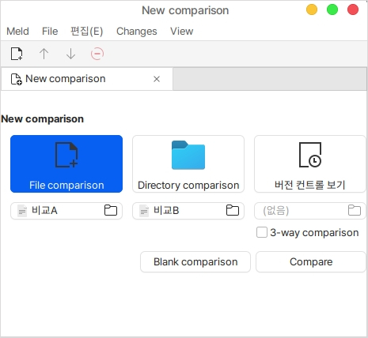
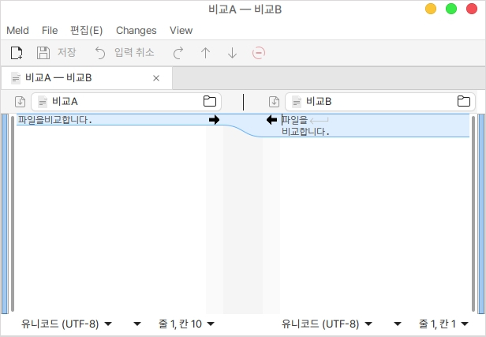
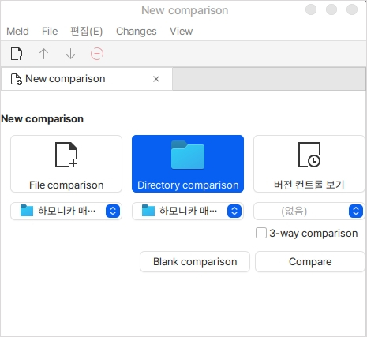
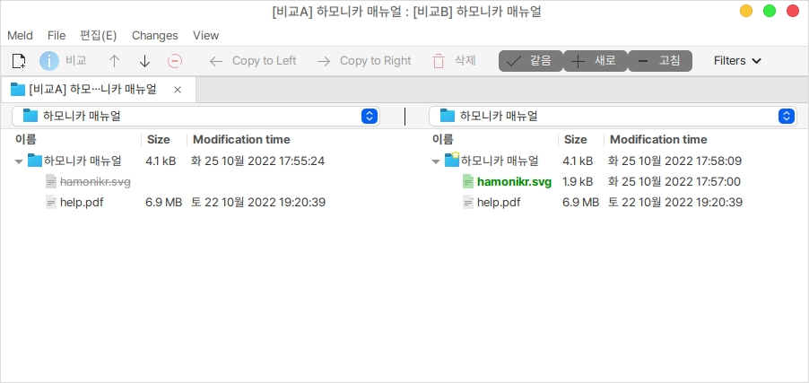
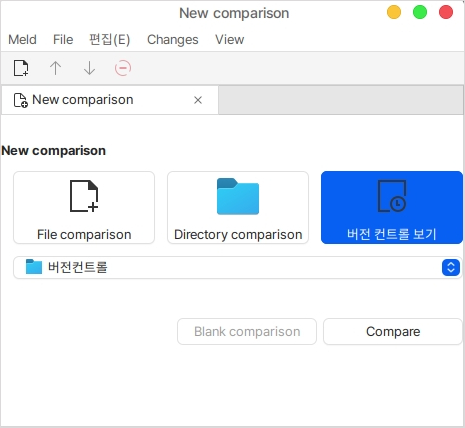
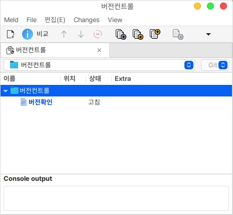

# Meld

## 설치

터미널을 열고 다음을 입력합니다.

<pre class="language-bash"><code class="lang-bash"><strong>sudo apt install meld
</strong></code></pre>

## 사용법

먼저 비교할 파일이나 디렉터리를 준비합니다.

<figure><figcaption></figcaption></figure>

meld를 실행합니다.

실행하면 다음과 같이 **파일 비교**(File comparison), **디렉터리 비교**(Directory comparison), **버전 컨트롤 보기**로 분류되어 있습니다.

<figure><figcaption></figcaption></figure>

### 파일 비교 (File comparison)

파일 비교를 하기 위해서는 파일 비교 버튼을 클릭하고 하단의 없음 버튼을 클릭하여 직접 파일을 선택하거나 드래그 앤 드롭으로 비교할 파일을 끌어다가 추가할 수 있습니다.

우측의 체크박스에 체크를 하면 최대 3개의 파일까지 비교가 가능합니다.

파일의 내용을 비교하는 것이기 때문에 이미지, 바이너리 파일 등 비교하기 어려운 항목에 대해서는 표시가 되지 않거나 깨져서 보이게 됩니다.

비교할 파일을 추가하였다면 아래쪽의 비교(Compare) 버튼을 누릅니다.

<figure><figcaption></figcaption></figure>

중앙의 화살표 버튼으로 비교한 내용을 좌측, 우측으로 동기화 할 수 있으면 저장 버튼을 이용하여 저장할 수 있습니다.

3개를 비교하는 경우도 마찬가지로 화살표 버튼을 이용하여 동기화 할 수 있습니다.

<figure><figcaption></figcaption></figure>

### 디렉터리 비교 (Directory comparison)

디렉터리 비교는 디렉터리 안에 있는 모든 항목에 대해 비교합니다.

<figure><figcaption></figcaption></figure>

내용을 확인할 수 없는 경우의 파일은 존재의 유무만 확인할 수 있습니다.

내용을 확인할 수 있는 파일의 경우에는 더블 클릭하여 파일 비교의 기능을 사용할 수 있습니다.

<figure><figcaption></figcaption></figure>

### 버전 컨트롤 보기

깃, SVN등 형상 관리도구를 통하여 변경 내용을 확인할 수 있습니다.

<figure><figcaption></figcaption></figure>

형상 관리 되어있는 최신 소스를 가져와서 해당 텍스트 문서의 내용을 변경하면 다음과 같이 변경된 항목이 표시됩니다.

상단의 버튼을 이용하여 commit, push 까지 진행 할 수 있습니다.

<figure><figcaption></figcaption></figure>
