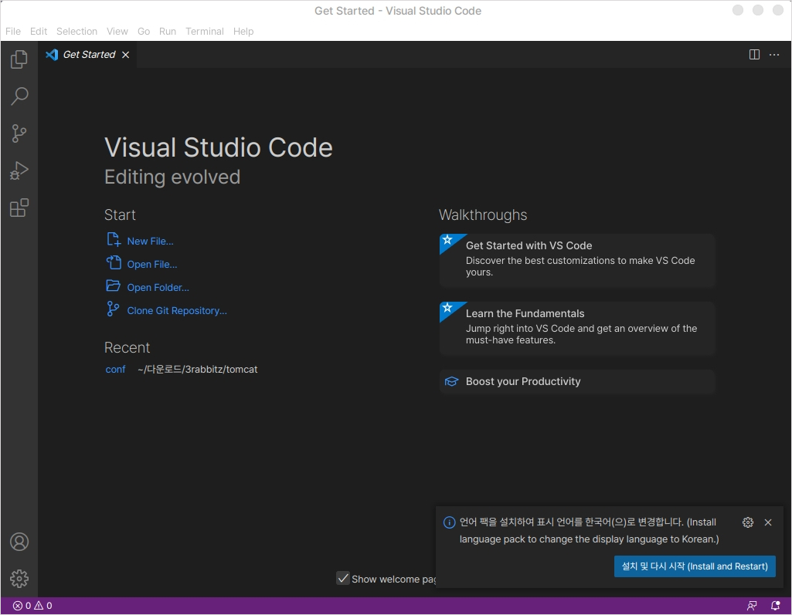

# Visual Studio Code

## 설치

다음 링크를 클릭하여 deb 확장자로된 code 패키지를 다운로드 합니다.



다운로드한 패키지 파일을 더블클릭합니다.

<figure><figcaption></figcaption></figure>

패키지 설치 버튼을 클릭하여 설치합니다.

<figure><figcaption></figcaption></figure>

## 실행

처음 실행 화면입니다.

우측 하단의 알림으로 올라오는 한국어 언어팩을 설치를 하게 되면 인터페이스가 전부 한국어로 바뀌게 됩니다.

<figure><figcaption></figcaption></figure>

좌측의 메뉴의 블록모양 아이콘을 누르면 마켓플레이스로 이동할 수 있습니다.

검색을 통해 원하는 개발 환경과 다양한 확장 기능을 추가할 수 있습니다.

<figure><figcaption></figcaption></figure>

자바 환경을 구축하고 싶다면 다음과 같은 순서로 진행하실 수 있습니다.

```bash
# 1.자바설치 (자바 11이 설치됩니다.)
sudo apt install default-jdk

# 2.마켓플레이스에서 자바 확장팩 설치
# Visual Studio Code 마켓플레이스에서 Extension Pack for Java를 검색하여 설치
```

리눅스 Visual Studio Code의 특징으로는 윈도우 버전과 일부 바로가기 키가 다르다는 점입니다.

```
# 커맨드 팔레트(Command Palette)
# 윈도우 : Ctrl + Shift + A
# 리눅스 : Ctrl + Shift + P
```

자바 프로젝트를 생성하기 위해서 Ctrl + Shift + P 기능을 사용합니다.

java로 검색시 Java: Create Java Project... 항목을 선택합니다.

원하는 설정을 선택하고 프로젝트 이름을 생성합니다.

자바 프로그램이 잘 실행되는지 확인합니다.

<figure><figcaption></figcaption></figure>
