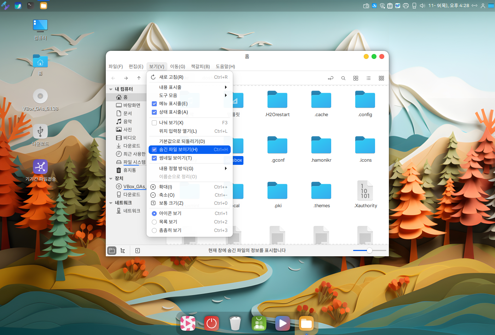
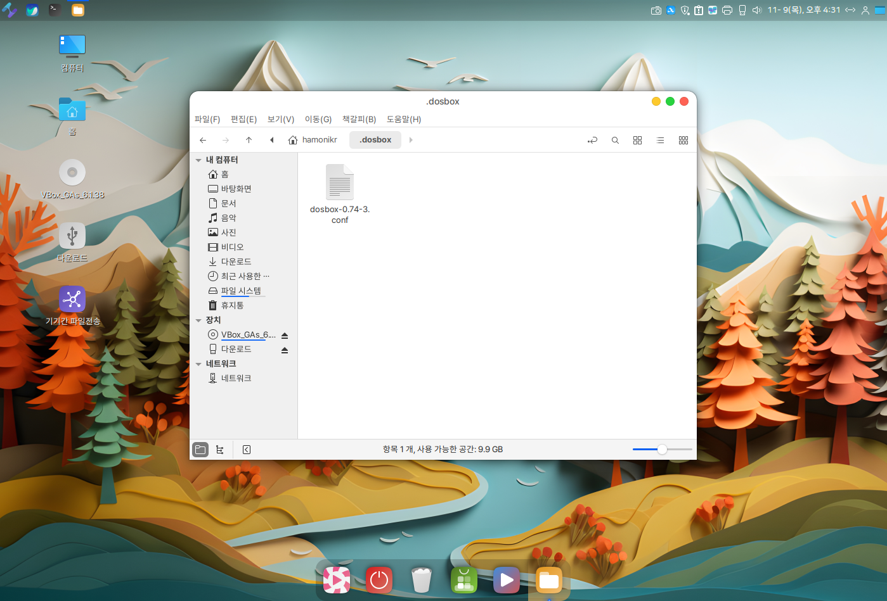

# 고전게임(dosbox)

Hamonikr OS에서는 추억의 게임을 위해 dosbox 프로그램이 설치되어있습니다.


## 고전 게임을 하기위한 사전 작업.

* Dosbox configue 파일 생성 및 설정
* Dosbox 게임 다운로드


### 1. Dosbox configue 파일 생성 및 설정

Albert (alt + space) 또는 프로그램 메뉴에서 "DOSBox Emulator"를 실행합니다.&#x20;

<figure><figcaption></figcaption></figure>

* "exit" 또는 Dosbox 닫기를 눌러서 종료해주세요.
* DOSBox Emulator가 실행되면 설정파일을 체크하는데 없으면 자동으로 생성시켜줍니다.&#x20;
* Dosbox 설정 파일 위치는  /home/\<user>/.dosbox/dosbox-0.\*\*\*.conf&#x20;
* 생성된 설정 파일은 아래에서 설정해 드리겠습니다.&#x20;


### 1-1. DOSBox 게임 폴더 생성.

여러개의 게임을 다운받아 즐기기위해서 홈폴더안에 dosbox game 폴더를 생성해 주세요.&#x20;

```
# 터미널에서 폴더 생성
$ mkdir ~/dosbox/
```

바탕화면에 있는 홈 아이콘을 클릭 후 빈 곳에서 마우스 우클릭 > 새폴더 만들기를 하셔도됩니다.&#x20;

<figure><figcaption></figcaption></figure>

### 1-2. DOSBox 설정&#x20;

DOSBox 설정을 위해서 '.dosbox"폴더를 더블 클릭하세요. ".dosbox" 폴더는 숨긴 폴더이기 때문에 안보입니다.&#x20;

보기 > 숨긴 파일 보이기를 선택하시면 폴더안의 숨긴 폴더및 파일을 보여요\~\~

<figure><figcaption></figcaption></figure>

만약 ".dosbox"폴더를 더블 클릭하시면 dosbox-0.74-3.conf 파일을 확인하실 수 있습니다.&#x20;

<figure><figcaption></figcaption></figure>

<figure><figcaption></figcaption></figure>

dosbox 설정 파일을 열고  아래와 같이 수정합니다. 여신 다음 파일 맨 밑에 mount 명령어를 적어주세요.


DOSBox 전체 화면으로 전환한뒤 다시 원화면으로 돌아올떄 바탕화면 디스플레이 꺠짐 방지.

```
fullscreen=false
fulldouble=false
#fullresolution=original
fullresolution=desktop <----------------- fullresolution의 값을 desktop으로 변경해주세요.
windowresolution=original
output=overlay
#output=surface
autolock=true
sensitivity=100
waitonerror=true
priority=higher,normal
mapperfile=mapper-0.74-3.map
usescancodes=true

```

DOSBox 자동 마운팅.

```

[autoexec]
# Lines in this section will be run at startup.
# You can put your MOUNT lines here.

mount c: /home/hamonikr/dosbox # dosbox가 실행할 때 자동으로 마운트 시켜줍니다.
c: # 마운트된 폴더로 이동.
```


### 2. 고전 게임 다운로드

고전게임(dosbox)을 하기 위해서는 먼저 게임을 다운로드 받아야합니다.&#x20;





위 주소 또는 구글이나 네이버에 msdos game으로 검색하셔서 다운로드 받으셔도 됩니다.&#x20;


다운로드 받은 게임을 압축을 푼다음 1-1. DOSBox 게임 폴더 생성에서 만드신 폴더로 복사&붙여넣기 하세요

```
# 터미널에서 압축 푸는방법.
unzip ~/다운로드/ppx.zip -d ~/dosbox/ppx
```

<figure><figcaption></figcaption></figure>


### 3. 고전게임 실행하기.

Albert (alt + space) 또는 프로그램 메뉴에서  DOSBox Emulator를 실행합니다.&#x20;

```
c:\> cd ppk <---게임폴더명
c:\ppk> dir <-- ppk 폴더안의 파일 목록 보기

c:\ppk> ppk.exe <-- ppk 게임 실행
```

<figure><figcaption></figcaption></figure>

DOSBox  실행된 상태에서 "dir" 입력 후 엔터을 눌러보세요.

다운로드 받으신 게임 목록이 출력됩니다.

<figure><figcaption></figcaption></figure>

원하시는 게임 폴더로 이동을 하신 후  ".EXE"  확장자를 가진 파일을 실행하면됩니다.

<figure><figcaption></figcaption></figure>


<figure><figcaption></figcaption></figure>

<figure><figcaption></figcaption></figure>
