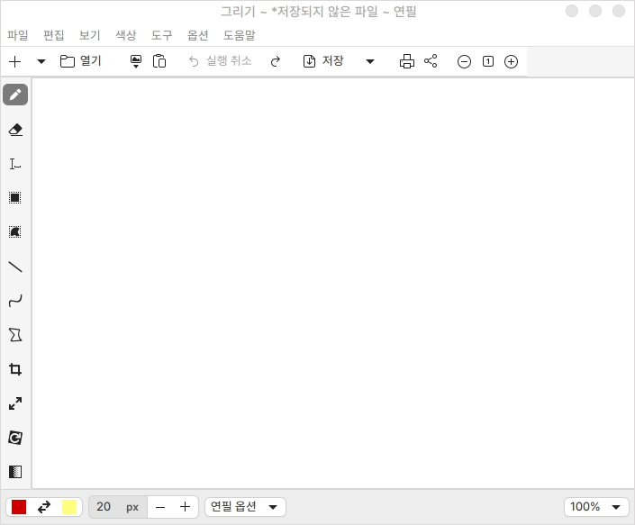
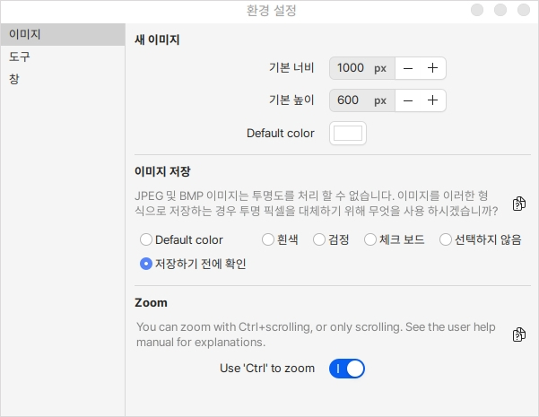

# 그림판 (drawing)

## 설치

터미널을 열고 다음을 입력합니다.

```bash
sudo apt install drawing
```

## 실행

간단한 이미지를 수정하거나 그림을 그릴 수 있는 그래픽 프로그램입니다.

기본 사용 방법은 좌측의 도구를 선택하고 하단의 색상, 크기, 옵션을 정해서 사용합니다.

예를 들어 모양 아이콘을 선택하고 하단의 모양 옵션을 선택하여 사각형 동그라미 모양등을 지정하여 사용하실 수 있습니다.

<figure><figcaption></figcaption></figure>

환경 설정을 통해 기본 이미지의 크기를 지정하거나 도구 추가, 테마 등을 변경할 수 있습니다.

<figure><figcaption></figcaption></figure>
