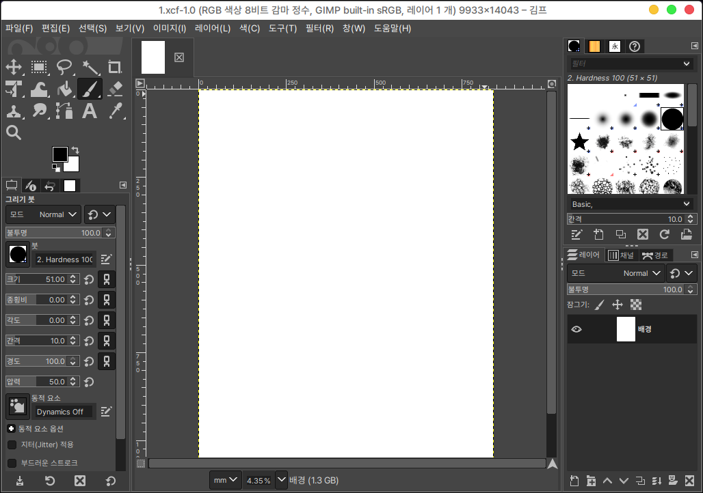

# 그누 이미지 처리 프로그램 (gimp)

김프는 리눅스에서 포토샵과 일러스트레이터의 기능을 대체할 수 있는 오픈소스 그래픽 편집 툴입니다.

사용하던 키나 도구가 일부 다를 수 있지만 리눅스에서 가장 많이 쓰고 있는 프로그램 중 하나입니다.

## 설치

터미널에서 다음과 같이 입력합니다.

```
sudo apt install gimp
```

## 실행

시작 메뉴에서 확인하실 수 있습니다.

<figure><figcaption></figcaption></figure>

파일 > 새 이미지를 통해 배경을 추가합니다.

좌측 상단의 편집 도구를 선택하여 하단의 설정을 통해 크기나 간격 등을 조정하실 수 있습니다.

우측 상단에서는 특정 패턴의 붓 도구를 사용하실 수 있으며 우측 하단에는 포토샵이나 일러스트레이터와 같이 레이어를 통해 이미지를 관리하실 수 있습니다.

<figure><figcaption></figcaption></figure>

