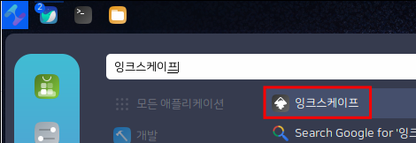
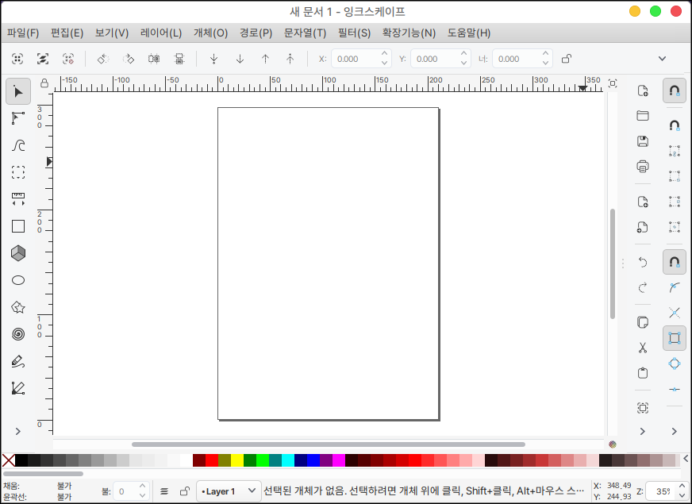
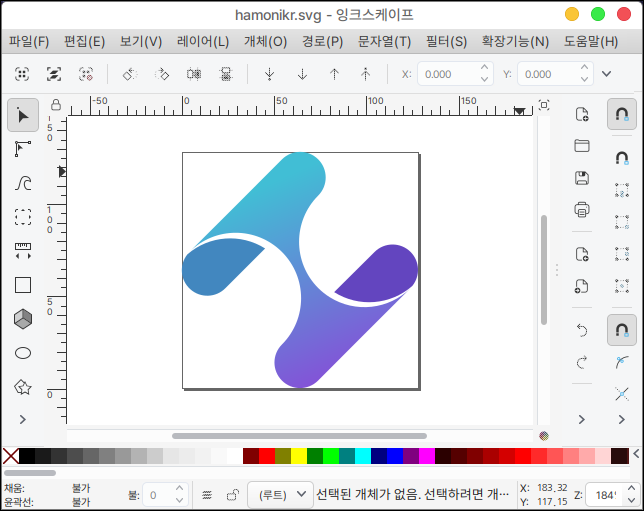
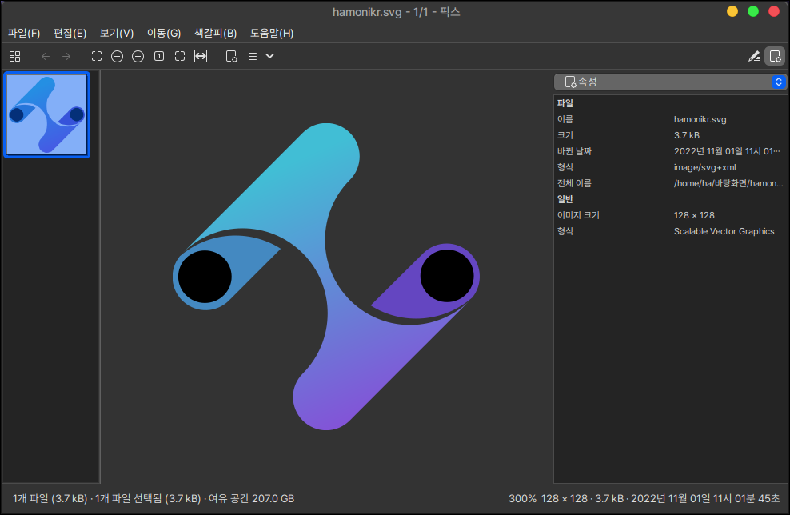

# 잉크스케이프

잉크스케이프는 벡터 그래픽 편집기 입니다.

크기를 변경해도 해상도가 유지되는 이미지가 벡터 이미지 입니다.

일반적인 그림판, 김프 등은 해당 벡터 이미지를 가져와서 저장할 경우 png로 변환이 되기 때문에 특별한 도구가 필요합니다.

이를 해결하기 위한 편집도구가 여러가지가 있지만 잉크스케이프가 가장 유명합니다.

벡터 이미지의 확장자는 보통 SVG 이미지 파일입니다.

SVG 파일은 다양한 곳에 사용하는데 보통 리눅스에서는 파일이나 폴더의 아이콘 이미지로 많이 사용됩니다.

## 설치

터미널을 열고 다음과 같이 입력합니다.

```bash
sudo apt install inkscape
```

## 실행

시작 메뉴에서 확인하실 수 있습니다.

<figure><figcaption></figcaption></figure>

실행화면 입니다.

이미지 삽입시 마우스를 끌어다 사용하면 이미지가 해당 페이지에 삽입이 되는 형태이기 때문에 특정 이미지를 수정 해야할 경우 따로 열기를 통해서 이미지를 열어주어야 합니다.

<figure><figcaption></figcaption></figure>

다음과 같이 따로 이미지를 열어줄 경우 이미지 사이즈에 맞는 도화지로 생성이 됩니다.

<figure><figcaption></figcaption></figure>

즉석에서 수정을 하고 Pix 이미지 뷰어로 열어 보았습니다.

간단하게 벡터 이미지를 편집하고 바로 저장을 할 수 있기 때문에 빠른 작업을 할 수 있습니다.

<figure><figcaption></figcaption></figure>
