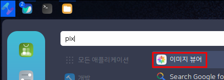
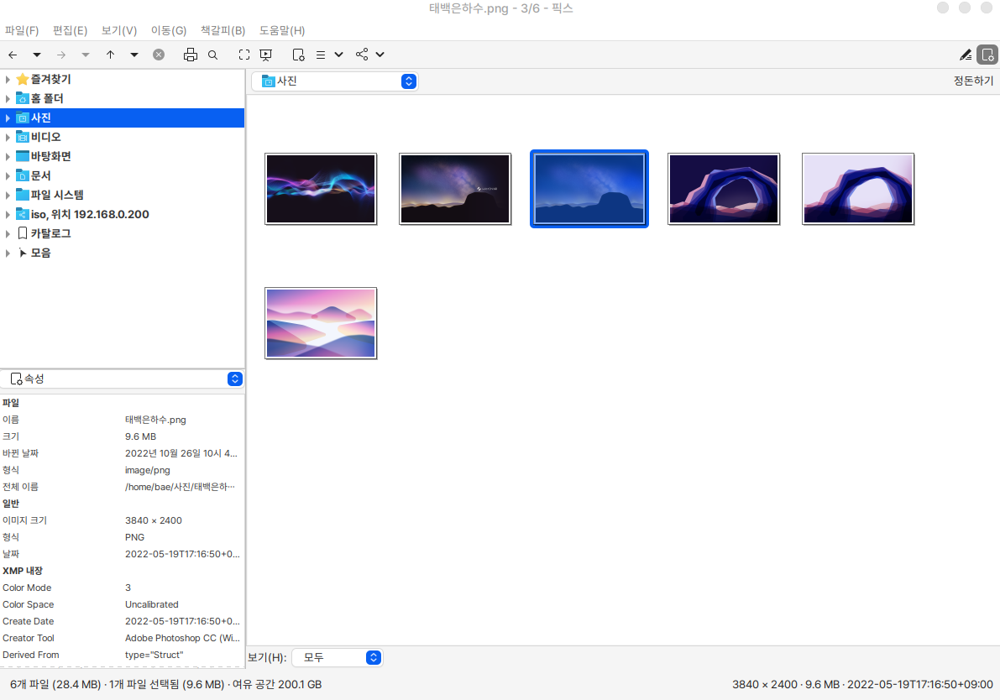
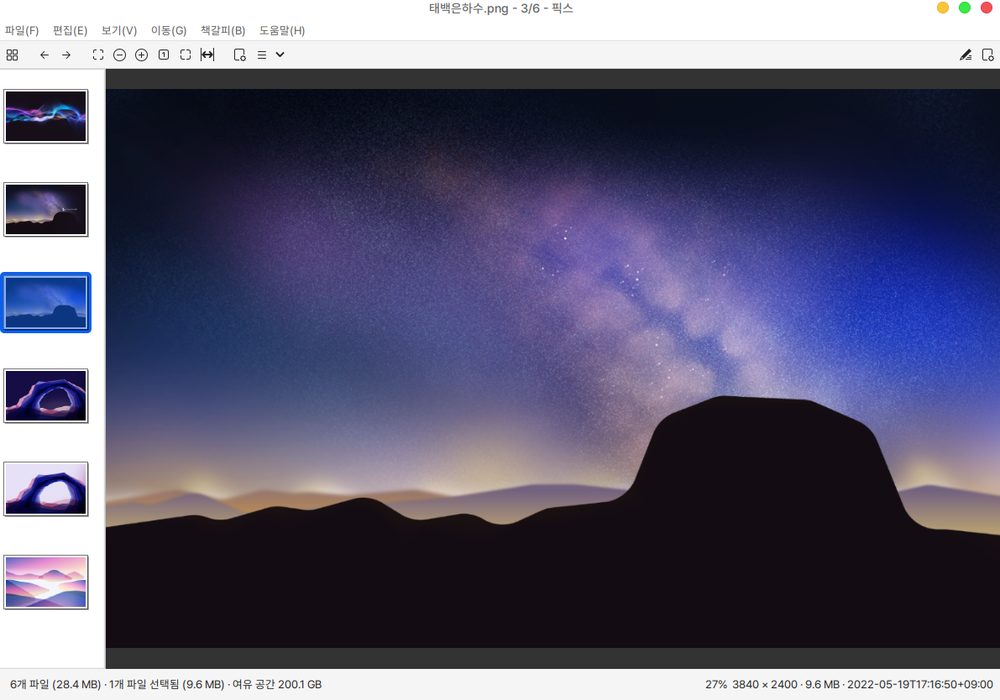
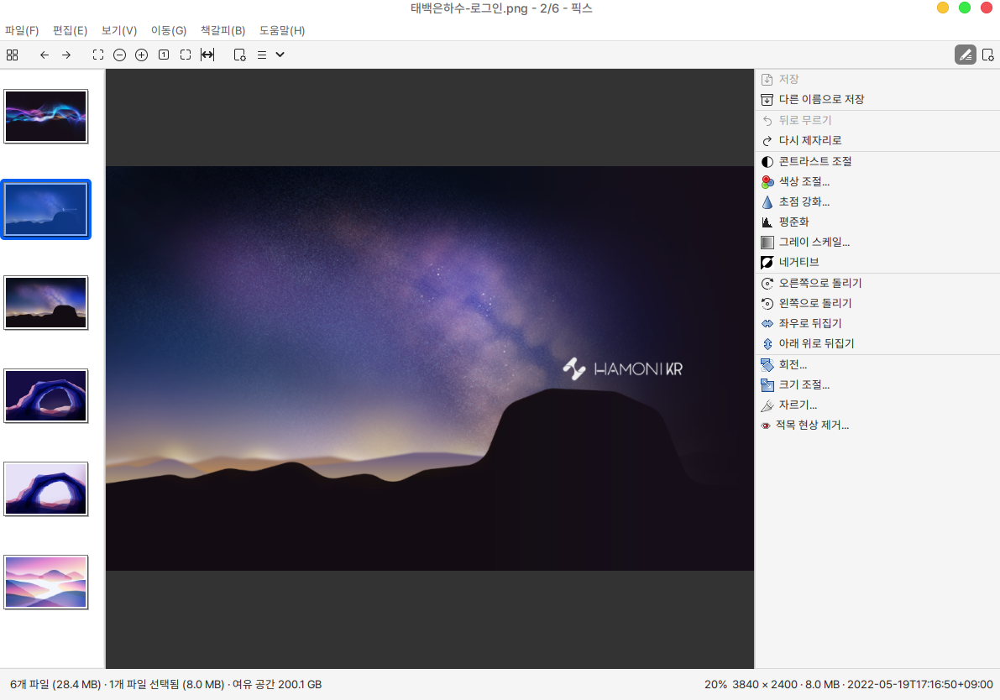
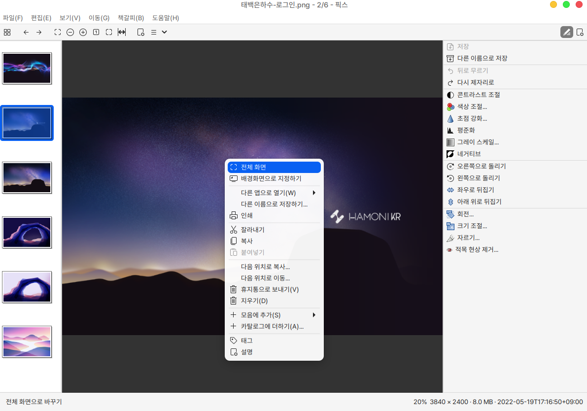

# 이미지 뷰어 (Pix)

픽스는 이미지를 보거나 간단하게 편집, 보정할 수 있게 도와주는 오픈소스 소프트웨어 입니다.

## 설치

터미널에서 다음과 같이 입력합니다.

```bash
sudo apt install pix 
```

## 실행

시작 메뉴에서 확인하실 수 있습니다.

<figure><figcaption></figcaption></figure>

처음 픽스를 열면 기본은 사진 폴더에 위치해 있습니다.

<figure><figcaption></figcaption></figure>

특정 이미지를 선택하면 확대해서 보실 수 있으며 키보드 좌우 방향키나 상하 방향키로 이전이나 다음 이미지로 이동할 수 있습니다.

<figure><figcaption></figcaption></figure>

아래 이미지에서 우측 상단 닫기 버튼 아래에 있는 연필 모양의 아이콘을 클릭하면 해당 이미지를 보정하거나 편집할 수 있습니다.

연필 모양 아이콘 오른쪽에 있는 버튼은 해당 파일의 속성을 표시하고 있으며 메뉴 선택시 히스토그램도 확인하실 수 있습니다.

<figure><figcaption></figcaption></figure>

이미지에서 마우스 우클릭을 했을 때 설정할 수 있는 창입니다.

바로 배경화면으로도 지정이 가능하며 이외에도 여러 기능을 지원합니다.

<figure><figcaption></figcaption></figure>
