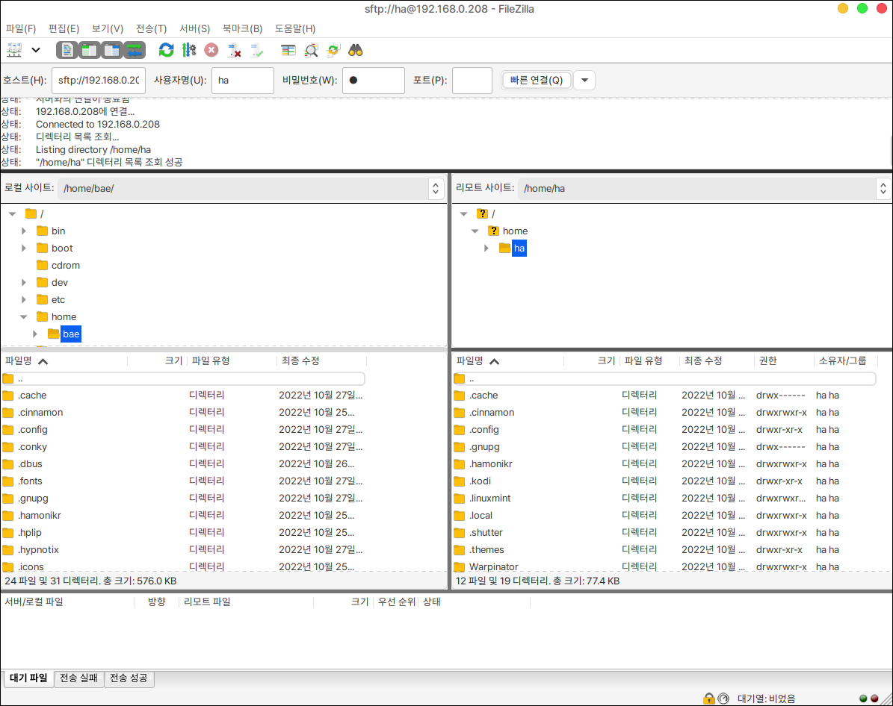

# Filezilla

파일질라는 FTP, SFTP 프로토콜을 통해 파일을 주고 받을 수 있는 오픈소스 소프트웨어 입니다.

<figure><figcaption></figcaption></figure>

## 설치

터미널에 다음을 입력합니다.

```
sudo apt install filezilla
```


## 실행

파일질라는 상대방 원격지의 아이피 주소와 아이디, 패스워드, 포트번호를 필요로 합니다.

기본 접속포트는 22번입니다.

sftp로 접속할시 호스트의 아이피 주소 앞에 sftp:// 를 입력해주어야 정상적으로 접속이 됩니다.

<figure><figcaption></figcaption></figure>
