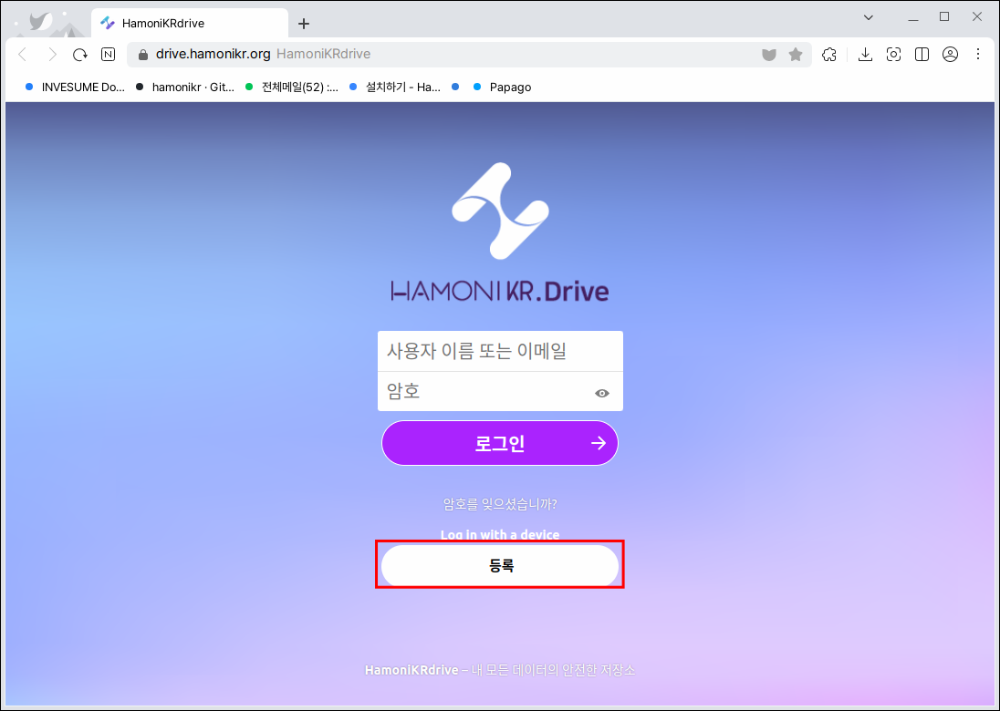
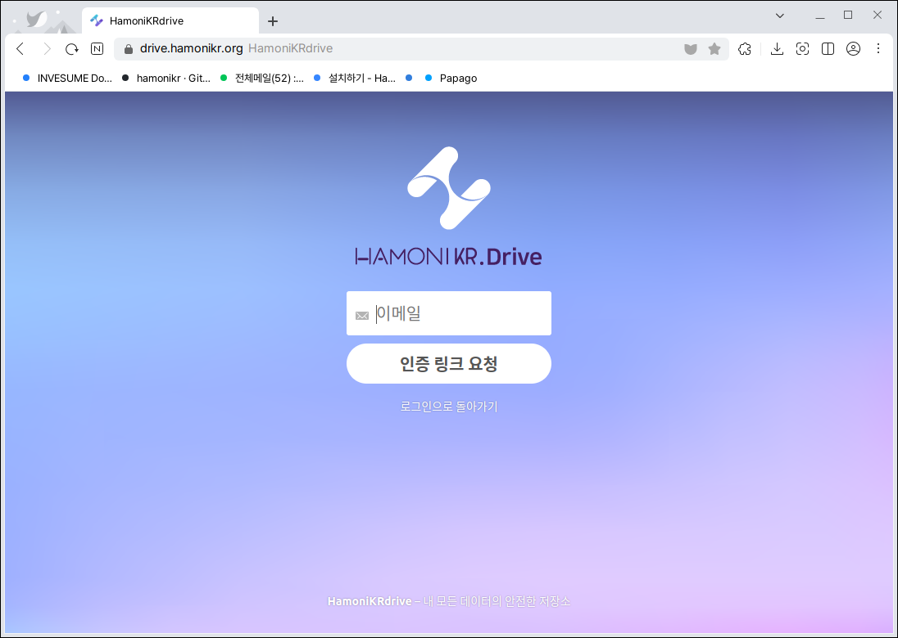
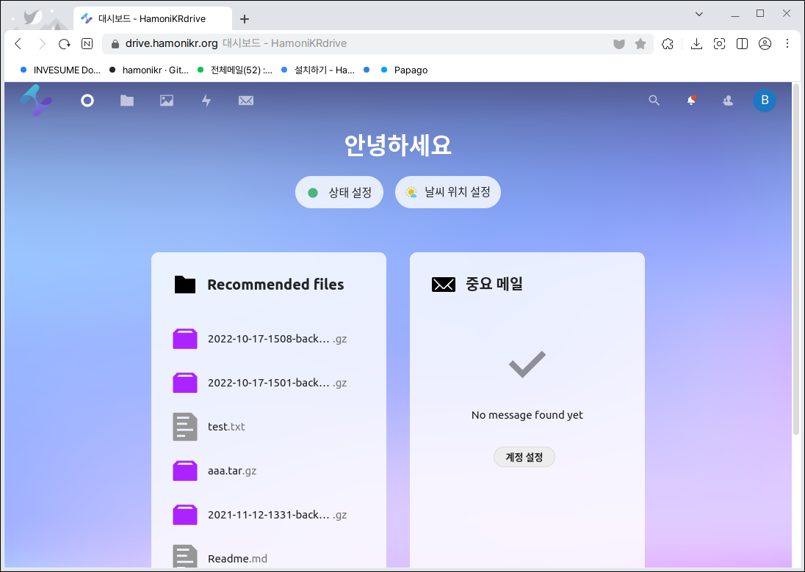
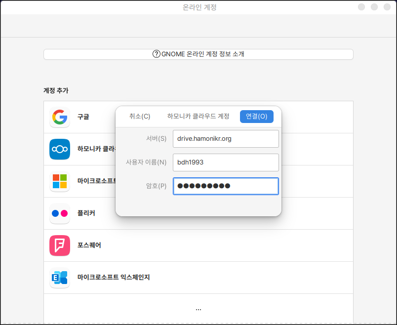
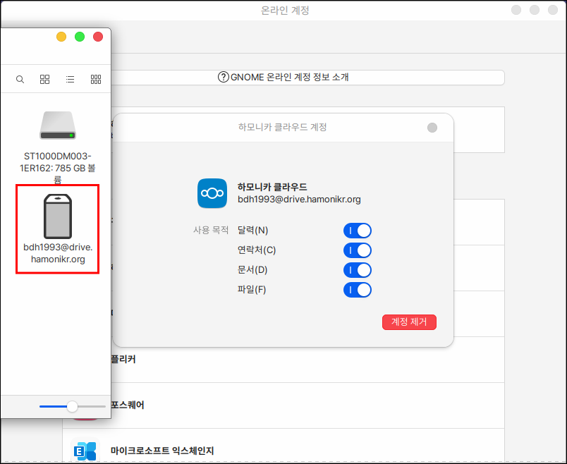

# 하모니카 드라이브

하모니카에서 제공하고 있는 웹하드입니다.

하모니카 백업에서 연동하여 사용자의 홈 폴더에 있는 파일을 웹하드로 백업 복원할 수 있습니다.

## 설치

터미널을 열고 아래와 같이 입력합니다.

```bash
sudo apt install hamonikr-drive
```

## 실행

시작메뉴에서 웹하드를 검색하여 실행합니다.

<figure><figcaption></figcaption></figure>

### 회원가입

하모니카 드라이브 실행하면 인터넷 웹페이지로 이동됩니다.

아이디가 존재한다면 로그인을 하여 사용하실 수 있고 회원가입이 필요한 경우 하단의 등록버튼을 누릅니다.

<figure><figcaption></figcaption></figure>

이메일 주소를 입력하는 창이 나오게 됩니다.

순서대로 회원가입을 진행합니다.

<figure><figcaption></figcaption></figure>

회원가입이 완료되면 로그인이 제대로 되는지 직접 로그인 하여 확인합니다.

<figure><figcaption></figcaption></figure>

### 계정 연동

계정 연동은 다른 프로그램인 외부 서비스 연동에서 진행해야 합니다.

<figure><figcaption></figcaption></figure>

실행하여 하모니카 클라우드를 클릭하고 연동합니다.

**서버** : drive.hamonikr.org

**사용자 이름** : ID

**암호** : PW

<figure><figcaption></figcaption></figure>

&#x20;연동이 정상적으로 완료되었다면 다음과 같이 탐색기에 연동된 drive 항목이 표시됩니다.

<figure><figcaption></figcaption></figure>
