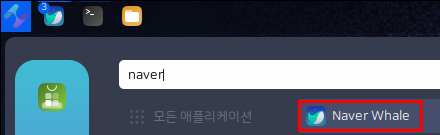

# Naver Whale

네이버 웨일은 네이버가 만든 크로미움 기반의 브라우저입니다.

<figure><figcaption></figcaption></figure>

## 설치

다음 링크를 통해 네이버웨일 데비안 패키지를 다운로드 합니다.



다운로드가 되지 않을 경우 공식 홈페이지의 링크를 통해 다운받아주세요



## 실행

네이버 웨일은 기본적으로 사이드 탭에 파파고, 네이버와 관련된 앱들이 설치되어 있어 매우 유용하게 사용하실 수 있습니다.

<figure><figcaption></figcaption></figure>
