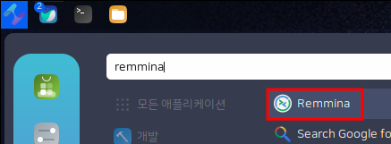
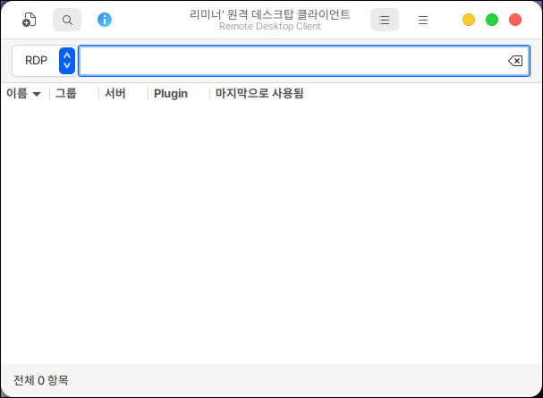
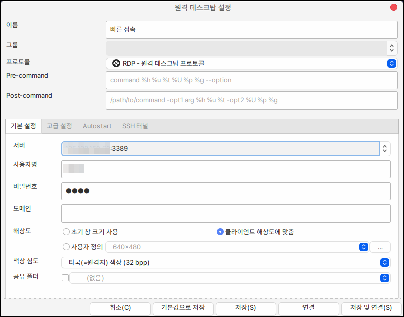
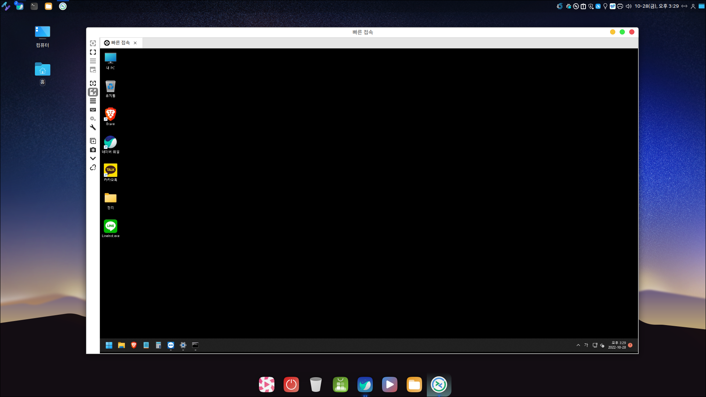

# Remmina

하모니카 리눅스에서 윈도우 PC에 접속하여 사용하기 위해서는 remmina와 같은 원격 데스크톱 연결 프로그램을 사용하여 쉽게 접속할 수 있습니다.

## 설치

터미널을 열고 다음을 입력하여 설치합니다.

```bash
sudo apt install remmina \
                 remmina-plugin-rdp \
                 remmina-plugin-secret \
                 remmina-plugin-vnc \
                 remmina-plugin-spice
```

## 실행

<figure><figcaption></figcaption></figure>

처음 프로그램을 실행한 화면입니다.

좌측 상단의 + 버튼을 누르면 원격 데스크탑 설정을 할 수 있습니다.

<figure><figcaption></figcaption></figure>

### 윈도우 원격 접속

원격접속을 하기 위해서는 다음과 같이 설정을 해야합니다.

**서버** : IP:PORT를 입력해줍니다.

윈도우의 기본 원격접속 포트는 3389이기 때문에 생략할 수 있습니다.

**사용자명** : 윈도우 명령 프롬프트를 열고 whoami를 입력합니다.

PC이름/사용자명 으로 적혀있는 부분 중 사용자 명을 입력해줍니다.

**비밀번호** : 윈도우 접속 비밀번호입니다.

**해상도** : 클라이언트 해상도에 맞춤으로 설정해야 원격지 PC의 해상도로 조정됩니다.

**색상심도** : 리스트의 위로 올라갈수록 높은 색상을 보여주지만 원격접속 반응속도가 떨어집니다.

반대로 낮은 색상은 속도가 빨라집니다.

**공유폴더** : 로컬 PC의 폴더를 원격지 공유하여 파일을 옮길 수 있습니다.

<figure><figcaption></figcaption></figure>

&#x20;원격접속에 성공한 화면입니다.


윈도우에서 원격접속을 허용해 주어야 원격접속이 가능합니다.


<figure><figcaption></figcaption></figure>
