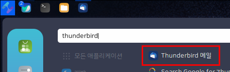
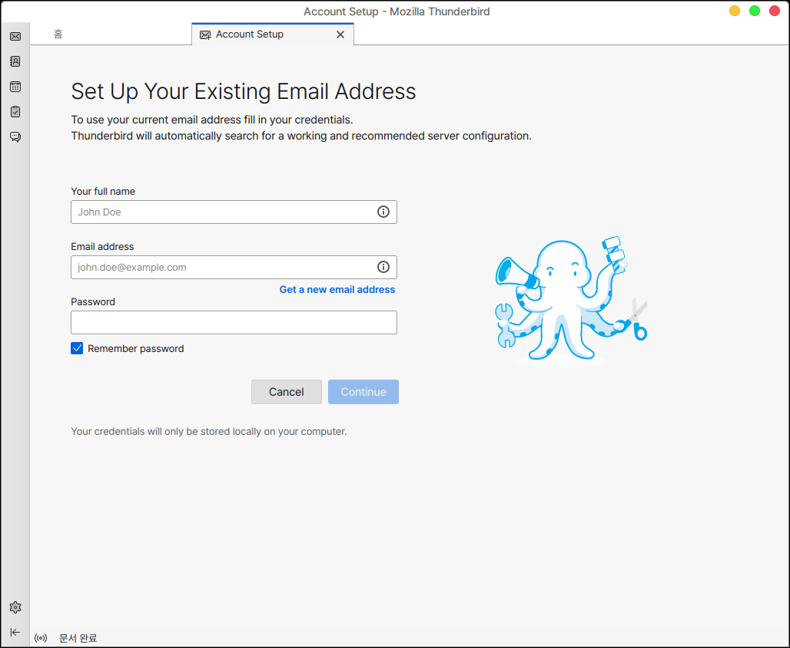
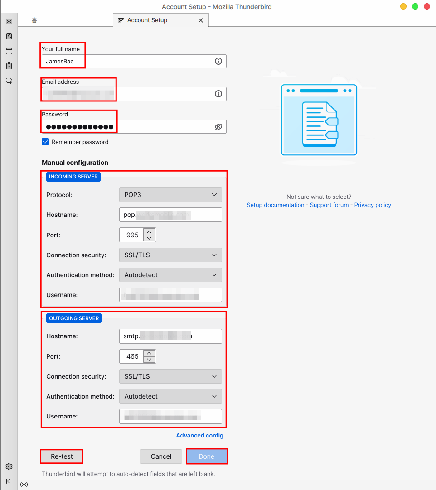
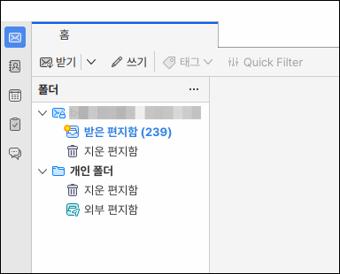

# Thunderbird 메일

썬더버드(Thunderbird)는 모질라 재단이 개발한 메일 및 뉴스 클라이언트 입니다.

여러곳의 외부 메일(구글, 네이버 등)을 가지고와서 한눈에 확인할 수 있으며 핵심 기능인 메일 기능 이외에도 일정관리 등 다양한 기능들을 이용할 수 있습니다.

## 설치

터미널에 다음을 입력하여 설치합니다.

```bash
# 설치
sudo apt install thunderbird

# 한국어팩 설치
sudo apt install thunderbird-locale-ko
```

## 실행

<figure><figcaption></figcaption></figure>

기본 실행화면입니다.

첫 화면부터 메일을 연동, 등록할 수 있도록 입력하는 창이 뜨게됩니다.

**Your full name :** 자신의 이름또는 닉네임 입력합니다.

**Email address** : 외부에서 가지고 올 이메일 주소를 입력합니다.

**Password** : 외부 이메일 주소의 로그인 비밀번호를 입력합니다.

<figure><figcaption></figcaption></figure>

위에 있는 내용을 입력하게 되면 취소 버튼 왼쪽에 Manual configuration 항목이 나타나게 됩니다.

클릭하게 되면 아래와 같이 INCOMING SERVER, OUTGOING SERVER 항목을 입력할 수 있습니다.

INCOMMING 방식에는 POP3 방식과 IMAP 방식이 존재하는데 외부메일 사이트의 환경설정에 가 보면 접속 정보, 포트 등이 표시되어 있습니다.

OUTCOMMING 방식은 SMTP 를 입력하시면 됩니다.


POP3 방식과 IMAP 방식의 SMTP 포트가 다를 수 있습니다.


모두 입력하였고 Done 버튼이 활성화 되지 않는다면 하단의 Re-test 버튼을 먼저 클릭해주세요.

초록색 팝업창이 나오면 정상적으로 이용가능 합니다.

Done 버튼을 누릅니다.

<figure><figcaption></figcaption></figure>

연동을 하게 되면 외부에 있는 메일을 받아오게됩니다.

상당한 시간이 소요될 수 있습니다.

<figure><figcaption></figcaption></figure>
