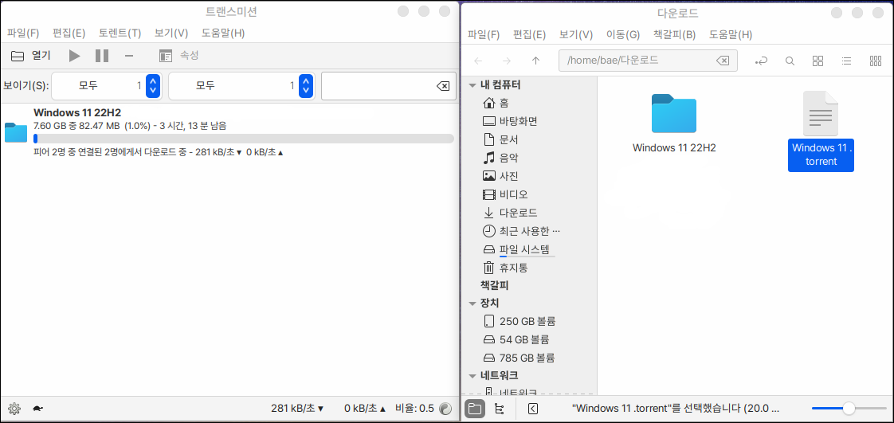

# 토렌트 클라이언트

토렌트 클라이언트는 토렌트 파일 또는 주소를 이용하여 파일을 다운로드 하는 프로그램입니다.

<figure><figcaption></figcaption></figure>

토렌트 파일을 끌어다가 토렌트 클라이언트 창에 끌어다 놓으면 다운로드가 시작됩니다.

기본 다운로드 주소는 사용자 홈 폴더의 다운로드 폴더이며 변경이 가능합니다.

<figure><figcaption></figcaption></figure>
