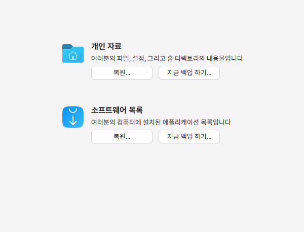
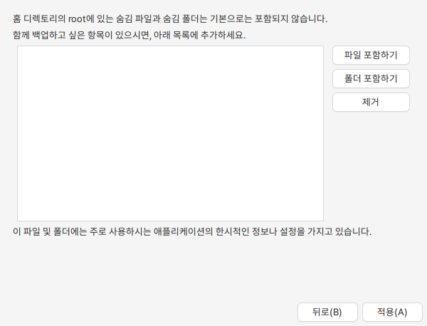

# 백업 도구

## 백업

개인 자료와 설치된 애플리케이션을 선택하여 백업을 할 수 있습니다.&#x20;

<figure><figcaption></figcaption></figure>

개인자료는 개인(계정)의 파일, 설정, 홈 디렉토리의 내용을 백업할 수 있습니다. 로컬PC에 백업공간을 선택하면 해당 폴더로 백업이 진행됩니다.&#x20;

<figure><figcaption></figcaption></figure>

<figure><figcaption></figcaption></figure>

홈 디렉토리의 root에 있는 숨김 파일과 폴더는 백업에 포함되지 않으로 추가로 백업하고 싶은 항목이 있으면 추가합니다.&#x20;

<figure><figcaption></figcaption></figure>

로컬 PC 백업 폴더에 백업이 완료되었습니다.&#x20;

<figure><figcaption></figcaption></figure>

하모니카 드라이브 사용에 체크를 하고 하모니카 드라이브의 계정 정보를 입력하여 연결하면 하모니카 드라이브가 바탕화면에 마운트 되며 드라이브로 백업 파일을 저장할 수 있습니다.&#x20;

<figure><figcaption></figcaption></figure>

소프트웨어 목록의 백업은 사용자가 설치한 애플리케이션을 선택하여 백업할 수 있습니다.&#x20;

<figure><figcaption></figcaption></figure>

## 복원

개인자료의 복원은 완전 덮어쓰거나 잃어버린 파일만 복구할 수 있습니다. 로컬PC에 저장이 되었거나 하모니카 드라이브에 저장된 백업파일을 선택할 수 있습니다.&#x20;

<figure><figcaption></figcaption></figure>

