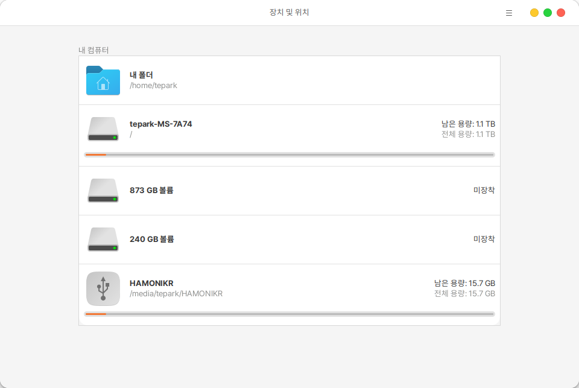
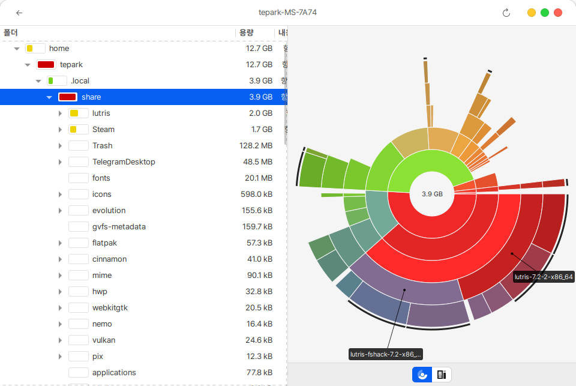

# 디스크 사용량 분석

PC에 연결된 하드디스크, USB 등의 사용 정보를 분석하여 보여줍니다.&#x20;

<figure><figcaption></figcaption></figure>

하드디스크의 디렉토리별 사용 용량과 파일 수량, 최종 수정 날짜 등의 내역을 보여주며, 마우스로 클릭하면 상세정보를 나타냅니다.

<figure><figcaption></figcaption></figure>
