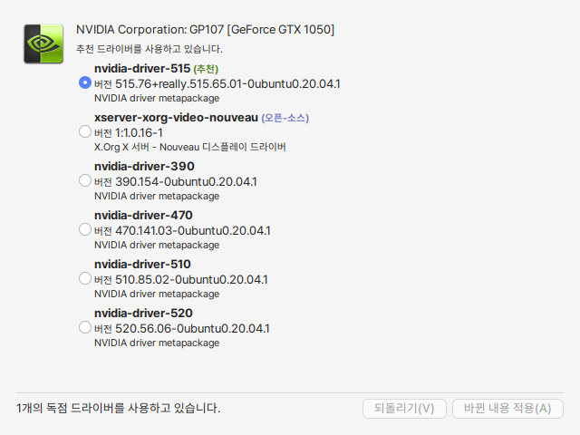

# 드라이버 매니저

드라이버 매니저를 실행하 현재 PC에설치된 상용 그래픽 드라이버(HW)에서 사용할 수 있는 적절한 드라이버를 추천하여 줍니다. 오픈소스 드라이버 혹은 제조사의 드라이버를 버전에 따라 추천하여 줍니다.

사용자는 해당 드라이버 중 적절한 드라이버를 설치하면 됩니다.&#x20;

<figure><figcaption></figcaption></figure>

