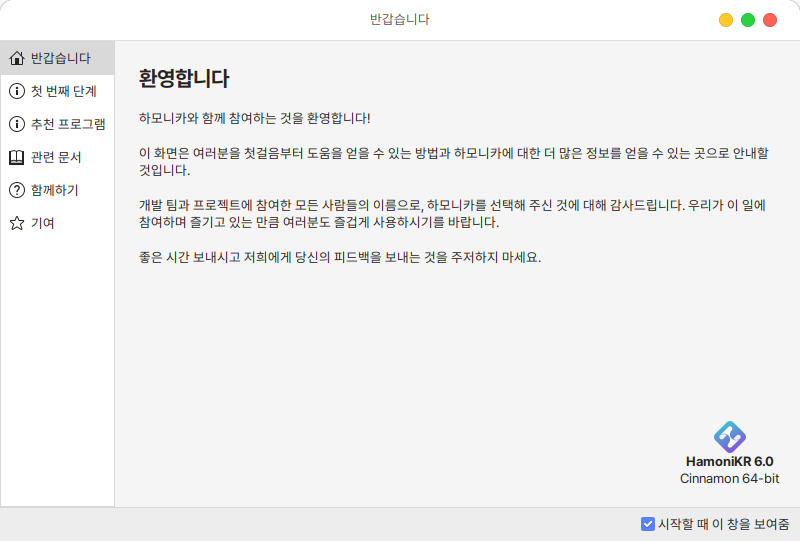
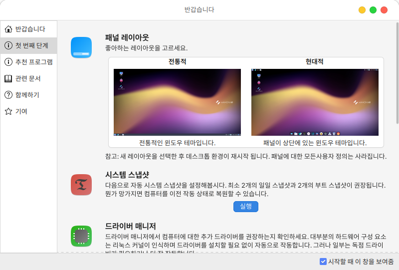
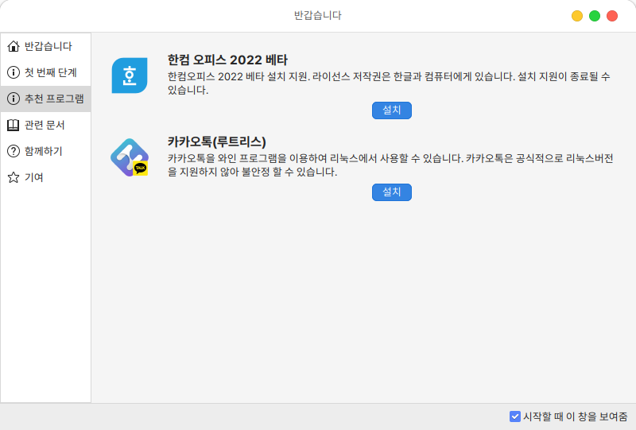
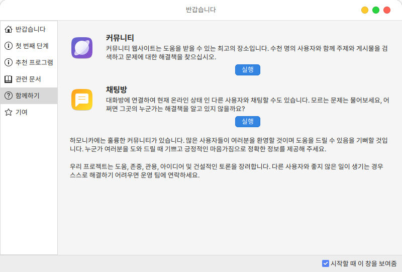

# 환영합니다

처음 사용자를 위한 안내와 기본 사용방법, 추천 프로그램등을 안내합니다.

<figure><figcaption></figcaption></figure>

바탕화면 레이아웃 설정, 시스템 스냅샷, 드라이버/업데이트 매니저, 시스템 설정, 소프트웨어 매니저 등 바로가기 를 제공합니다.&#x20;

<figure><figcaption></figcaption></figure>

추천 프로그램에서는 한글문서 편집을 위한 한컴 오피스 2022 베타, 카카오톡 설치를 제공합니다.

<figure><figcaption></figcaption></figure>

사용자 가이드와 새로운 기능, 릴리즈 노트, 커뮤니티 참여 방법과 프로젝트 기여 방법 등에 대한 정보를 제공합니다.&#x20;

<figure><figcaption></figcaption></figure>
