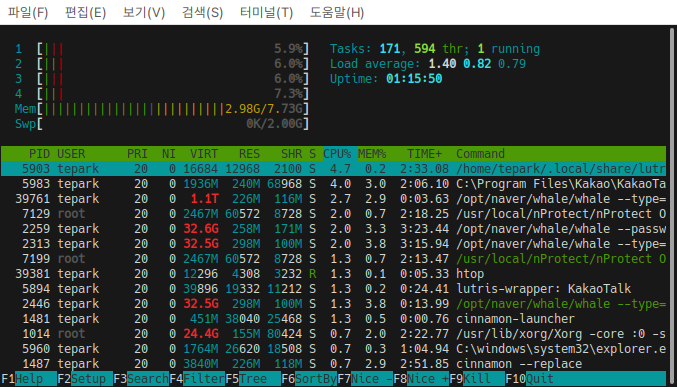

# Htop

Htop은 실시간으 시스템 자원사용과 프로세스의 상태를 확인할 수 있습니다.&#x20;

## 설명

CPU 상태 표시 : 각 CPU코어를 프로세스가 점유하고 있는 비율을 표시하고 각 bar는 해당 코어에 사용된 퍼센트를 나타냅니다.

* 파랑색 bar : low-priority
* 초록색 bar : normal
* 빨강색 bar : 커널
* 하늘색 bar : virtualiz

<figure><figcaption></figcaption></figure>

Htop 하단에 있는 단축키의 역할은 다음과 같습니다.&#x20;

* F1 Help : 단축기 기능 확인
* F2 Setup : htop 설정 메뉴
* F3 Search : 프로세스 검색
* F4 Filter : 프로세스 필터링(필터링할 키워드 입력)
* F5 Tree : Tree 구조로 변환
* F6 SortBy : 정렬&#x20;
* F7 Nice(-) : 우선순위 내림
* F8 Nice(+) : 우선순위 올림
* F9 Kill : 프로세스 종료 (kill -9 \[pid]와 같음)
* F10 Quit : Htop 종
