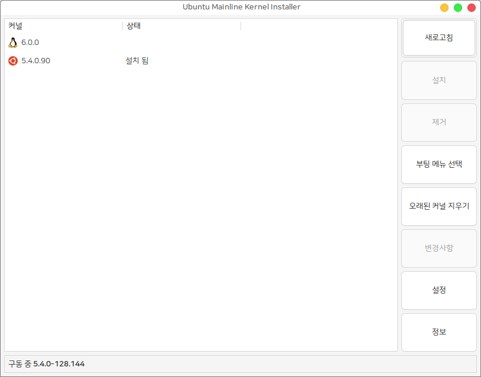

# 커널 업그레이드

`sudo apt upgrade` 를 통해 제공되지 않는 특정 버전 또는 최신 버전의 우분투 커널을 사용하고 싶은 경우 터미널을 사용하지 않고 GUI 를 통한 손쉬운 커널 업그레이드를 제공하는 프로그램 입니다.

이 프로그램을 사용하면 누구나 쉽게 자신의 시스템 커널을 업그레이드 하거나 삭제할 수 있습니다.

(※ 커널을 업그레이드 하면 시스템의 하드웨어가 정상적으로 동작하지 않을 수 있습니다.)

<figure><figcaption></figcaption></figure>

* 새로고침 : 좌측의 커널 목록이 새로고침 됩니다.
* 설치 : 커널 목록 중 설치되지 않은 커널을 선택 후 설치 버튼을 누르면 설치가 진행됩니다.&#x20;
* 제거 : 상태가 설치 됨 으로 표시된 커널을 선택 후 제거 버튼을 누르면 제거가 진행됩니다.
* 부팅 메뉴 선택 : 우선적으로 부팅 될 메뉴 선택이 가능합니다.&#x20;
* 오래된 커널 지우기 : 오래된 커널이 제거됩니다.
* 변경사항 : 변경사항을 확인하고 싶은 커널을 선택하고 버튼을 누르면 변경사항 확인이 가능합니다
* 설정 : 설정 화면이 보여집니다.
* 정보 : 프로그램의 상세 정보 확인이 가능합니다.&#x20;
