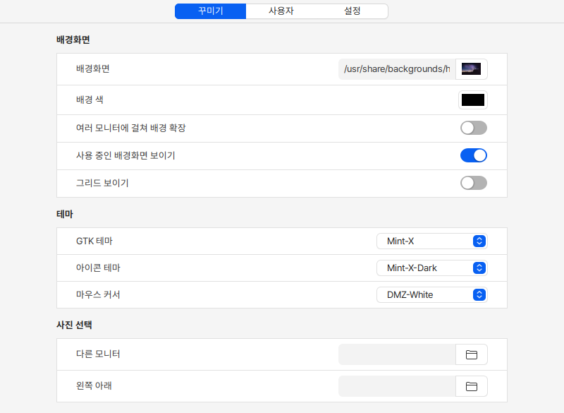
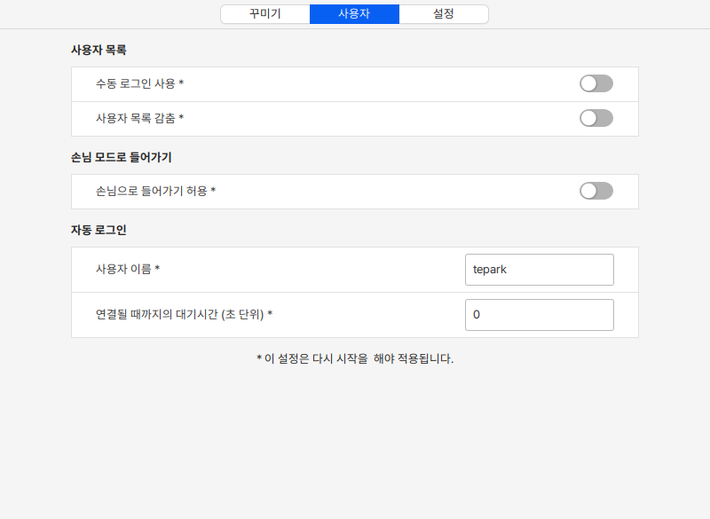
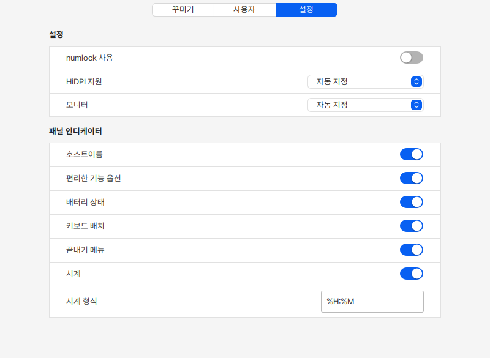

# 로그인 화면 설정

꾸미기 탭에서 로그인 화면을 사용자가 원하는데로 수정할 수 있습니다. 배경화면, 배경색과 로그인 화면의 테마를 변경할 수 있습니다.&#x20;

<figure><figcaption></figcaption></figure>

사용자 탭에서는 수동 로그인 설정, 사용자 목록 감춤, 손님 모드, 자동 로그인 등의 설정을 할 수 있습니다.

이 설정은 PC를 다시 시작해야 적용됩니다.&#x20;

<figure><figcaption></figcaption></figure>

설정 탭에서는 로그인 화면이 표시될 모니터, 기본 제공될 정보, 가상 키보드 배치, 시계, 배터리 상태 등의 정보 표시 여부를 설정할 수 있습니다.&#x20;

<figure><figcaption></figcaption></figure>
