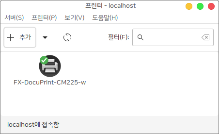
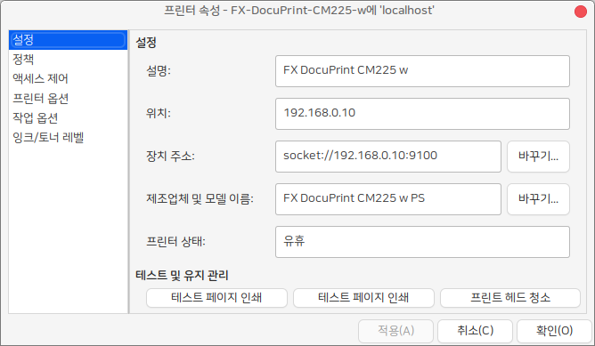
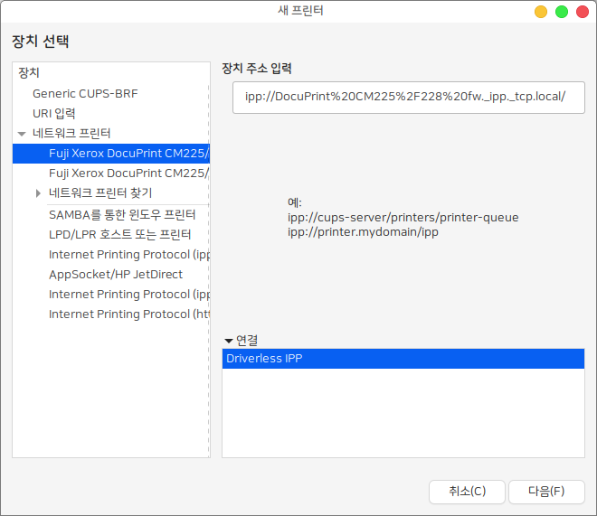

# 프린터

### 프린터 설정 

제어판의 프린터 아이콘을 클릭하면 다음과 같이 프린터를 추가할 수 있는 창이 나타납니다.

프린터를 추가하려면 상단의 추가 버튼을 누르고 자신의 시스템에 USB나 네트워크에 연결된 프린터를 선택할 수 있습니다.&#x20;

설정을 마친 프린터를 다음과 같이 다양한 옵션을 설정할 수 있습니다. (하드웨어 제조사의 드라이버 제공에 따라 다름)

프린터 제조사에서 적합한 리눅스용 드라이버를 제공하지 않는 경우에는 Driveless 프린터를 추가할 수도 있습니다.

보다 자세한 내용은 하모니카 커뮤니티의 사용자 가이드를 참고하세요.

### &#x20;
