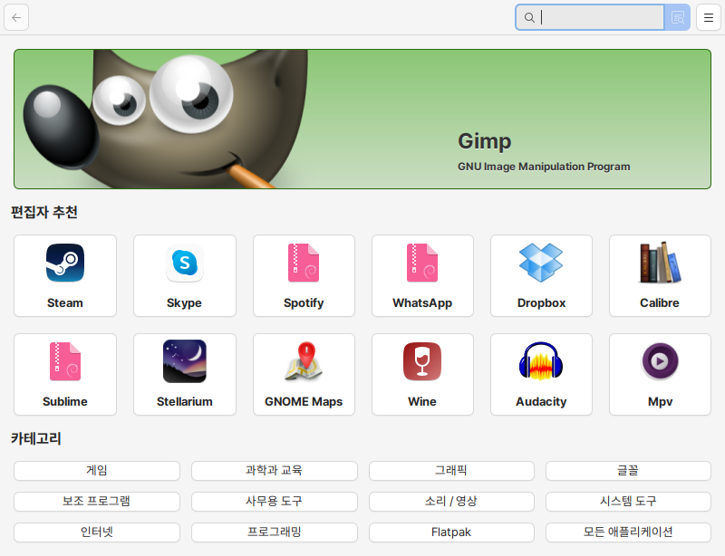
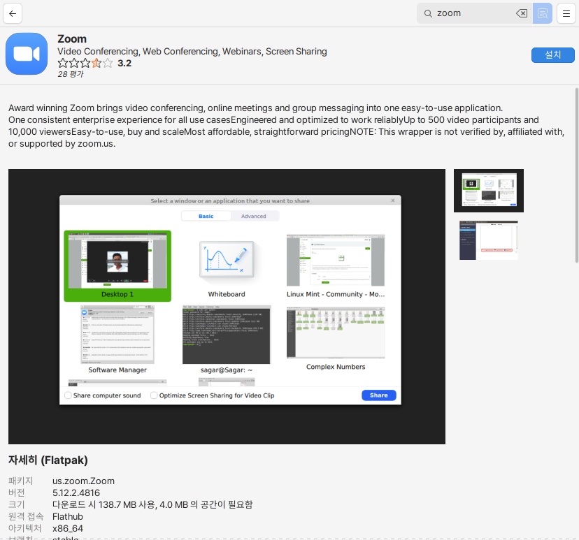

# 소프트웨어 매니저

소프트웨어매니저는 하모니카OS를 사용하는 사용자에게 유용한 최신의 수 만개 프로그램을 제공하고 있습니다.&#x20;

<figure><figcaption></figcaption></figure>

검색창에서 찾고자하는 프로그램을 검색하여 설치할 수 있습니다.&#x20;

프로그램의 설명과 홈페이지, 버전 정보와 설치용량, 아키택처 등의 기본 정보를  제공하고 다운로드 받은 사용자들의 코멘트와 별점을 확인할 수 있습니다.&#x20;

<figure><figcaption></figcaption></figure>
