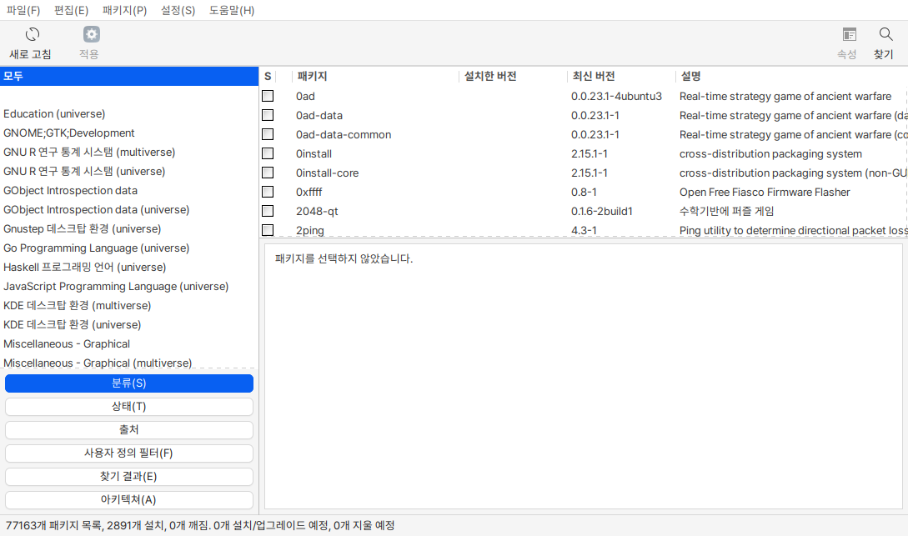
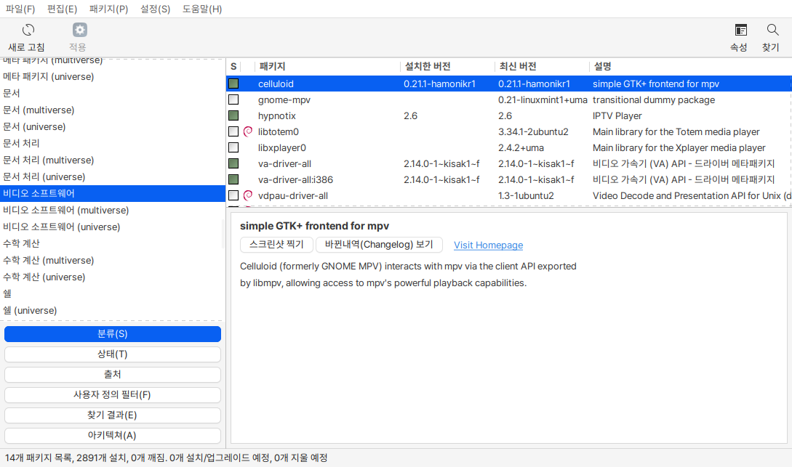

# 시냅틱 패키지 관리자

설치된 소프트웨어는 패키지라는 단위로 관리됩니다. 패키지 관리자는 소프트웨어 패키지를 설치하고, 업그레이드하고 삭제할 수 있게 도와줍니다.&#x20;

<figure><figcaption></figcaption></figure>

분류를 선택하면 설치되어있는 패키지 정보가 나타납니다. 패키지명과 설치된 버전, 최신 버전 정보를 제공하여 업그레이드 가능 여부를 확인할 수 있습니다.&#x20;

이와 같은 방법으로 각각의 패키지에 대해서 업그레이드를 하거나 삭제를 할 수 있습니다.&#x20;

<figure><figcaption></figcaption></figure>
