# 시스템 및 서비스 관리 (Stacer)

Stacer는 시스템의 상태 모니터링과 서비스를 관리할 수 있는 기능들을 제공합니다. 직관적이고 간결한 인터페이스로 초보자도 쉽게 서비스를 관리할 수 있습니다.&#x20;

**대시보드**

<figure>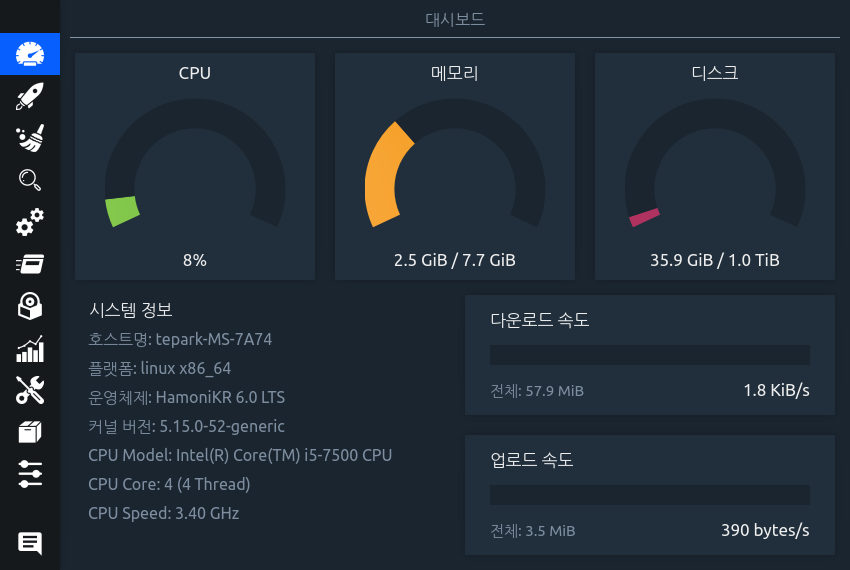<figcaption></figcaption></figure>

**시작 프로그램 목록**

<figure>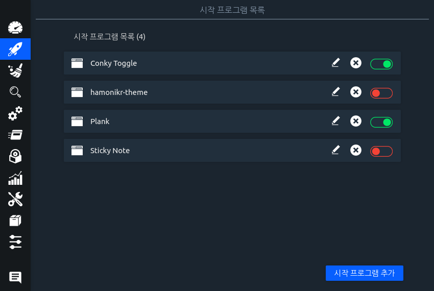<figcaption></figcaption></figure>

**시스템 클리너**

<figure>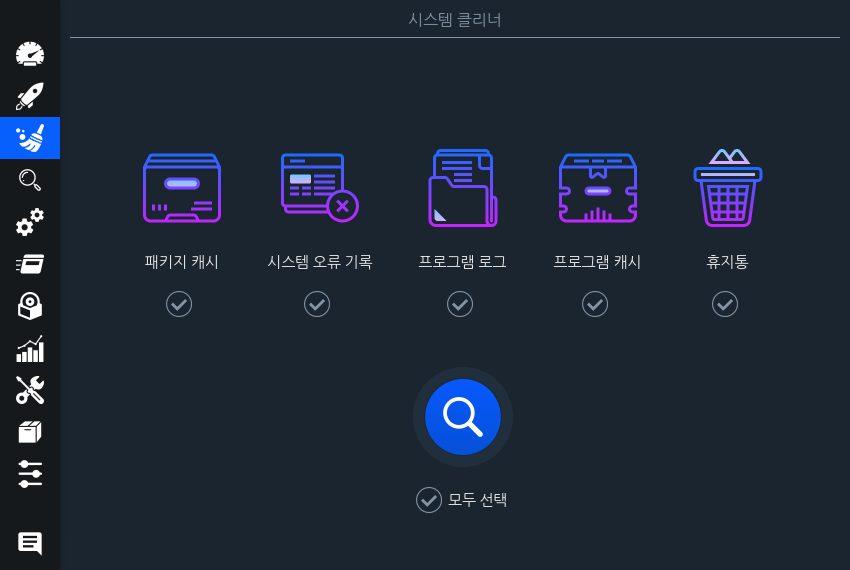<figcaption></figcaption></figure>

**검색(파일 및 폴더 검색)**

<figure>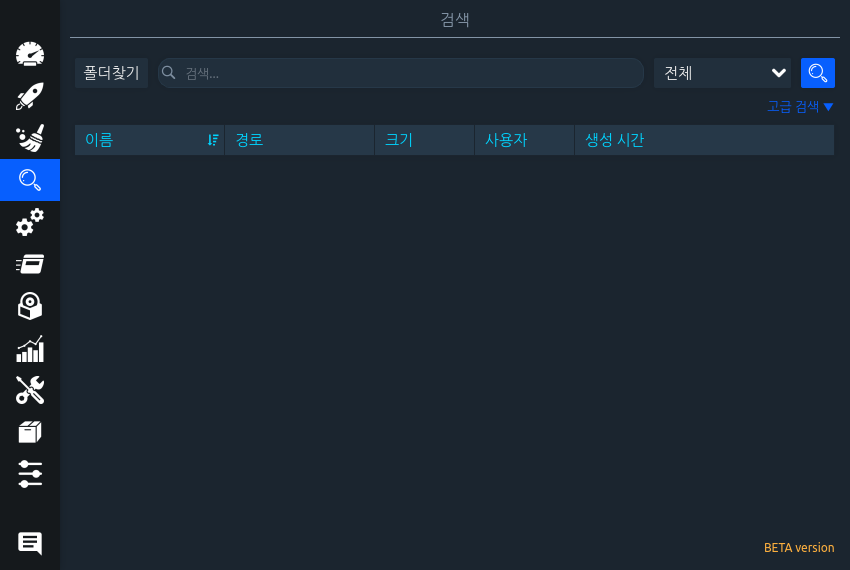<figcaption></figcaption></figure>

**서비스 목록(상태표시 및 실행/중단)**

<figure>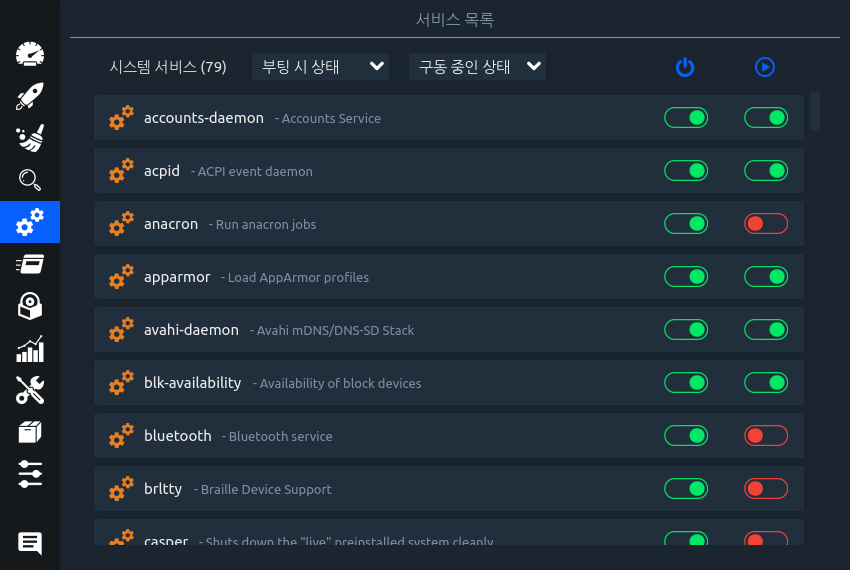<figcaption></figcaption></figure>

**프로세스 목록**

<figure>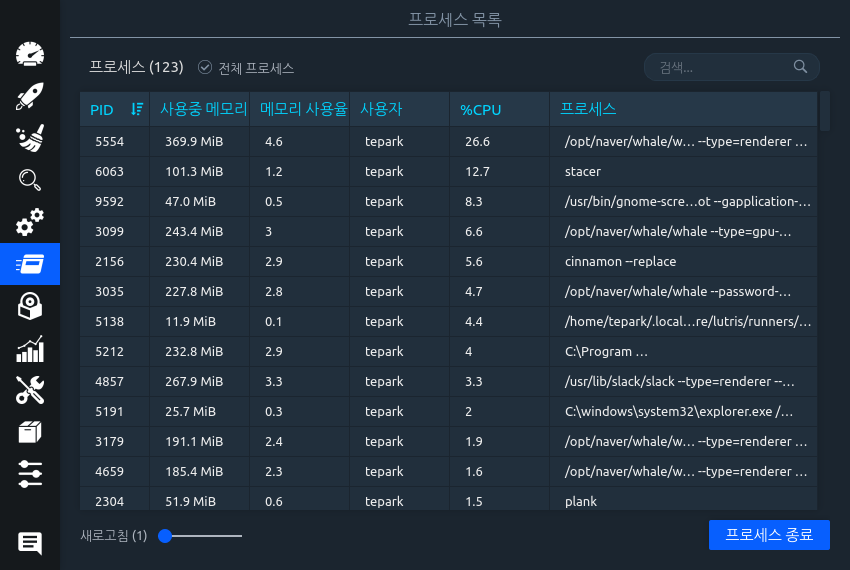<figcaption></figcaption></figure>

**프로그램 제거**

<figure>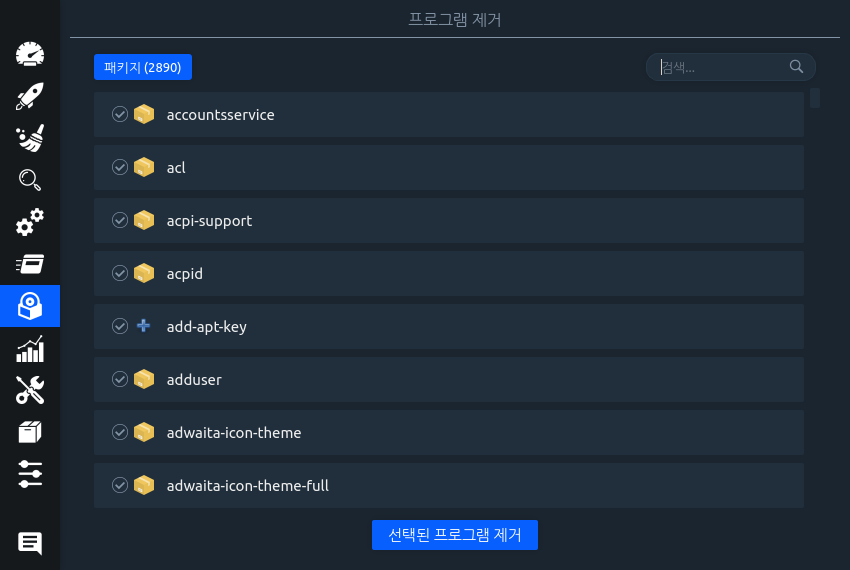<figcaption></figcaption></figure>

**시스템 자원(현황)**

<figure>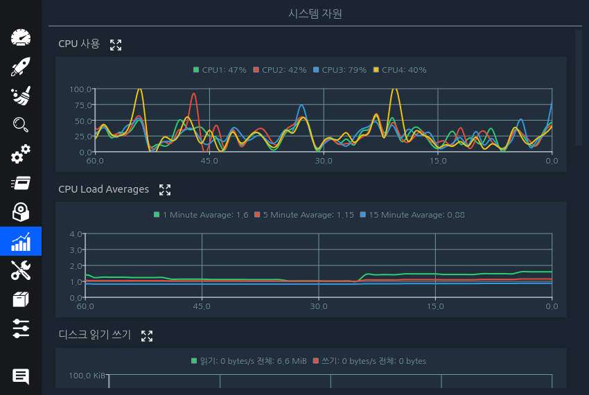<figcaption></figcaption></figure>

**호스트 관리**

<figure>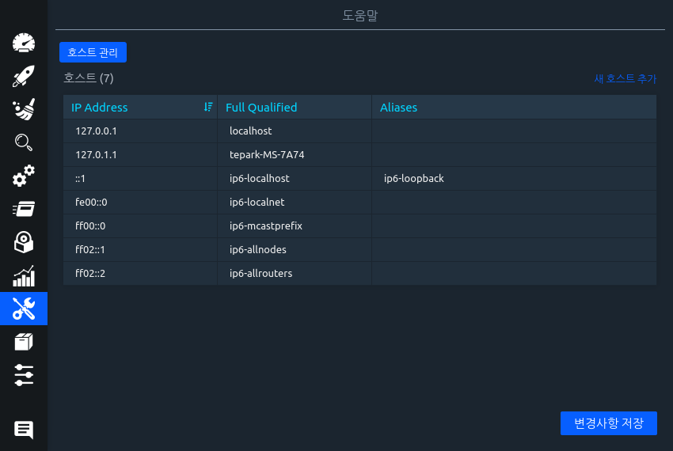<figcaption></figcaption></figure>

**APT 저장소 관리**

<figure>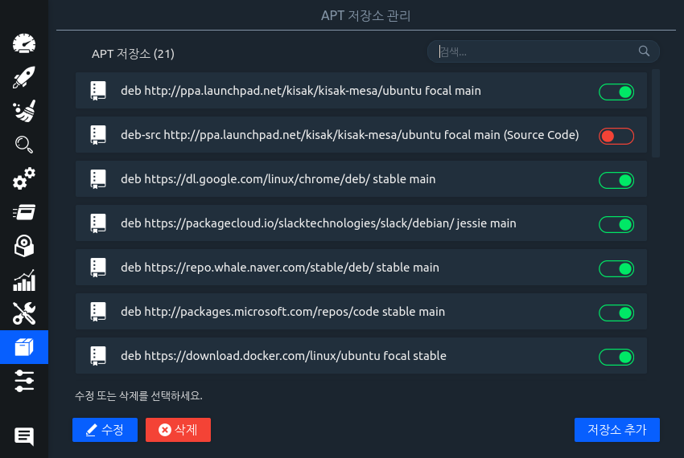<figcaption></figcaption></figure>

**설정**

<figure>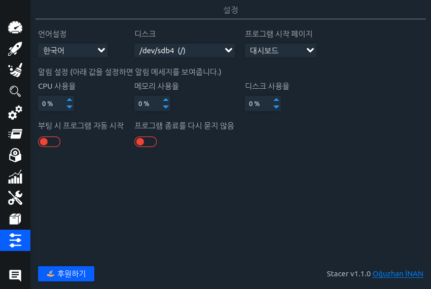<figcaption></figcaption></figure>
