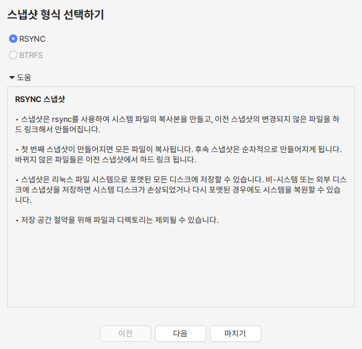
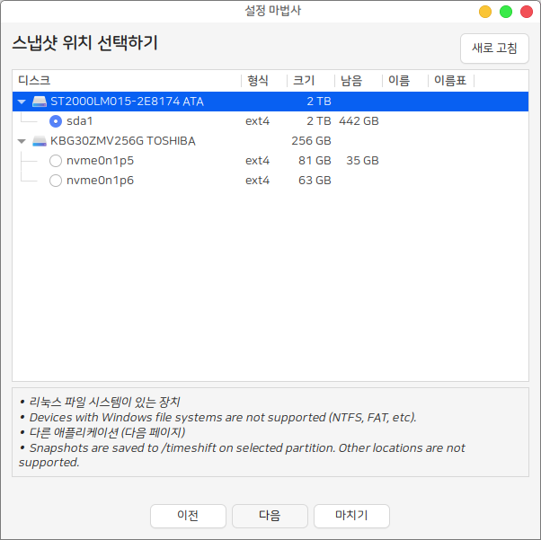
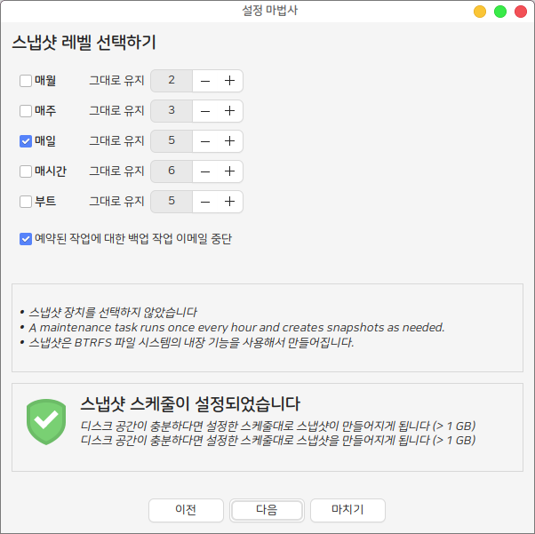
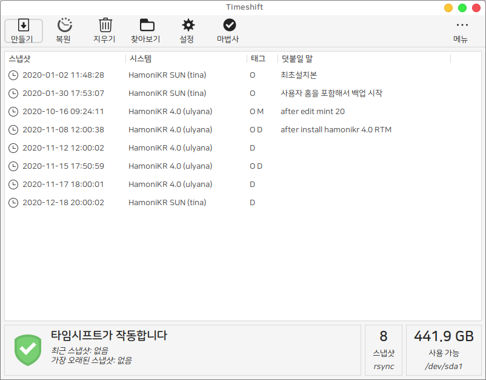
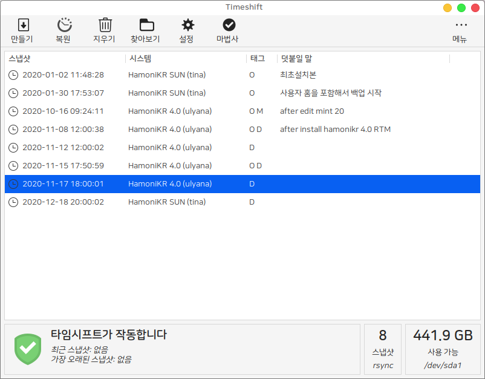
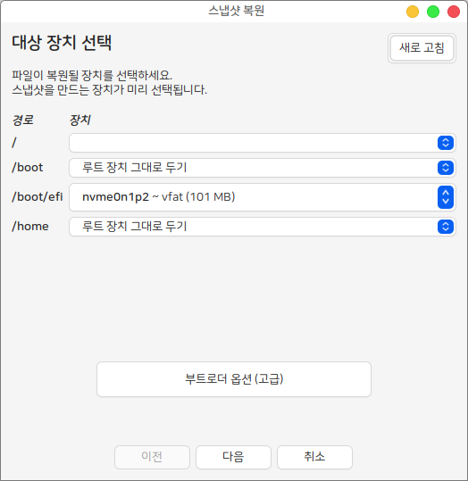
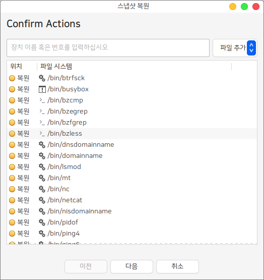

# 시스템 스냅샷 (Timeshift)

시스템 스냅샷을 통해서 시스템 사용중 문제가 발생하는 경우 쉽게 복원할 수 있습니다.&#x20;

처음 실행하는 경우 저장방식과 스냅샷이 저장될 위치를 묻는 창이 나타나고 이때 설정된 폴더에  스냅샷이 저장됩니다.&#x20;

<figure><figcaption></figcaption></figure>

스냅샷 저장 위치 선택

<figure><figcaption></figcaption></figure>

다음 버튼을 눌러 스냅샷을 생성할 방법을 선택합니다. 여기서 원하는 스냅샷 생성 스케쥴을 설정할 수 있습니다.

<figure><figcaption></figcaption></figure>

백업설정이 완료되고 정상적인 스냅샷이 생성되면 다음과 같이 설정된 스냅샷을 확인할 수 있습니다.

<figure><figcaption></figcaption></figure>

시스템을 이전에 생성한 스냅샷으로 복원하고 싶은 경우에는 생성한 스냅샷을 선택하고 프로그램 상단의 복원 버튼을 누릅니다.

<figure><figcaption></figcaption></figure>

스냅샷을 복원할 장치를 선택하고 다음을 누릅니다.&#x20;

이제 스냅샷으로 복원을 사전에 테스트한 후 변경되는 내역을 알려주고 다음 버튼을 누르면 시스템이 복원됩니다.

