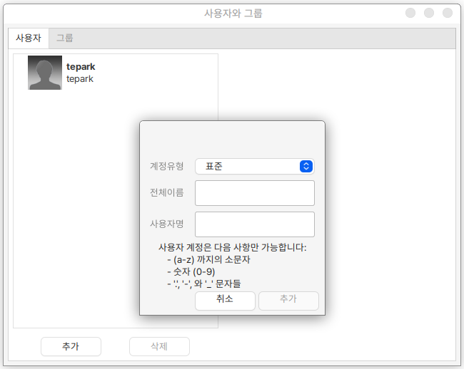
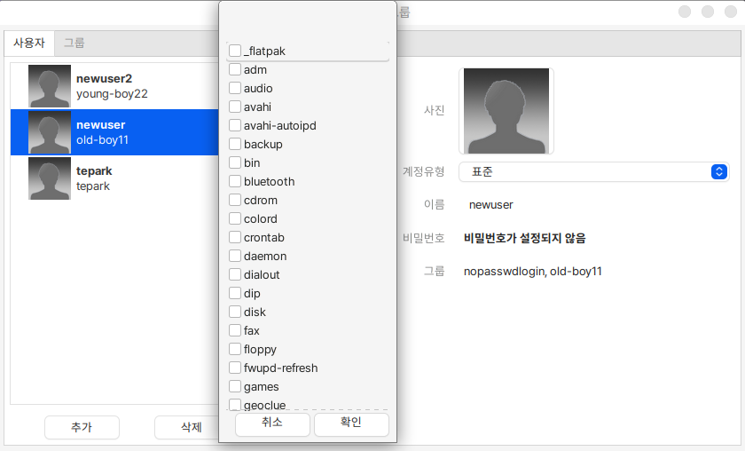

# 사용자와 그룹

사용자와 그룹을 추가 하거나 삭제할 수 있습니다.&#x20;

<figure><figcaption></figcaption></figure>

새로운 사용자를 2명 추가하였습니다.&#x20;

<figure><figcaption></figcaption></figure>

생성된 사용자는 계정유형에서 표준(일반), 관리자로 선택할 수 있습니다.&#x20;

그룹을 선택하여 사용자를 그룹핑할 수 있습니다.&#x20;
